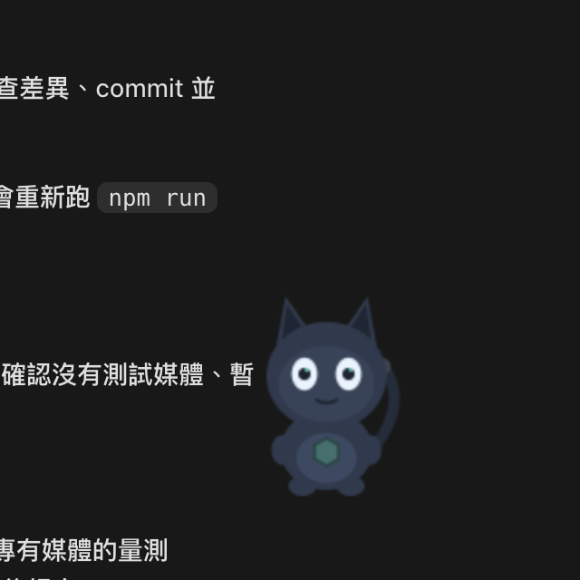
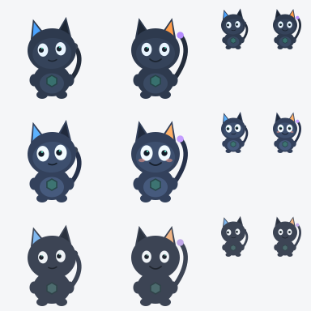
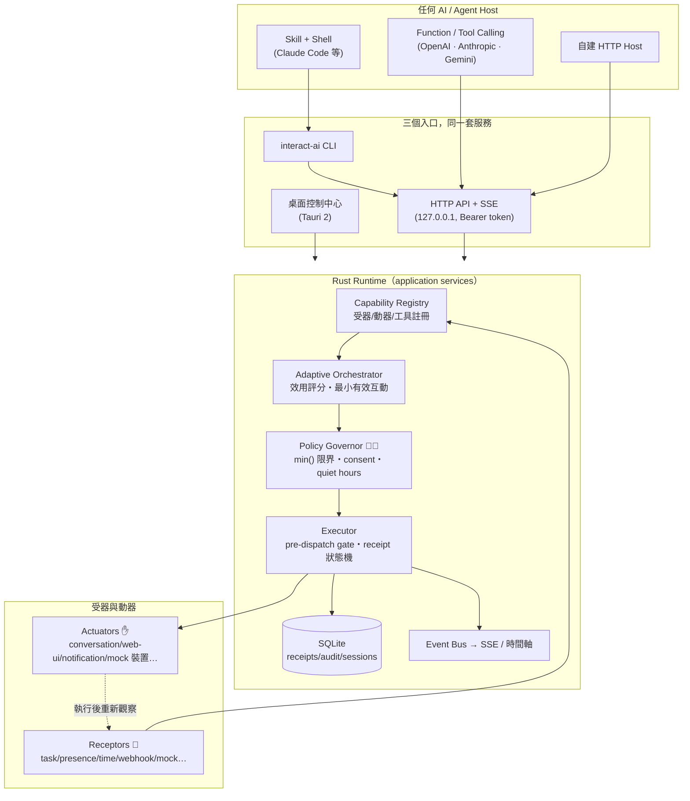

# adaptive-interaction

[](https://github.com/miles990/adaptive-interaction/actions/workflows/ci.yml)
[](https://github.com/miles990/adaptive-interaction/releases)


> ⚠️ **實驗型專案（Experimental）**：這是探索「跨 AI 自適應互動」的研究性平台，
> API、CLI 與配方格式可能在版本間破壞性變動。請勿用於生產環境，
> 也不要連接真實的高風險裝置。


## 這是什麼？

想像你請了一位很聰明的 AI 助手，但它天生**沒有眼睛、沒有手、也不懂分寸**。
這個專案在你的電腦裡幫它蓋一座「小總部」，由四種東西組成：

| | 專有名詞 | 白話說 | 例子 |
|---|---|---|---|
| 👀 | **Receptor（受器）** | AI 的眼睛和耳朵 | 知道「任務完成了」「你在不在電腦前」「現在幾點」 |
| ✋ | **Actuator（動器）** | AI 的手 | 說一句話、發桌面通知、亮燈、讓裝置震一下 |
| 🧑‍⚖️ | **Policy Governor（安全管家）** | 一個用程式寫死、AI 騙不過的守門人 | 太大力→調小、沒同意→擋掉、深夜→只准安靜的方式 |
| 🔴 | **Emergency Stop（緊急停止）** | 紅色大按鈕 | 隨時按，一切立刻停，且不會自己偷偷恢復 |

有了小總部，AI 就能做到：**看到你剛完成任務、而且人在電腦前 → 挑最不打擾的
方式輕聲說「完成了」→ 確認訊息真的送到 → 如果你最近被打擾太多，這次選擇安靜。**

一切都在你自己的電腦上運作（HTTP API 只綁 `127.0.0.1`，即本機回環位址，不對外開放；
唯一的例外是 v0.5 的 iPhone 配對伺服器——**只有你曾經配對過 iPhone 之後**才會在區網開
一個 TLS 埠，且憑證指紋釘選、每台手機獨立金鑰、可隨時撤銷），不需要雲端帳號。任何 AI 都能接上——Claude、GPT、Gemini 或自製程式。
刻意**不使用 MCP**（Model Context Protocol，一種 AI 工具接入協定）：
以 CLI、HTTP API 與標準 JSON Schema 工具定義取代，任何宿主都能直接接。

## 它承諾的三件事

1. **管家說了算**——AI 只能提出「語意化請求」（例如：用 0.9 的強度慶祝一下），
   實際執行值由 Rust 程式的規則決定：`有效值 = min(AI 請求, 你的偏好,
   session 限制, 裝置安全上限, 剩餘預算)`。提示詞（prompt）繞不過它。
2. **收據不說謊**——每個動作都有一張 **receipt（收據）**，完整記錄狀態歷程：
   「排進佇列（accepted）」≠「做完了（completed）」；連「驅動層說做了、
   但沒觀察到實際效果」都會誠實標成 `acknowledged-only` 或 `uncertain`。
3. **你隨時能反悔**——同意（consent）可隨時撤回，進行中的動作立刻取消；
   緊急停止在 CLI、HTTP API、桌面 app 三處都有，效果完全相同。

## 給一般人的介面：一般模式

桌面控制中心預設是**一般模式**：首次啟動有三步設定精靈（選擇角色與陪伴方式／選擇 AI 工作方式／
確認安全與權限預設），之後只有 **5 個一級入口：現在／〔目前角色〕／工作／連接與權限／更多**
（第二項顯示你目前角色的名字，預設是小樞），待決定事項在
右上角 Inbox——全部人話、全部卡片，不需要理解 UUID、YAML 或 JSON。

- 每個能力都有一張卡片：它是什麼、資料從哪來、會不會離開這台電腦、
  能確認到哪一層（「通知已送達作業系統」≠「你已經看見」）。
- 自動互動用**句子**編輯：「當〔任務完成〕，就用〔最不打擾的方式〕回應，
  沒有合適方式時保持安靜」。可以先模擬（安靜時段？缺同意？AI 掛了？），
  啟用前會列出「它會做什麼／不會做什麼」。
- **暫停主動互動**是一般控制（休息一下）；**緊急停止**是安全機制（全部停下、
  解除要走確認流程、高風險能力不自動恢復）。兩者分開，不會混淆。
- 第三方能力沒有說明時，系統顯示保守提示而不是亂猜；AI 可以幫忙潤飾說明文字，
  但永遠改不了風險、同意與資料流這些「能力事實」。

打開「設定 → 顯示進階功能」即可切到**進階模式**：原始 manifest、YAML 配方、
JSON 政策、時間軸與技術 ID 全部都在，兩種模式共用同一套後端與安全規則。

## 狀態列常駐 ＋ 桌面角色小樞（v0.3）

平常桌面你只需要看到**狀態列 icon** 與可選的**桌面角色小樞**。關閉控制中心視窗
只是把它藏起來——狀態列、小樞、你允許的自動互動仍然運作；只有選「完全結束」
才安全停止整套 Runtime。若已有 `interact-ai serve` daemon 在跑，桌面 App 會連上它
而不搶裝置，完全結束 App 也不會關掉那個外部 daemon。

<p align="center">
  
  &nbsp;&nbsp;
  
</p>

小樞是**呈現層與輸入入口**，不持有任何權限：completed 只點頭、綠色勾勾只在真的
**驗證過結果**才出現、緊急停止固定安全姿勢。點它可以說話或下指令、拖檔案會先預覽
再確認；**原始游標座標不持久化、不傳 AI**。說話風格可換世界觀，但**緊急停止、
被阻擋、結果未知、感測使用中這些安全訊息永遠是固定文字，任何角色包都改不了**。

新增能力：**外部裝置**（宣告式 HTTP/SSE adapter，配對用指紋不用 IP）、
**AI Agent Session**（有租約/預算/範圍、mailbox 溝通、防循環委派、聲稱完成≠驗證）、
**麥克風**（預設關、consent-gated、30 秒硬上限、無靜默擷取、只留 level 事實）。

## v0.4.1 已發布能力（2026-08-28）

版本號 0.4.1（`Cargo.toml`／`package.json`／`tauri.conf.json` 同步）。v0.4 接上的能力：

- 小樞成為 7 receptors＋7 actuators 的 Presentation Provider，並有本機
  Behavior Runtime／Attention／Utility AI、程序化視線耳朵及三種貓系變體。
- 直接使用本機已登入 Codex（app-server；exec/resume fallback）與 Claude Code
  （stream-json）；預設只讀，限權寫入需明確 workdir＋二次確認。
- 人類控制 token 與 restricted agent token 分離；AI 不能授權、改 policy、
  發布知識或解除緊急停止。
- 10 層記憶、CAS 素材、Knowledge Graph／FTS5／Candidate-only tools、
  更新決策／使用者糾正／Knowledge Receipt。
- metadata-only 硬體掃描：17 類覆蓋結果，掃描不開啟攝影機、麥克風、
  BLE 或 mDNS；看不到時會顯示具體原因，不用假裝置。
- 控制中心 Global Search／Activity Inbox／390px 導覽（v0.4 為 8 一級頁；v0.5 已縮為 5 入口）。

v0.4 的 Capability Matrix（**25/25 complete**）衡量的是治理平台的完成度，見
[`docs/capability-completion-matrix.md`](docs/capability-completion-matrix.md) 與
[`docs/v04-final-machine-evidence.md`](docs/v04-final-machine-evidence.md)。

## v0.5（角色・硬體・AI 三核心重定位）——**v0.5.1 已發布；v0.6.0 Foundation 已於 2026-09-05 發布（tag `v0.6.0`）**

**v0.5.0 已於 2026-09-03 發布**（tag `v0.5.0`）；`main`／`release/v0.5.1-product-hardening` 上的
**v0.5.1 修補版本已於 2026-09-04 發布（tag `v0.5.1`）**。**v0.6.0 Foundation 已於 2026-09-05 發布
（tag `v0.6.0` → commit `4bd55fe`；Release 資產 23 個；發布後 `main` 的修補 `ea7de59`／`8826656`／`8f52837`）**：AIP 1.0 最小協定、權威 Character Session、
小樞脫離協定核心，見下方「AIP 1.0 與 Character Session」小節與
[`docs/releases/v0.6.0-test-matrix.md`](docs/releases/v0.6.0-test-matrix.md)。v0.5 **不沿用** 25/25 的完成度敘述；它的誠實基線與收尾狀態在
[`docs/v05-capability-gap-matrix.md`](docs/v05-capability-gap-matrix.md)（v0.5.1 修補見 §13），
Phase 7 的逐條恢復矩陣在 [`docs/v05-recovery-matrix.md`](docs/v05-recovery-matrix.md)。重點：

- **小樞 v3 女僕正式版**：執行期參數化分層 rig（非 sprite sheet）、36 正式表情、
  Interaction Director、遊玩場（玩具＋輕量 2D 物理、使魔、場景、Roll Call）。
- **真硬體**：Serial／MQTT／BLE 線協定 adapter＋ESP32 官方參考韌體（已用 arduino-cli
  實際編譯；**尚未在真板驗收**）；模擬器閉環與真機分開標示。
- **AI 角色閉環**：Agent session taxonomy 事件→角色演出；claimed ≠ verified，
  綠勾只在人類驗證後。
- **iPhone Mobile Provider**：TLS wss＋配對碼＋每機金鑰；SwiftUI companion app
  已在 **iOS 模擬器**完成配對閉環，**iPhone 11／iOS 26.3.1 真機部分驗收**（2026-09-03：配對、動器、
  緊急停止投影與停感測、撤銷等列已過真機；動作觀察、BLE connect／GATT 尚未涵蓋，見
  [`docs/releases/v0.5.0-iphone-device-evidence.md`](docs/releases/v0.5.0-iphone-device-evidence.md)）。
- **Character Presentation Protocol 1.0（角色無關的呈現層）**：Runtime 只送語意化
  Character Intent（含 truthState 與 priority 下限），角色透過可版本化 manifest＋能力協商接上
  （參數化 rig、sprite、文字、外部 WebSocket 程式都走同一份契約；不支援就誠實降級，安全訊息
  永遠落到可信文字）；**小樞是第一個 Reference Adapter，不是唯一角色**；estop／感測指示由可信
  host overlay 保證。契約：[`docs/character-protocol/README.md`](docs/character-protocol/README.md)。
- **一般模式產品化**：五入口（現在／角色／工作／連接與權限／更多）以任務、角色、權限與結果為中心；
  工作頁先交代任務；狀態一律走共用人話投影（claimed ≠ verified）；首次成功體驗可略過。
- **v0.5.1 修補（2026-09-04 發布）**：修掉 v0.5.0 刻意保留的五個 partial（精靈安靜時段不再封鎖桌面角色、
  agent interrupt 擁有權、角色舞台逐物件點擊穿透、配對未比對就降級證據等級、serial fallback 讀取執行緒
  回收）與一般模式的殘留缺口（工作送達六態誠實投影、真正的「只這一次」授權、provider 生命週期真的擋得住、
  首次設定原子提交、記憶匯出範圍明列、iPhone 冷啟動自動重連與位址變更提示）。新增**真 Tauri 視窗驗收**
  這個證據等級；**iPhone 真機驗收本輪 blocked（鑰匙圈授權待人工），ESP32 仍未真板驗收**。
  逐項見 [`docs/releases/v0.5.1-release-readiness.md`](docs/releases/v0.5.1-release-readiness.md)、
  [`v0.5.1-test-matrix.md`](docs/releases/v0.5.1-test-matrix.md)、
  [`v0.5.1-known-limitations.md`](docs/releases/v0.5.1-known-limitations.md)、
  [`v0.5.1-migration.md`](docs/releases/v0.5.1-migration.md)、
  [`v0.5.1-final-report.md`](docs/releases/v0.5.1-final-report.md)、
  [`v0.5.1-iphone-device-evidence.md`](docs/releases/v0.5.1-iphone-device-evidence.md)。

## AIP 1.0 與 Character Session（v0.6.0 Foundation，已發布）

**Adaptive Interaction Protocol（AIP）1.0** 是唯一的跨裝置語意訊息契約：新 crate
`crates/interaction-aip`（純函式、無 tokio／I/O）定義 versioned envelope、十二種 message type、
十二值 Outcome 誠實階梯（`received≠accepted≠applied≠observed≠claimed-completed≠verified`）、
確定性版本與能力協商、身分綁定、離線事件政策與 19 個穩定錯誤碼；schema 由 Rust 型別產生
（golden：`schemas/aip-1.0.schema.json`），TypeScript 與 Swift 由同一份 schema 產生、CI 擋手改漂移。
新 crate `crates/interaction-session` 是**權威 Character Session**：確定性 Director（touch→反應、
`task.verified`→celebrate、emergency→凍結）、單調 revision／sequence、RFC 7396 patch＋SHA-256
state hash、有界事件日誌 delta replay／snapshot fallback、十三關安全管線；掛在 Runtime 上並綁定
iPhone wire、HTTP、SSE、Tauri IPC 四種 transport。小樞同步作為 **Strangler 重構**脫離協定核心：
`interaction-character`（CPP 核心）不再含任何小樞字串，小樞邏輯搬到新 crate
`interaction-character-shu`；第二個 Reference Character `ref-shape`（純幾何角色）證明核心對新角色
零分岔。**全部經過模擬 iPhone（fixture）與 iOS 模擬器驗證，iPhone 真機上的 AIP／Character Session
閉環尚未執行（implemented-unverified）**。契約與逐項證據：
[`docs/aip/README.md`](docs/aip/README.md)（唯一契約）、
[`docs/aip/character-session.md`](docs/aip/character-session.md)、
[`docs/aip/general-mode-ux.md`](docs/aip/general-mode-ux.md)、
[`docs/releases/v0.6.0-test-matrix.md`](docs/releases/v0.6.0-test-matrix.md)。

## 安裝（3 分鐘）

從 [Releases](https://github.com/miles990/adaptive-interaction/releases) 一鍵安裝，
免編譯、支援 macOS（Apple Silicon/Intel）、Linux、Windows：

```bash
curl -fsSL https://github.com/miles990/adaptive-interaction/releases/latest/download/install.sh -o install.sh
bash install.sh
```

會出現**預設全選**的元件選單，不想裝的輸入編號取消：

```text
adaptive-interaction all-in-one 安裝 — 預設全選，輸入編號可取消
  [x] 1. interact-ai CLI（必裝：核心指令與 daemon）
  [x] 2. 跨 AI Skill（偵測到的 agent 全裝：Claude/Codex/Gemini/Copilot…）
  [x] 3. 桌面控制中心（圖形介面）
  [x] 4. Shell completion（指令自動補全）
```

裝完之後：

```bash
interact-ai serve            # 啟動小總部（daemon＝常駐背景服務）
interact-ai session start    # 開始一個互動 session（授權的邊界）
```

想先看它動起來？照 [60 秒體驗](docs/INSTALL.md#3-第一次互動60-秒體驗) 跑一遍。
之後更新／移除：

```bash
interact-ai self update              # 一鍵更新（比對 Release 的 .sha256；缺校驗檔即中止安裝）
interact-ai self uninstall --yes     # 移除（--purge 連設定資料一起刪）
```

> 完整性說明：安裝／更新一律比對 Release 附的 `.sha256`，不符或抓不到就中止（fail-closed）。
> 但**沒有程式碼簽章、Apple 公證、SBOM 或 build provenance**——sha256 只證明位元組與 Release 一致，
> 不證明來源；桌面安裝包也未簽章。Linux aarch64 沒有預編譯檔，需從原始碼建置。
> 細節見 [安裝指南](docs/INSTALL.md#完整性驗證能證明什麼不能證明什麼)。

## 三種使用方式

- **🖥️ 圖形介面**：桌面控制中心（Tauri 2 打造）——開關受器與動器、寫互動配方、
  管理同意、看即時時間軸；右上角永遠有紅色緊急停止鈕。→ [桌面指南](docs/DESKTOP-GUIDE.md)
- **⌨️ 終端機**：`interact-ai` 一支指令涵蓋全部功能。→ [使用手冊](docs/USER-GUIDE.md)
- **🤖 給 AI 接**：三條路任選——
  ① 讀 Skill＋執行 CLI（Claude Code、Codex CLI 等）；
  ② 載入工具定義檔（`interact-ai tools export --format openai|anthropic|gemini`）；
  ③ 直接呼叫 HTTP API（附完整 OpenAPI 規格與 SSE 即時事件流──
  SSE＝Server-Sent Events，伺服器單向即時推播）。→ [接入說明](docs/INSTALL.md#6-給-ai-接入的三條路)

## 📚 文件

| 文件 | 內容 |
|---|---|
| **[安裝與部署](docs/INSTALL.md)** | 白話解釋＋安裝選單＋60 秒體驗＋常見問題 |
| **[特點與能力](docs/FEATURES.md)** | 核心循環與安全設計圖解（mermaid） |
| **[人類使用手冊](docs/USER-GUIDE.md)** | 日常操作：session／同意／配方／政策／緊急停止 |
| **[桌面控制中心指南](docs/DESKTOP-GUIDE.md)** | 圖形介面逐頁說明＋狀態列／桌面角色／感測＋收據狀態圖 |
| **[架構總覽](docs/ARCHITECTURE.md)** | crate 責任、生命週期、誠實階梯、provider／agent／sensor 設計 |
| **[AI 入口地圖](AGENTS.md)** | 任何 AI 的起點：分層與禁止依賴、canonical source 對照、改各領域前必讀、測試命令、遷移與發布流程、進度續接 |
| **[能力歸屬對照表](docs/MAINTAINERS-MAP.md)** | 十個能力各自的 owner／入口／狀態來源／公開契約／擴充點／必要測試／已知限制 |
| **[相容路徑退場登記表](docs/aip/deprecation-ledger.md)** | 每條相容路徑的存在理由、移除前需要的證據、資料遷移與回退方式 |
| **[驗收證據](docs/acceptance-evidence.md)** | 真實環境端到端測試紀錄 |
| **[v0.4 機器證據](docs/v04-final-machine-evidence.md)** | v0.4 測試數字、connector、SHA-256 與未完成項 |
| **[v0.5 Gap Matrix](docs/v05-capability-gap-matrix.md)** | v0.5 誠實基線（§0–§8）、Phase 7 收尾狀態（§9）、Phase 8 收尾狀態（§10，Character Presentation Protocol＋一般模式產品化）、Phase 9 發布硬化（§11／§12）與 v0.5.1 修補（§13） |
| **[v0.5 恢復矩陣](docs/v05-recovery-matrix.md)** | 新 Session 逐規格條目核對：程式存在／已接線／測試／真環境／缺口（463 列） |
| **[Character Presentation Protocol](docs/character-protocol/README.md)** | 角色呈現通用協定唯一契約：manifest／能力協商／intent／input event／lifecycle／receipt／wire／安全模型／版本政策 |
| **[Character Adapter 撰寫指南](docs/character-protocol/adapter-authoring.md)** | 如何建立最小角色、宣告能力、收 intent、回 receipt、送 event、cancel／Emergency／Reduced Motion、自訂 channel、WebSocket、migration、測試 |
| **[Reference Adapters 導覽](docs/character-protocol/reference-adapters.md)** | 小樞 rig／sprite／文字／外部 WebSocket fixture 各走一遍 |
| **[v0.5.0 發布就緒](docs/releases/v0.5.0-release-readiness.md)** | 發布關卡清單、測試矩陣、已知限制、iPhone 真機證據、遷移指南（`docs/releases/`） |
| **[v0.5.1 發布文件](docs/releases/v0.5.1-release-readiness.md)** | v0.5.1 的 20 道發布關卡（發布後全數 met，關卡 20 附範圍備註）；同一資料夾另有 [測試矩陣](docs/releases/v0.5.1-test-matrix.md)（含真 Tauri 視窗驗收表）、[已知限制](docs/releases/v0.5.1-known-limitations.md)、[遷移指南](docs/releases/v0.5.1-migration.md)、[最終交付報告](docs/releases/v0.5.1-final-report.md)、[iPhone 真機證據（blocked）](docs/releases/v0.5.1-iphone-device-evidence.md) |
| **[AIP 1.0（Adaptive Interaction Protocol）](docs/aip/README.md)** | v0.6.0 唯一的跨裝置語意契約：envelope／message type／Outcome 誠實階梯／版本與能力協商／離線政策／錯誤碼；同一資料夾另有 [Character Session 協定](docs/aip/character-session.md)、[iPhone Companion 手機端](docs/aip/iphone-companion.md)、[一般模式同步 UX](docs/aip/general-mode-ux.md)、[Transport bindings](docs/aip/transport-bindings.md)、[配對安全](docs/aip/pairing-security.md)、[隱私](docs/aip/privacy.md)、[威脅模型](docs/aip/threat-model.md)、[架構邊界](docs/aip/architecture-boundaries.md)、[Reference Character（`ref-shape`）](docs/aip/reference-character.md)、[相容矩陣](docs/aip/compatibility.md)、[Conformance](docs/aip/conformance.md) |
| **[v0.6.0 Foundation 文件（已發布，tag `v0.6.0`）](docs/releases/v0.6.0-test-matrix.md)** | 測試矩陣（四個 wave 逐輪數字＋新增測試清單＋效能前後對照＋未執行清單）；同一資料夾另有 [修改前基線](docs/releases/v0.6.0-baseline.md)、[Phase 0 恢復矩陣](docs/releases/v0.6.0-recovery-matrix.md)、[遷移指南](docs/releases/v0.6.0-migration.md) |
| **[更新日誌](CHANGELOG.md)** | 版本歷史（語意化版本） |

## 核心設計理念

1. **能力感知（capability-aware）**——AI 每次規劃前都先問「我現在能感知什麼、
   能控制什麼？」，而不是假設某個裝置一定存在。能力清單是活的：受器與動器
   可隨時上線、離線、被停用或撤權。
2. **語意化請求，程式化限界**——AI 只表達意圖（「慶祝一下，強度 0.9」），
   實際能做多少由 deterministic（決定論的，即固定規則、無隨機無模型）的
   Policy Governor 裁決。安全從不依賴提示詞。
3. **不介入是一級決策**——每次規劃都在挑「最小有效互動」；當效益低於干擾成本，
   正確答案就是安靜，系統會把這個決定連同理由記錄下來。
4. **誠實回報**——排入佇列不等於完成；觀察到的事實與模型推論分開存放，
   推論帶信心值；不知道就標 `uncertain`，永不假裝。
5. **人類主權**——一切互動都發生在有邊界的 session 裡：同意（consent）可隨時
   撤回並立即生效，緊急停止永遠可用、永不自動恢復。
6. **跨 AI 中立**——一份 Canonical Tool Manifest 產生所有平台的工具定義；
   不綁定任何 AI 宿主、任何硬體，也不依賴 MCP。
7. **File=Truth＋全程審計**——人類可編輯的 YAML 是設定的唯一真相；每個敏感
   操作（授權、限界、停止）都留下可追查的紀錄。

## 技術架構

主要架構：



核心循環：

```
Discover → Observe → Interpret → Plan → Authorize → Act → Verify → Adapt
（探索能力 → 觀察 → 解讀 → 規劃 → 授權限界 → 行動 → 驗證 → 調適）
```

設計要點：「不介入」是一級決策結果；`accepted ≠ completed` 由 receipt 狀態機強制；
Observation 嚴格分離 facts（可觀察事實）與 inferences（模型推論＋信心值）；
配方觸發具備事件消耗語意（同一事件不會重複觸發）；終態收據 sticky（緊急停止
寫入的狀態無法被競態覆寫）。

| 層 | crate / 目錄 | 職責 |
|---|---|---|
| 領域模型 | `crates/interaction-core` | manifests、observation、bounded action、receipt 狀態機、traits |
| 安全 | `crates/interaction-policy` | deterministic governor：min() 限界鏈、quiet hours、consent、預算 |
| 配方 | `crates/interaction-recipe` | YAML/JSON 模型＋驗證、條件 DSL、多受器融合、觸發評估 |
| 儲存 | `crates/interaction-storage` | SQLite：receipts／plans／sessions／observations／audit |
| 註冊表 | `crates/interaction-registry` | 動態能力註冊、健康狀態、capability snapshot |
| 事件 | `crates/interaction-events` | bounded event bus＋Last-Event-ID 重播 |
| Runtime | `crates/interaction-runtime` | orchestrator、executor（pre-dispatch gate）、recipes 自主迴圈、watchdog、`sensor_source.rs` 單一停止協調器、`declarative_lifecycle.rs` 宣告式裝置綁定生命週期 |
| 工具介面 | `crates/interaction-tool-schema` | 單一 Canonical Manifest → OpenAI/Anthropic/Gemini/OpenAPI/JSON-Schema |
| API / CLI | `crates/interaction-api`、`crates/interaction-cli` | axum＋SSE；`interact-ai`（client＋daemon＋self 管理） |
| Adapter SDK | `crates/interaction-adapter-sdk`、`adapters/builtin` | 第三方 driver 介面＋內建受器/動器 |
| 角色協定 | `crates/interaction-character`、`apps/interaction-desktop/src/character` | Character Presentation Protocol 1.0：純函式 Gateway＋manifest／協商／intent／receipt；TS 鏡射＋in-process gateway＋reference adapters |
| 跨裝置語意契約（v0.6.0） | `crates/interaction-aip` | AIP 1.0：純函式 envelope／message type／Outcome 誠實階梯／版本與能力協商／離線政策；golden schema 來源 |
| 權威 Character Session（v0.6.0） | `crates/interaction-session` | 純函式：語意狀態、確定性 Director、revision／sequence、RFC 7396 patch＋hash、十三關安全管線；`src/receive.rs` 是 Rust／TypeScript／Swift 共用的接收端決策表 |
| 小樞 Reference Adapter（v0.6.0） | `crates/interaction-character-shu` | 從 `interaction-character` 拆出的小樞專屬型別／rig-pack 遷移，核心不再含任何小樞字串 |
| 桌面 | `apps/interaction-desktop` | Tauri 2＋React；與 CLI/API 共用同一套 application services；`src/aip/sessionClient.ts` 接收端 reducer、`src/companion/applyPresetPlan.ts` 陪伴檔位的可恢復兩段交易（純函式，不進 React 元件） |
| iPhone companion | `apps/interaction-ios` | SwiftUI；`Services/SessionReceive.swift` 決策表的 Swift 端、`Services/SocketTransport.swift` 可注入的 socket 與排程 |
| Skill | `skills/orchestrate-adaptive-interaction` | 跨 AI Agent Skill（開放格式） |

```bash
# 品質關卡
cargo fmt --check && cargo clippy --workspace --all-targets && cargo test --workspace
cd apps/interaction-desktop && pnpm typecheck && pnpm build

# 發版（同步四處版本＋changelog＋tag；push 後 CI/CD 自動編譯發布跨平台產物）
scripts/release.sh 0.2.0 && git push && git push --tags
```

## 特別感謝

本專案的靈感來自兩個先行專案，特此致謝：

- [immersive-vibration-response-skill](https://github.com/ra1nyxin/immersive-vibration-response-skill) —
  「AI 感知後主動給出實體回饋、作用後立即重新觀察」的閉環概念
- [tentacle-monster-roleplay-esp32](https://github.com/ra1nyxin/tentacle-monster-roleplay-esp32) —
  非同步效果佇列、PATTERN 時間軸與情境連動的設計啟發

## 授權

MIT
