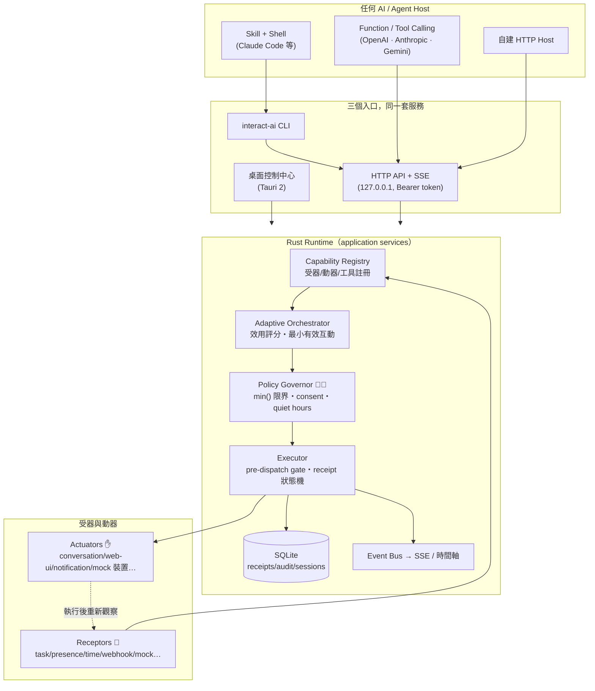

# adaptive-interaction

[](https://github.com/miles990/adaptive-interaction/actions/workflows/ci.yml)
[](https://github.com/miles990/adaptive-interaction/releases)


> ⚠️ **實驗型專案（Experimental）**：這是探索「跨 AI 自適應互動」的研究性平台，
> API、CLI 與配方格式可能在版本間破壞性變動。請勿用於生產環境，
> 也不要連接真實的高風險裝置。


## 這是什麼？

想像你請了一位很聰明的 AI 助手，但它天生**沒有眼睛、沒有手、也不懂分寸**。
這個專案在你的電腦裡幫它蓋一座「小總部」，由四種東西組成：

| | 專有名詞 | 白話說 | 例子 |
|---|---|---|---|
| 👀 | **Receptor（受器）** | AI 的眼睛和耳朵 | 知道「任務完成了」「你在不在電腦前」「現在幾點」 |
| ✋ | **Actuator（動器）** | AI 的手 | 說一句話、發桌面通知、亮燈、讓裝置震一下 |
| 🧑‍⚖️ | **Policy Governor（安全管家）** | 一個用程式寫死、AI 騙不過的守門人 | 太大力→調小、沒同意→擋掉、深夜→只准安靜的方式 |
| 🔴 | **Emergency Stop（緊急停止）** | 紅色大按鈕 | 隨時按，一切立刻停，且不會自己偷偷恢復 |

有了小總部，AI 就能做到：**看到你剛完成任務、而且人在電腦前 → 挑最不打擾的
方式輕聲說「完成了」→ 確認訊息真的送到 → 如果你最近被打擾太多，這次選擇安靜。**

一切都在你自己的電腦上運作（只綁 `127.0.0.1`，即本機回環位址，不對外開放），
不需要雲端帳號。任何 AI 都能接上——Claude、GPT、Gemini 或自製程式。
刻意**不使用 MCP**（Model Context Protocol，一種 AI 工具接入協定）：
以 CLI、HTTP API 與標準 JSON Schema 工具定義取代，任何宿主都能直接接。

## 它承諾的三件事

1. **管家說了算**——AI 只能提出「語意化請求」（例如：用 0.9 的強度慶祝一下），
   實際執行值由 Rust 程式的規則決定：`有效值 = min(AI 請求, 你的偏好,
   session 限制, 裝置安全上限, 剩餘預算)`。提示詞（prompt）繞不過它。
2. **收據不說謊**——每個動作都有一張 **receipt（收據）**，完整記錄狀態歷程：
   「排進佇列（accepted）」≠「做完了（completed）」；連「驅動層說做了、
   但沒觀察到實際效果」都會誠實標成 `acknowledged-only` 或 `uncertain`。
3. **你隨時能反悔**——同意（consent）可隨時撤回，進行中的動作立刻取消；
   緊急停止在 CLI、HTTP API、桌面 app 三處都有，效果完全相同。

## 安裝（3 分鐘）

從 [Releases](https://github.com/miles990/adaptive-interaction/releases) 一鍵安裝，
免編譯、支援 macOS（Apple Silicon/Intel）、Linux、Windows：

```bash
curl -fsSL https://github.com/miles990/adaptive-interaction/releases/latest/download/install.sh -o install.sh
bash install.sh
```

會出現**預設全選**的元件選單，不想裝的輸入編號取消：

```text
adaptive-interaction all-in-one 安裝 — 預設全選，輸入編號可取消
  [x] 1. interact-ai CLI（必裝：核心指令與 daemon）
  [x] 2. 跨 AI Skill → ~/.claude/skills/（給 Claude Code 等 agent）
  [x] 3. 桌面控制中心（圖形介面）
  [x] 4. Shell completion（指令自動補全）
```

裝完之後：

```bash
interact-ai serve            # 啟動小總部（daemon＝常駐背景服務）
interact-ai session start    # 開始一個互動 session（授權的邊界）
```

想先看它動起來？照 [60 秒體驗](docs/INSTALL.md#3-第一次互動60-秒體驗) 跑一遍。
之後更新／移除：

```bash
interact-ai self update              # 一鍵更新（自動驗證 sha256 檔案指紋）
interact-ai self uninstall --yes     # 移除（--purge 連設定資料一起刪）
```

## 三種使用方式

- **🖥️ 圖形介面**：桌面控制中心（Tauri 2 打造）——開關受器與動器、寫互動配方、
  管理同意、看即時時間軸；右上角永遠有紅色緊急停止鈕。→ [桌面指南](docs/DESKTOP-GUIDE.md)
- **⌨️ 終端機**：`interact-ai` 一支指令涵蓋全部功能。→ [使用手冊](docs/USER-GUIDE.md)
- **🤖 給 AI 接**：三條路任選——
  ① 讀 Skill＋執行 CLI（Claude Code、Codex CLI 等）；
  ② 載入工具定義檔（`interact-ai tools export --format openai|anthropic|gemini`）；
  ③ 直接呼叫 HTTP API（附完整 OpenAPI 規格與 SSE 即時事件流──
  SSE＝Server-Sent Events，伺服器單向即時推播）。→ [接入說明](docs/INSTALL.md#6-給-ai-接入的三條路)

## 📚 文件

| 文件 | 內容 |
|---|---|
| **[安裝與部署](docs/INSTALL.md)** | 白話解釋＋安裝選單＋60 秒體驗＋常見問題 |
| **[特點與能力](docs/FEATURES.md)** | 核心循環與安全設計圖解（mermaid） |
| **[人類使用手冊](docs/USER-GUIDE.md)** | 日常操作：session／同意／配方／政策／緊急停止 |
| **[桌面控制中心指南](docs/DESKTOP-GUIDE.md)** | 圖形介面逐頁說明＋收據狀態圖 |
| **[驗收證據](docs/acceptance-evidence.md)** | 真實環境端到端測試紀錄 |
| **[更新日誌](CHANGELOG.md)** | 版本歷史（語意化版本） |

## 核心設計理念

1. **能力感知（capability-aware）**——AI 每次規劃前都先問「我現在能感知什麼、
   能控制什麼？」，而不是假設某個裝置一定存在。能力清單是活的：受器與動器
   可隨時上線、離線、被停用或撤權。
2. **語意化請求，程式化限界**——AI 只表達意圖（「慶祝一下，強度 0.9」），
   實際能做多少由 deterministic（決定論的，即固定規則、無隨機無模型）的
   Policy Governor 裁決。安全從不依賴提示詞。
3. **不介入是一級決策**——每次規劃都在挑「最小有效互動」；當效益低於干擾成本，
   正確答案就是安靜，系統會把這個決定連同理由記錄下來。
4. **誠實回報**——排入佇列不等於完成；觀察到的事實與模型推論分開存放，
   推論帶信心值；不知道就標 `uncertain`，永不假裝。
5. **人類主權**——一切互動都發生在有邊界的 session 裡：同意（consent）可隨時
   撤回並立即生效，緊急停止永遠可用、永不自動恢復。
6. **跨 AI 中立**——一份 Canonical Tool Manifest 產生所有平台的工具定義；
   不綁定任何 AI 宿主、任何硬體，也不依賴 MCP。
7. **File=Truth＋全程審計**——人類可編輯的 YAML 是設定的唯一真相；每個敏感
   操作（授權、限界、停止）都留下可追查的紀錄。

## 技術架構

主要架構：



核心循環：

```
Discover → Observe → Interpret → Plan → Authorize → Act → Verify → Adapt
（探索能力 → 觀察 → 解讀 → 規劃 → 授權限界 → 行動 → 驗證 → 調適）
```

設計要點：「不介入」是一級決策結果；`accepted ≠ completed` 由 receipt 狀態機強制；
Observation 嚴格分離 facts（可觀察事實）與 inferences（模型推論＋信心值）；
配方觸發具備事件消耗語意（同一事件不會重複觸發）；終態收據 sticky（緊急停止
寫入的狀態無法被競態覆寫）。

| 層 | crate / 目錄 | 職責 |
|---|---|---|
| 領域模型 | `crates/interaction-core` | manifests、observation、bounded action、receipt 狀態機、traits |
| 安全 | `crates/interaction-policy` | deterministic governor：min() 限界鏈、quiet hours、consent、預算 |
| 配方 | `crates/interaction-recipe` | YAML/JSON 模型＋驗證、條件 DSL、多受器融合、觸發評估 |
| 儲存 | `crates/interaction-storage` | SQLite：receipts／plans／sessions／observations／audit |
| 註冊表 | `crates/interaction-registry` | 動態能力註冊、健康狀態、capability snapshot |
| 事件 | `crates/interaction-events` | bounded event bus＋Last-Event-ID 重播 |
| Runtime | `crates/interaction-runtime` | orchestrator、executor（pre-dispatch gate）、recipes 自主迴圈、watchdog |
| 工具介面 | `crates/interaction-tool-schema` | 單一 Canonical Manifest → OpenAI/Anthropic/Gemini/OpenAPI/JSON-Schema |
| API / CLI | `crates/interaction-api`、`crates/interaction-cli` | axum＋SSE；`interact-ai`（client＋daemon＋self 管理） |
| Adapter SDK | `crates/interaction-adapter-sdk`、`adapters/builtin` | 第三方 driver 介面＋內建受器/動器 |
| 桌面 | `apps/interaction-desktop` | Tauri 2＋React；與 CLI/API 共用同一套 application services |
| Skill | `skills/orchestrate-adaptive-interaction` | 跨 AI Agent Skill（開放格式） |

```bash
# 品質關卡
cargo fmt --check && cargo clippy --workspace --all-targets && cargo test --workspace
cd apps/interaction-desktop && pnpm typecheck && pnpm build

# 發版（同步四處版本＋changelog＋tag；push 後 CI/CD 自動編譯發布跨平台產物）
scripts/release.sh 0.2.0 && git push && git push --tags
```

## 特別感謝

本專案的靈感來自兩個先行專案，特此致謝：

- [immersive-vibration-response-skill](https://github.com/ra1nyxin/immersive-vibration-response-skill) —
  「AI 感知後主動給出實體回饋、作用後立即重新觀察」的閉環概念
- [tentacle-monster-roleplay-esp32](https://github.com/ra1nyxin/tentacle-monster-roleplay-esp32) —
  非同步效果佇列、PATTERN 時間軸與情境連動的設計啟發

## 授權

MIT
