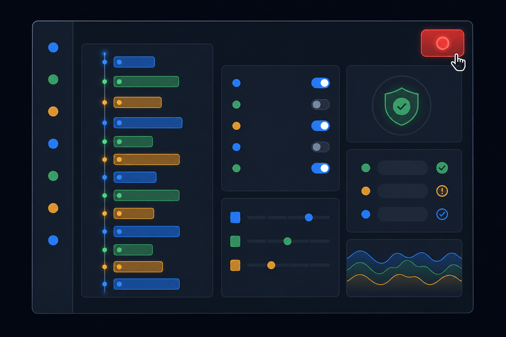
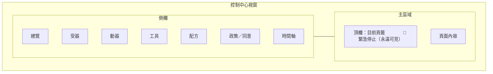
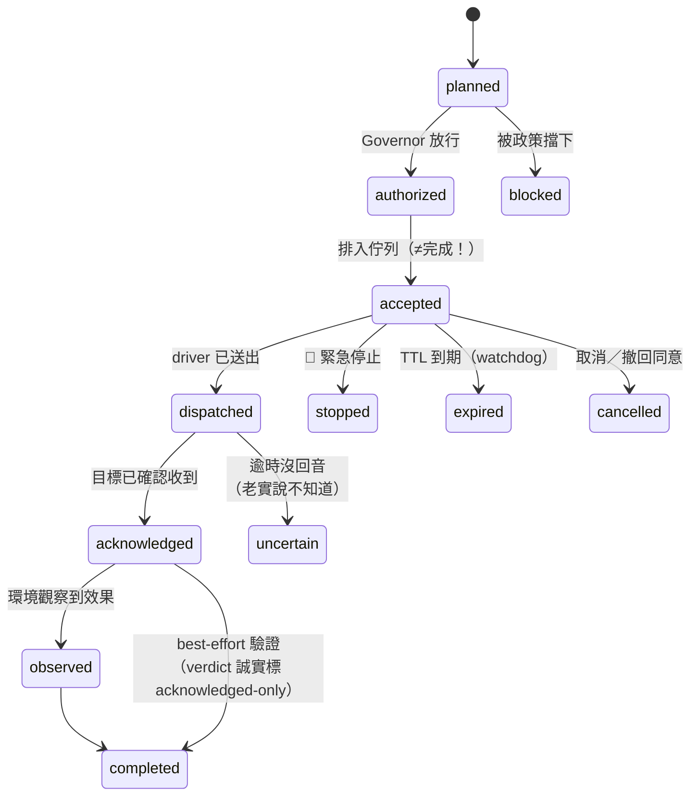

# 視覺化工具使用說明（Tauri 桌面控制中心）



桌面控制中心是**人類的駕駛艙**：設定、測試、監控、授權、喊停。
它不是 AI 使用 Runtime 的必要條件——沒有它，CLI／API／Skill 一樣全功能。

## 啟動

```bash
cd apps/interaction-desktop
pnpm install        # 第一次
pnpm tauri dev      # 開發模式
# 正式打包：pnpm tauri build
```

啟動時 app 會**內嵌**同一套 Rust Runtime（desktop-managed 模式），並同時開放
`127.0.0.1:8787` 的 HTTP API——所以桌面開著時，CLI 和 AI 連的就是同一個實例。
若已有 `interact-ai serve` daemon 在跑，app 會顯示 instance lock 訊息而不會搶裝置。
**關閉視窗＝安全停止 Runtime**（絕不偷偷在背景繼續實體輸出）。

## 版面總覽



右上角的紅色**緊急停止**按鈕在任何頁面都在：按下→全停＋撤回同意＋不自動恢復；
按鈕會變成黃色的「解除緊急停止」，需要你再按一次才重新武裝。

## 各頁面

### 總覽（Overview）
- Runtime 版本／啟動時間／緊急停止狀態／設定錯誤
- **Session 卡片**：目前 session、已授同意清單；沒有 session 時可直接輸入 label 開一個
- 能力摘要：受器/動器/工具數量＋目前生效的限制（如「安靜時段中」）
- 最近訊息（outbox）：AI 實際說過的話——刻意沉默也會標示出來
- 最近動作：intent／動器／狀態徽章／驗證等級

### 受器（Receptors）
每個感官一列：類別、模式（poll/event/stream）、敏感度（需同意的會標示）、在線狀態。
- **啟用／停用**：敏感受器（攝影機等級）預設停用，開啟是明確動作
- **測試讀取**：現場讀一筆，右側預覽會把 `facts` 與 `inferences` 分開顯示

### 動器（Actuators）
每個輸出通道一列：通道、風險徽章（`外部副作用`／`需同意`會特別標紅）、裝置上限、狀態。
- **測試**：送一個小的（magnitude 0.2、500ms）測試動作——**完整走安全管家授權路徑**，
  結果收據連同政策決策一起顯示。被擋就是被擋，UI 不會替你繞過
- 啟用／停用即時生效

### 工具（Tools）
12 個 `interaction.*` operation 的清單：角色（受器/動器）、風險、是否需批准。
- 點一列看 input/output JSON Schema
- 右上選格式（openai/anthropic/gemini/openapi/json-schema）→ **由同一 Canonical Manifest 匯出**

### 配方（Recipes）
- 左：已安裝配方＋本 session 觸發次數；**模擬**（會不會觸發？為什麼？計畫長怎樣？）、
  **執行**（跳過觸發、不跳過安全）、啟用/停用/刪除
- 右：YAML 編輯器＋範本；**驗證**按鈕會標出精確的錯誤欄位路徑

### 政策／同意（Policy）
- 左：目前生效政策全文（Rust 後端強制執行的那一份）
- 右上：JSON merge-patch 編輯器（例如改 `initiative`、加安靜時段）
- 右下：Session 同意管理——授予（可輸入任意 scope）與**一鍵撤回**
  （撤回會立即取消該範圍進行中的動作）

> UI 裡看不到的按鈕不代表做不到、看得到的按鈕也不代表一定放行——
> **所有輸入最終都由 Rust 後端重新驗證**。隱藏按鈕從來不是安全機制。

### 時間軸（Timeline）
即時事件流（與 SSE 同源）：
`Observation → Plan → Policy Decision → Bounded Action → 執行 → Receipt → Verification`
- 依 correlation id 串起同一次互動的完整因果鏈
- 篩選框可過濾事件類型／correlation／內容
- 點任一事件看完整 payload（含政策決策與收據狀態）

## 收據狀態機

看懂時間軸與收據的關鍵——**排入佇列不等於做完**：



徽章顏色：🟢 completed／healthy　🔵 acknowledged／observed　🟣 進行中　🟡 uncertain　🔴 blocked／failed　⚪ 終止類

## UI 狀態行為

| 情境 | 你會看到 |
|---|---|
| Runtime 啟動中 | 「正在啟動 Runtime…」 |
| instance lock 被 daemon 佔用 | 離線畫面＋原因＋處理建議（不會搶裝置） |
| 清單為空 | 明確的空狀態說明（不是白畫面） |
| 呼叫失敗 | 紅框錯誤原文（不彈系統對話框） |
| 緊急停止中 | 全域紅色橫幅＋按鈕變「解除」 |
| 視窗縮小 | 雙欄自動折成單欄（min 360px） |
