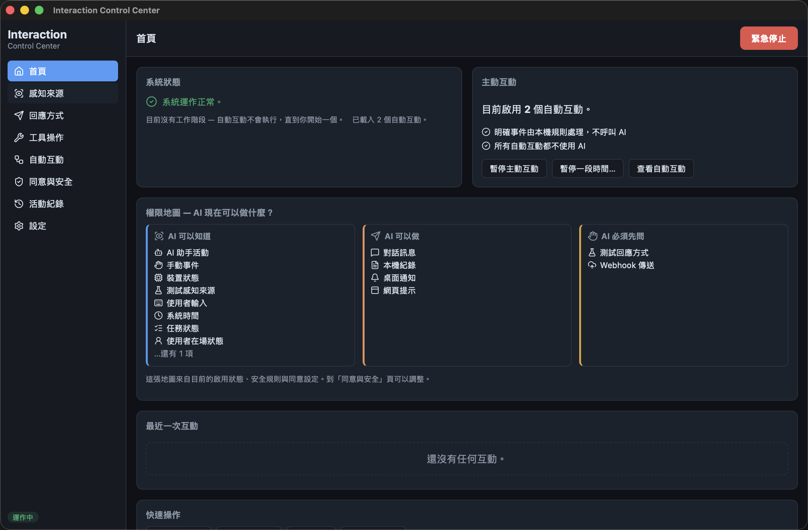
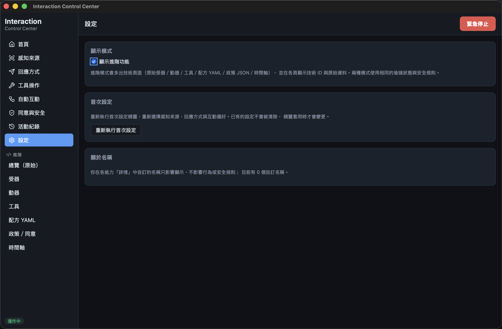
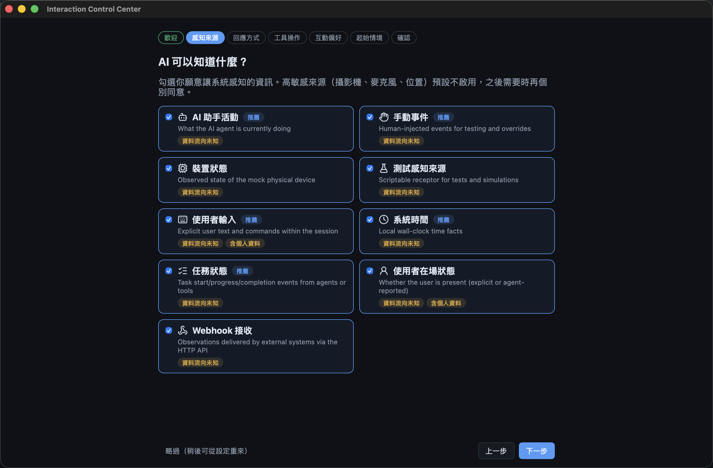
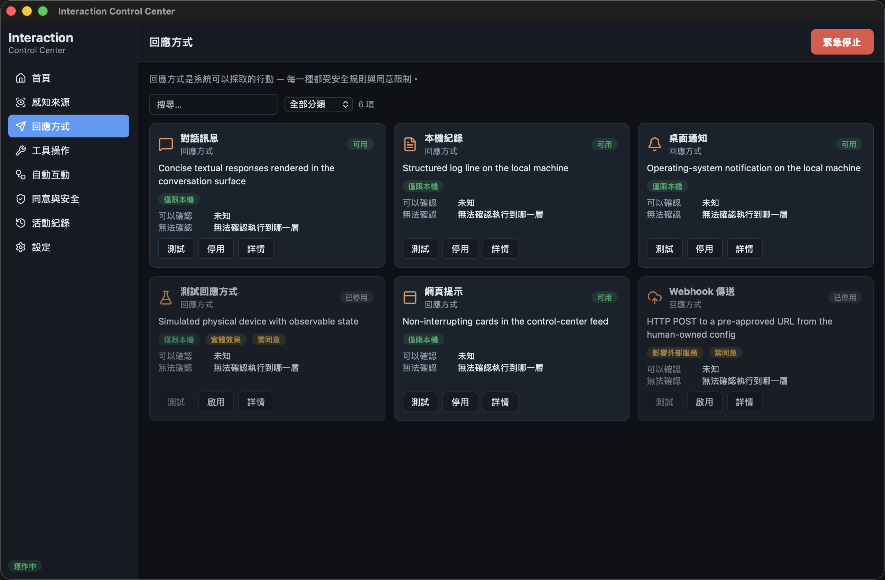
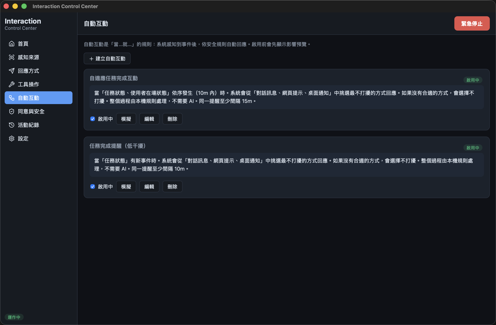
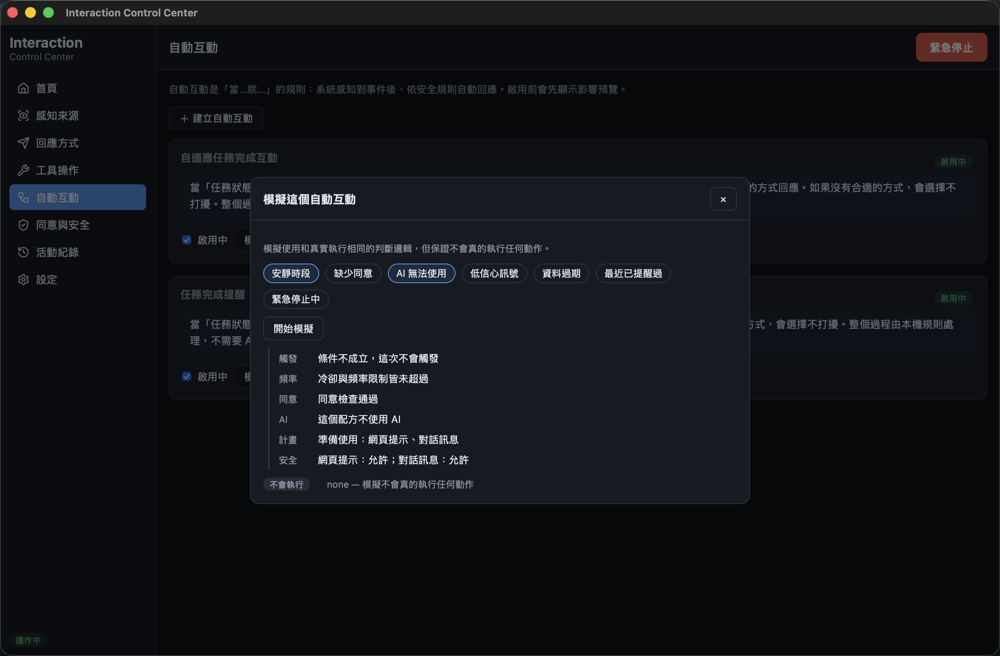
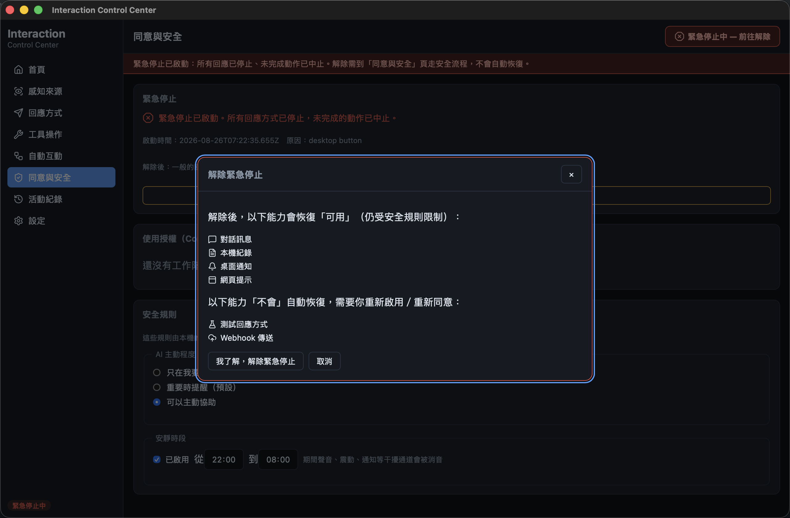
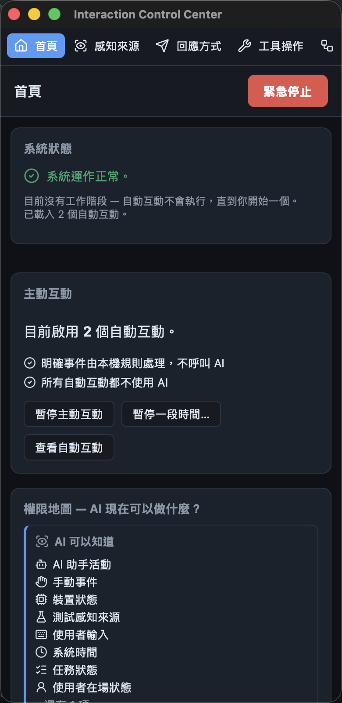
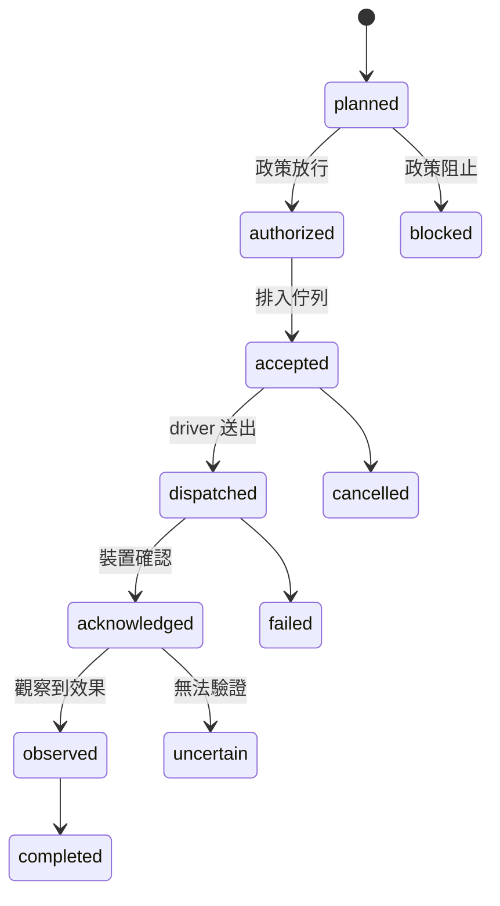

# 視覺化工具使用說明（Tauri 桌面控制中心）



桌面控制中心是**人類的駕駛艙**：設定、測試、監控、授權、喊停。
它不是 AI 使用 Runtime 的必要條件——沒有它，CLI／API／Skill 一樣全功能。

## 啟動

```bash
cd apps/interaction-desktop
pnpm install        # 第一次
pnpm tauri dev      # 開發模式
# 正式打包：pnpm tauri build
```

啟動時 app 會**內嵌**同一套 Rust Runtime（desktop-managed 模式），並同時開放
`127.0.0.1:8787` 的 HTTP API——所以桌面開著時，CLI 和 AI 連的就是同一個實例。
若已有 `interact-ai serve` daemon 在跑，app 會顯示 instance lock 訊息而不會搶裝置。
**關閉視窗＝安全停止 Runtime**（絕不偷偷在背景繼續實體輸出）。

## 兩種模式

- **一般模式（預設）**：全部人話、全部卡片。不需要理解 UUID、YAML、JSON。
- **進階模式**：設定頁打開「顯示進階功能」後，側欄多出原始技術頁面
  （總覽（原始）／受器／動器／工具／配方 YAML／政策／時間軸），
  各頁詳情也會多出技術 ID、manifest hash 與原始資料。

兩種模式共用同一套後端狀態與安全規則；模式偏好存在後端，CLI（`interact-ai prefs`）
也能讀寫。



## 首次設定精靈

第一次啟動自動開啟（設定頁可隨時重來）。七步：歡迎 → 感知來源 → 回應方式 →
工具操作 → 互動偏好 → 起始情境 → 確認。



- 只預選低風險、本機、不需硬體的能力；**攝影機／麥克風／位置／對外寫入永不預選**。
- 中途關閉只留草稿；按「完成設定」才一次套用（走與 CLI/API 相同的 governor 驗證路徑）。
- 確認頁摘要「AI 可以知道／可以做／必須先問／資料是否離開本機／何時呼叫 AI」。

## 一般模式各頁

### 首頁
系統是否正常、主動互動狀態（含**暫停**控制）、**三區權限地圖**
（AI 可以知道／AI 可以做／AI 必須先問）、最近一次互動的五步故事
（感知→理解→計畫→安全→結果）、快速操作。

### 感知來源／回應方式／工具操作
每個能力一張卡片：人類名稱、一句說明、影響徽章（僅限本機／含個人資料／實體效果／
需同意…）、誠實的確認層級（「可以確認：通知已送達作業系統／無法確認：你是否已經看見」）、
測試、啟用/停用、詳情（可自訂顯示名稱——只改名稱，不改行為）。



第三方能力若沒有提供說明，會顯示保守提示：
「提供者尚未提供完整的資料與影響說明。在你確認前，系統不會自動使用這項能力。」
AI 補充的說明會標示「AI 補充說明」，且永遠改變不了上面的能力事實。

### 自動互動
不寫 YAML 的句子式編輯器：「當〔感知來源＋條件〕，需要時〔AI 介入方式〕，
就用〔回應方式＋模式〕，說什麼〔文字策略〕，限制〔冷卻／頻率／允許不介入〕」。
每個配方都有一段由結構自動生成的**自然語言摘要**（跟實際設定永不脫節）。



- **模擬**：切換情境（安靜時段／缺少同意／AI 無法使用／低信心／資料過期／
  最近已提醒過／緊急停止中），逐步顯示觸發→頻率→同意→AI→計畫→安全的判斷，
  保證零副作用。
- **啟用前影響預覽**：列出「這個自動互動會…／不會…」。
- 含進階結構（多重觸發、自訂欄位）的配方會標示「包含進階設定」，
  未知欄位在編輯與儲存過程中**原樣保留**（YAML↔JSON 無損轉換）。



### 同意與安全
- **使用授權**：能力選擇器授予／撤回，不需要輸入 `channel:haptic` 這類技術 scope；
  撤回後明確顯示「新動作已阻止；進行中的已要求取消」。
- **安全規則**：表單化（AI 主動程度／安靜時段）；JSON merge patch 只在進階頁。
- **緊急停止**：右上角紅鈕**二段確認**觸發；觸發後右上角變成「前往解除」的指示器，
  解除必須到本頁走安全流程——顯示停止原因與時間、列出「會恢復／不會自動恢復」
  的能力清單、再次確認，後端確認後才顯示解除。高風險與需同意能力永不自動恢復。



### 活動紀錄
人類可讀的活動故事，嚴格區分：已規劃／已授權／已排入（尚未執行）／已送出／
已收到（效果未確認）／已完成／驗證成功／被阻止／已取消／結果未知。
「結果未知」會註明**不會自動重試**（避免重複副作用）。原始 receipt 與事件
放在進階模式的「技術詳細資料」。

### 設定
一般／進階模式切換、重新執行首次設定、自訂名稱說明。

## 主動互動暫停 vs 緊急停止

| | 暫停主動互動 | 緊急停止 |
|---|---|---|
| 定位 | 一般控制（休息一下） | 安全機制 |
| 自動互動 | 不觸發 | 不觸發 |
| 你的直接要求 | **照常執行** | 全部阻止 |
| 進行中動作 | 不受影響 | 立即取消 |
| 恢復 | 一鍵或到期自動 | 必須走安全解除流程，高風險不自動恢復 |

## 響應式與無障礙

- 視窗縮到 390px 寬仍可完成主要流程（側欄變頂列、卡片單欄）。
- 完整鍵盤操作：對話框有焦點圈養與 Esc 關閉；緊急停止可用鍵盤觸發，
  但**單次 Enter 只會進入確認狀態，不會誤觸**。
- `prefers-reduced-motion` 尊重系統設定；狀態不只用顏色表達（都有文字）。



## 收據狀態機（進階）



`accepted`（已排入）永遠不等於 `completed`（已完成）——UI 的每一處文案都遵守這條。
