# 視覺化工具使用說明（Tauri 桌面控制中心）

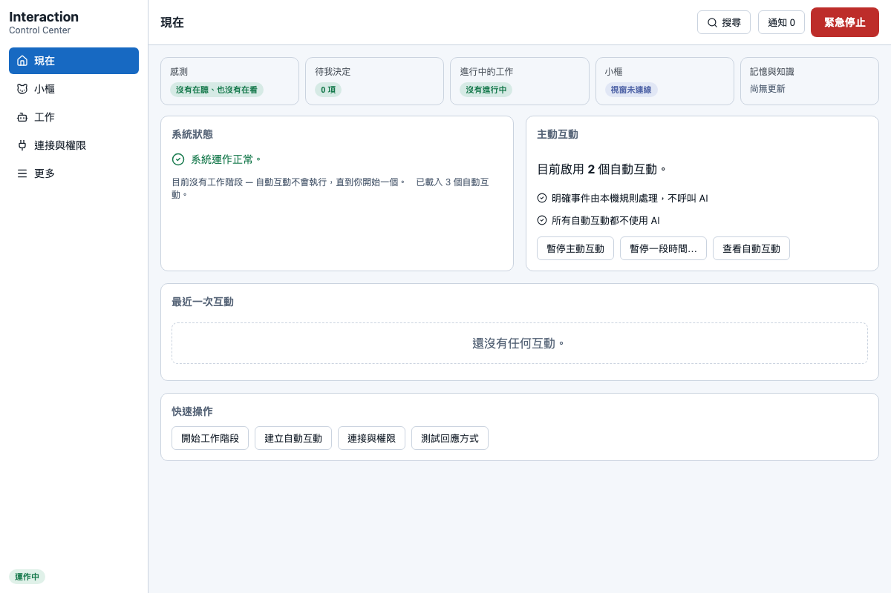

桌面控制中心是**人類的駕駛艙**：設定、測試、監控、授權、喊停。
它不是 AI 使用 Runtime 的必要條件——沒有它，CLI／API／Skill 一樣全功能。

> v0.5 的一級導覽是 **5 個入口：現在、角色（顯示目前角色的名字，預設「小樞」）、工作、連接與權限、更多**。
> 待決定事項走右上角 **Inbox**。每項設定只有一個主人：角色的外觀、名字、陪伴方式、主動對話與安靜時段都在「角色」頁；
> 一般／進階模式的切換在「更多 → 進階模式」。
>
> 本文描述的是 v0.5.1（產品完成度修補，2026-09-04；`docs/v05-capability-gap-matrix.md` §13、
> `CHANGELOG.md` 的 v0.5.1 段）的控制中心：工作頁預覽收斂為三個回答、送出結果六態投影與新的工作狀態
> 用語、原生資料夾選擇器（已在真 Tauri 視窗驗收）、連接與權限改裝置優先五區＋iPhone 重新配對與連接
> 診斷、角色頁一般／進階分層、「更多」分頁改名（記憶與資料／活動紀錄／外觀與語言／備份與還原／進階模式）、
> 首次設定精靈的套用前確認對話框。
>
> 截圖狀態：`assets/v05-evidence/` 底下 **39 張已由 v0.5.1 的 Playwright evidence spec 重新產生**
> （2026-09-04，寬版＋390px 窄版；`pnpm test:e2e` 的 evidence spec，瀏覽器版控制中心）。
> 少數本輪 evidence spec 沒有拍攝的舊圖仍留在同一資料夾——`desktop-companion.png`、`desktop-work.png`、
> `desktop-connect.png`、`desktop-more.png` 是較早一輪的版面，**已在圖說標明**。
> **核對版面時以本文的文字敘述為準。** v0.2–v0.4 的圖片一律視為升級歷史，集中在文末。

## 啟動

```bash
cd apps/interaction-desktop
pnpm install        # 第一次
pnpm tauri dev      # 開發模式
# 正式打包：pnpm tauri build
```

啟動時 `RuntimeSupervisor` 會先偵測是否已有 `interact-ai serve` daemon：

- **有** → app 連上那個外部 Runtime（前端改走 HTTP，token 由後端安全取得）。
  此時「完全結束」只會關閉這個 app 視窗，**不會**停掉外部 daemon。
- **沒有** → app **內嵌**同一套 Rust Runtime，並開放 `127.0.0.1:8787` 的 HTTP API，
  所以桌面開著時 CLI 和 AI 連的就是同一個實例。

> 自 v0.3 起關閉控制中心視窗只會隱藏它（**狀態列常駐**）；狀態列 icon、桌面角色與你允許的自動互動仍保持啟用。
> 第一次關閉時會顯示說明對話框，讓你選「保持運作」或「完全結束」。

## 狀態列（常駐）

平常桌面你只會看到**狀態列 icon** 與（可選的）**桌面角色**。狀態列選單提供：

- 系統狀態／主動互動狀態／AI 工作階段數量（永遠有文字，不只靠顏色）
- 顯示／隱藏桌面角色、開啟控制中心
- 暫停主動互動、暫停一小時
- **緊急停止**（直接走 Rust，不經 WebView，永遠可用）
- 設定、**完全結束**（優雅關閉內嵌 runtime：取消未完成動作、停止感測器、
  關閉 agent session、保存 receipt、釋放鎖）

正在使用麥克風／攝影機時，狀態列 icon 與選單會顯示，控制中心頂部也會出現橫幅
（誰啟動的、用途、幾秒後自動停止、立即停止按鈕）——**沒有任何靜默擷取路徑**。
狀態列的狀態與下面的「安全狀態」覆蓋視窗來自同一份 Rust 端 `HostSafetyView`，不會各說各話。

## 「安全狀態」覆蓋視窗（可信 host）

v0.5 Phase 8 新增一個由 Rust host 直接控制、**角色與任何第三方 adapter 都碰不到**的小視窗，標題「安全狀態」，
固定停在主螢幕右上角（340×200、透明、不搶焦點、不擋滑鼠、所有工作區都看得到）。它**只在有事時出現**，
沒事就關閉：

| 顯示的字 | 什麼時候出現 |
|---|---|
| 緊急停止中 | 緊急停止被觸發、尚未解除 |
| Runtime 離線 | 後端連不上（啟動中的短暫寬限期除外） |
| 麥克風使用中 | 任何麥克風類感測啟用（含 iPhone 的 mic-level） |
| 攝影機使用中 | 任何攝影機類感測啟用 |
| 感測使用中 | 其他啟用中的感測器（列出啟動者、用途、自動停止時間） |

它與狀態列一樣每 4 秒對帳一次，內嵌模式下緊急停止／感測啟停會立刻刷新。關閉控制中心視窗、隱藏角色、
切換角色都不會影響它——這就是「感測不靜默」與「安全提示不能被角色包蓋掉」在畫面上的落實。

## 桌面角色（預設小樞）

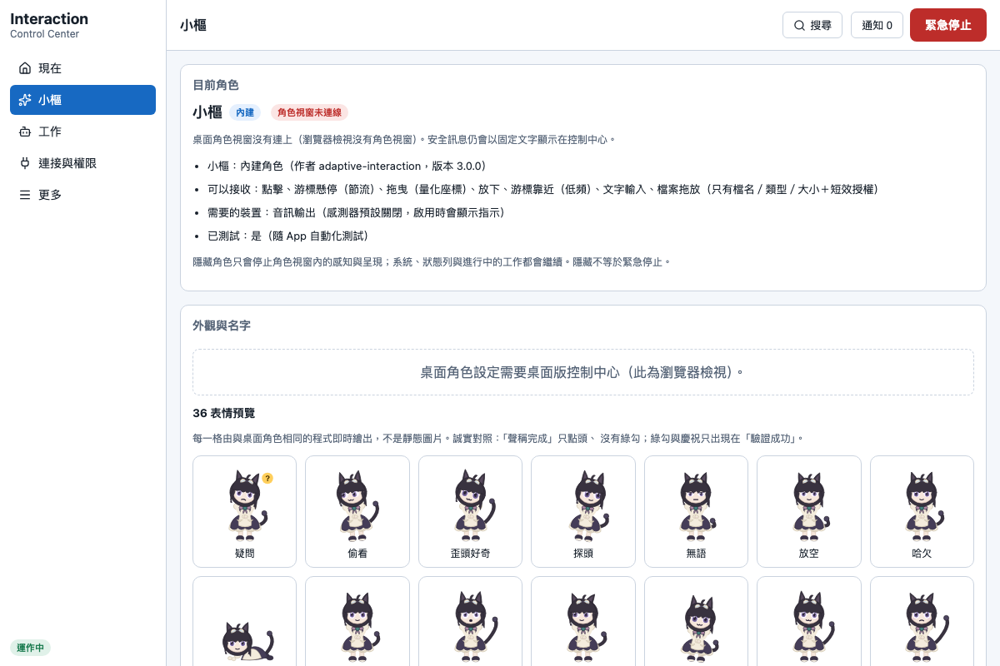

桌面角色是**呈現層與輸入入口**，不持有任何權限。從 v0.5 Phase 8 起，角色視窗內的角色都透過同一份
**Character Presentation Protocol（CPP v1.0，`docs/character-protocol/README.md`）** 接上 Runtime：Runtime 只送
語意化的「意圖」（例如 工作中／等你回答／說做完了／驗證成功／緊急），角色 adapter 自己決定怎麼演。
小樞（`shu-rig`）是第一個完整的參考 adapter；另有 `sprite`（舊 v1／v2 角色包相容層）與 `text`（純文字，最小角色）。

- 感知時左耳亮冷藍、行動時右耳亮暖橘、思考時胸口核心轉動
- **「說做完了」只點頭；綠色勾勾只在你真的驗證過結果（verified）才出現**
- 結果不確定顯示黃色問號、被阻擋顯示盾牌、緊急停止固定安全姿勢並顯示「緊急停止中」
- 角色包可以換說話風格（Persona），但**安全訊息永遠是固定的標準文字，任何角色包都無法覆寫或隱藏**

**點一下**角色打開快捷選單：玩具（丟給角色玩、收走玩具）、對〔角色名〕說話…、查看目前工作、暫停一小時、
一小時內不要主動說話、今天安靜一點、開啟控制中心、緊急停止；**拖放檔案**會先顯示清單與資料去向再確認。
原始游標座標只存在角色視窗記憶體，不持久化、不傳 AI——只有語意事件（靠近／點擊／拖放）會進入 Runtime。

**角色顯示不出來時改用文字。** 角色 adapter 載入失敗、崩潰、或被停用時，視窗會退回純文字角色，並顯示
「角色載入失敗，改用文字顯示」（固定文案，不是 adapter 說的；`companion-gateway-wiring.test.ts` 釘住）；
Runtime 離線時「現在」頁第一屏顯示的是另一句固定文案「角色離線，改用文字。」；角色頁則標示「角色目前無法
顯示，改用文字」——三句是刻意不同的固定文案，對應三種不同狀態（視窗內載入失敗／Runtime 離線／角色頁投影）。
安全訊息（緊急停止、被擋下、結果不確定）在文字模式一樣會出現，不會因為沒有動畫就消失。

v0.5 預設角色是 **shu-maid**（Q 版貓娘女僕 rig；經典／dusk／sakura 三種配色是三個兄弟角色 id）。

## 誠實階梯：用你的話說

系統裡每個結果都會告訴你**它到底知道多少**，畫面上的每一句文案都遵守這條階梯，不會往上跳：

| 你看到的字 | 真正的意思 | 不代表 |
|---|---|---|
| 已排入 | 系統接受了、排在佇列裡 | 已經送出去 |
| 已送出 | 交給裝置／服務了 | 對方收到了 |
| 已收到 | 對方確認收到 | 效果真的發生 |
| 說做完了（claimed） | 執行者**自稱**完成 | 有人查證過 |
| **驗證成功（verified）** | **你（人類）或可觀察到的效果確認了** | — |
| 結果不確定 | 系統不知道結果，**不會自動重試**（避免重複副作用） | 失敗 |
| 被擋下 | 政策／同意／緊急停止阻止了 | 出錯 |

角色的演出也有自己的一階：「演完了」只代表動畫播完，**永遠不等於工作驗證過**；角色視窗斷線時進行中的演出
一律記成「不確定」，不會補成「完成」。綠色勾勾、「驗證成功」這兩個訊號只有 Runtime 在人類驗證路徑後才會發，
AI、角色包、第三方 adapter 都製造不出來。

## 兩種模式

- **一般模式（預設）**：全部人話、全部卡片。不需要理解 UUID、YAML、JSON；技術資料折疊在各頁的「技術資料」裡或完全不顯示。
- **進階模式**：在「更多 → 進階功能」打開「顯示進階功能」後，側欄多出原始技術頁面
  （總覽（原始）／受器／動器／工具／配方 YAML／政策／同意／時間軸／Provider Registry／Knowledge Graph），
  各頁詳情也會多出技術 ID、manifest hash、Behavior State 與原始資料。

兩種模式共用同一套後端狀態與安全規則；模式偏好存在後端，CLI（`interact-ai prefs`）也能讀寫。
「設定」頁只顯示目前是哪個模式並連到「進階功能」，不再自己持有那個開關。

## 首次設定精靈與首次成功體驗

第一次啟動自動開啟（設定頁「重新執行首次設定」可隨時重來）。三步：**選擇角色與陪伴方式 → 選擇 AI 工作方式 →
確認安全與權限預設**。

- 只預選低風險、本機、不需硬體的能力；**攝影機／麥克風／位置／對外寫入永不預選**。
- 「選擇 AI 工作方式」一步只做 Codex／Claude Code 的安裝與登入狀態檢查、寫入 agent 分工路由，不授權任何工作區寫入。
- 中途關閉只留草稿；按「完成設定」會先呼叫零副作用的試算端點（`POST /v1/onboarding/preview`），彈出
  **「套用前確認」**對話框列出真的會變動的項目（能力開／關、要安裝的起步範本、安全設定），按「套用」才真的
  一次套用（走與 CLI／API 相同的 governor 驗證路徑）；試算失敗會退回本機估算並在畫面上明說「以本機快照估算」。
- 硬體掃描、iPhone 配對、安靜時段細調移到第一次真正需要時再詢問。「掃描目前可用的互動能力」只讀 metadata，
  畫面會顯示 `sensorActivationAttempted:false`——不代表找到所有硬體。
- **重新執行**時不會靜默停用你已經啟用、但不是新手安全預設的能力（例如已配對 iPhone 的動作感測）；只有你在
  精靈裡自己改動的項目才會出現在套用前確認清單裡。

精靈完成後接著**首次成功體驗**：「〔角色名〕準備好了。要不要先試一次？」，五個選項——

| 選項 | 做什麼 | 誠實邊界 |
|---|---|---|
| 提醒我休息 | 走既有的計畫路徑送一則本機提醒（通知或角色氣泡），**不建立任何 AI 工作** | 結果以收據狀態顯示（已排入／已送出／已收到／結果不確定），不會寫「已確認你看到」 |
| 交代一件小工作 | 預填一句任務後前往「工作」頁 | 工作流程本身在工作頁，這裡不啟動 agent |
| 先在桌面陪我 | 把角色顯示在桌面上（隨時可隱藏） | — |
| 更換角色 | 前往「角色」頁 | — |
| 先不用 | 關閉 | — |

這個畫面只出現一次；「已看過」的旗標存在後端 UI 偏好（`firstSuccessSeen`），後端沒有回應時才退回這台機器的
瀏覽器儲存（畫面會註明）。

## 五個入口

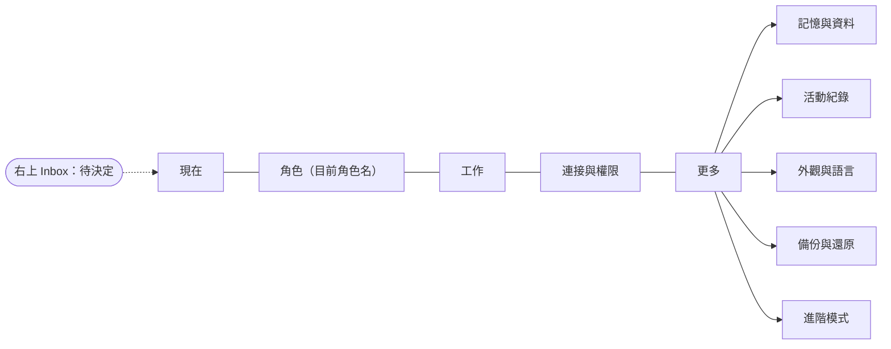

舊的 v0.4 九頁 tab id（感知來源／回應方式／工具操作／自動互動／同意與安全／活動紀錄／記憶與知識／設定…）仍可深連結，
會落到對應的入口與分頁。

### 現在

第一屏只回答三個問題，每個都是一張卡：

1. **角色現在怎麼樣**——一句話（連線／顯示／暫停／緊急停止／啟用中的感測），角色顯示不出來時寫「角色離線，改用文字。」
2. **正在做什麼**——進行中工作以人話狀態投影（排隊中／進行中／等你回答／說做完了／驗證成功／結果不確定…）。
3. **有什麼需要處理**——待決定（同意、agent 等待、知識複審），按下去進 Inbox 或對應頁。

**快速操作**：交代一件事（輸入一句話 → 前往「工作」並預填）、暫停主動互動／暫停一段時間…（或恢復）、加入裝置（→ 連接與權限）、
停止所有感測（誠實逐項回報：送出只說「已要求停止」，仍在使用中或沒回應一律說「結果不確定」，絕不用「已停止」冒充送出）。
首頁也有自己的緊急停止按鈕（與頂欄同一條路徑，觸發後同樣二段確認），沒有解除入口——解除一律在「連接與權限 → 同意與安全」。
系統狀態、工作階段、自動互動的數量、最近一次互動、記憶與知識摘要全部收進**「詳細狀態」折疊區**（展開才查詢）。
三區權限地圖不在這裡，唯一的家是「連接與權限 → 同意與安全」。

### 角色（顯示目前角色的名字）

側欄這一格顯示目前角色的名字（預設「小樞」；你改過名字就顯示你取的名字；角色還沒載入前顯示中性的「角色」）。
v0.6.x 起頁面分成**首屏三格**與**按需展開**的收合區塊（首屏可互動控制項從 40 個收斂到 5 個；展開後所有原本的設定都還在，
沒有拿掉任何功能；收合區塊是原生 `<details>`，鍵盤可達、有可及名稱、不做動畫）：

| 首屏 | 內容 |
|---|---|
| 目前角色 | 名字、來源（內建／匯入／外部）、即時狀態（角色視窗運作中／已隱藏／準備中／角色視窗未連線／角色目前無法顯示，改用文字）、預覽（小樞是 36 表情預覽；sprite 角色是動作預覽；文字角色是文字範例）、「顯示桌面角色」主要開關 |
| 陪伴方式 | 四個檔位：**安靜／自然／活潑／自訂**——只是可解釋的設定組合（表現程度＋勿擾＋主動說話的模式三個既有欄位），套用預設不覆蓋其它自訂值、不改費用上限、不啟用任何權限、不換 AI 幫手；目前的有效值逐項可讀（不吻合任何檔位就顯示「自訂」）。「調整陪伴方式」展開：表現程度、說話風格、角色自己宣告的偏好、遊玩場／基本開關、重看角色劇情。套用失敗的訊息留在首屏 |
| 同步 | 手機上的角色和這台電腦是不是同一個狀態（見下方「角色同步」；每一種狀態都有下一步） |

| 收合區塊（按需展開） | 內容 |
|---|---|
| 外觀與名字 | 取名字（≤24 字）、配色／變體、大小、透明度、保持在上方、重設位置 |
| 安靜與勿擾 | 一張「實際影響」清單，五項各自標示由哪個設定控制與現在的有效狀態：**安全提示**（固定安全文字，永遠顯示、任何安靜設定都關不掉）／**感測提示**（感測器使用中一定顯示）／**視覺陪伴**（勿擾開關＋桌寵右鍵設的本機安靜期，可在此取消）／**主動說話**（主動式對話的模式＋它自己的「一小時內不要主動說話／今天安靜一點」＋勿擾時段只延後非必要訊息）／**工作通知**（安靜時段）。這五項**不是同一個開關**。「主動程度與安靜時段」仍是**唯一的編輯處**（同意與安全頁只顯示摘要） |
| 主動式對話 | 由本機 AI 幫手產生的主動訊息。**收合時摘要行仍顯示有效上限**（每小時最多 N 則・最短間隔 N 分鐘・每日最多 N 則・費用上限 USD N・AI 幫手：實際那一家）——收起數字調校不等於藏起使用成本或重新授權；展開才可改 |
| 更換或加入角色 | 預設只列出使用中的角色與最近／常用的 3 張，其餘收在「顯示全部角色（另外 N 個）」後面；角色卡片（內建／匯入；一般模式只標示內建／第三方、可接收、已測試三個徽章；需要額外授權的角色只給一句人話——「這個角色需要額外授權：在你的電腦上執行它自己的程式、連上網路。控制中心不會自動執行它的程式、也不會自動連線。」外部／可執行程式／需要網路徽章與執行位置欄位只在進階模式出現）、選用、停用、移除、**匯入角色** |

**匯入角色**：一般模式只有「選擇角色描述檔」的檔案選擇器（沒有貼上原文的輸入框；進階模式才有）並提供它宣告的資產。
驗證器錯誤在一般模式只顯示問題數量摘要（例如「角色描述檔不符合規格（N 個問題）；請向角色作者索取正確的檔案。」），
原文收在收合的「問題明細」裡；進階模式才顯示驗證器與 host 的原始錯誤訊息。匯入只做驗證與存檔，**不會執行任何程式、不連線、不下載**；
這個版本只接受 in-process 的內建 entrypoint（shu-rig／sprite／text），單一資產上限依 manifest（最高 32 MB）、總量 32 MB，
資產內容用 magic bytes 核對宣告的媒體類型。內建角色 id 不能被覆蓋；純文字角色不能停用（它是備援）；
只有非內建角色可以移除。

> 匯入成功的角色會出現在卡片清單並可選用；角色視窗會從匯入資料夾建 adapter（文字／sprite／shu-rig），角色宣告的偏好與
> 變體會轉給 adapter；桌面程式把偏好存在 `companionPreferences`（每角色 ≤32 個布林／數字／字串）。**誠實邊界**：匯入角色
> 已於 v0.5.1（2026-09-04）在**真 Tauri 視窗**以原生 Open 對話框選擇真實資料夾走過完整流程（驗證 → 匯入 →
> `state/characters/<id>/` 建立）；任何載入失敗都退回純文字角色並顯示固定文案。**adapter 崩潰後的 fallback
> 仍只有單元測試覆蓋**，無法在真視窗誘發。

> **角色視窗會被主視窗蓋住（正常的 macOS 行為，不是缺陷）**：角色視窗沒有開「保持在其他視窗上方」時，
> 把控制中心疊上去就會蓋住它。被遮蔽時 WebKit 會暫停繪製，Runtime 因此每 20 秒左右會收到角色視窗重新
> 打招呼（instance generation 增加）；把角色移出遮蔽範圍就恢復、generation 停止增加。要讓角色永遠在上面，
> 開角色頁的「保持在其他視窗上方」。

**技術資料**（只在進階模式）：Character Pack 詳情、現在的 Behavior State、adapter 型態、協商結果、instance 世代等原始資料。

#### 角色同步

「同步」卡回答一個問題：**手機上的角色，和這台電腦上的角色，是不是同一個角色？**
內容全部來自 Runtime 的權威狀態（`GET /v1/character-session`）＋已配對裝置清單，沒有示範資料。

| 你看到的 | 意思 |
|---|---|
| iPhone 已連接，角色狀態已同步 | 手機和這台電腦看到的是同一個角色狀態 |
| 有裝置收不到完整狀態 | 這台裝置的連線只送得進一部分內容；它看到的角色不一定和這台電腦一樣，不算已同步 |
| iPhone 正在重新連線 | 連線斷了一下，正在接回來；這段時間的互動不會補播 |
| iPhone 暫時離線 | 手機現在收不到角色狀態，也送不出互動 |
| 部分能力目前不可用 | 狀態已經對齊了，只是這台裝置演不出角色的部分表演——這不是同步故障；做不到的不會假裝做到 |
| iPhone 已連接，能力核對中 | 狀態對齊了，但這台電腦還拿不到「它演得出哪些表演」的協商結果；在確認之前不算完全同步 |
| 同步尚未完成 | 還在對齊；在這之前不要把畫面上的樣子當成最新的 |
| 無法恢復，請重新連接 | 連續好幾次都對不齊，需要你重新連一次裝置 |
| 需要重新確認裝置 | 有裝置現在連著這台電腦，但還不是角色同步的成員（撤銷過的裝置重新連上來也算）；要再同步必須在手機上重新確認一次 |
| 尚未連接 iPhone | 目前只有這台電腦在陪你（中性狀態，不是成功也不是失敗） |
| 目前只在這台電腦使用 | 之前移除過的手機不會自動回來；要再用手機時重新配對一次就好。這是移除之後的正常狀態，不是故障 |
| 角色同步目前關閉 | 這台電腦沒有啟用角色同步；其他功能不受影響 |
| 同步紀錄暫時存不下來 | 這一輪的同步紀錄存不下來（或目前寫不進去），重新啟動之後會再試；角色和裝置的連線不受影響。它講的是紀錄不是角色，所以既不是綠色也不是紅色 |

紀錄**曾經**重建過（例如上次壞檔被隔離）只會在卡片下方出現一句灰色附註，不再當成警告——它在同一次執行期間
不會消失，當成警告會讓你從此看不到綠色。

「有裝置收不到完整狀態」底下，每一台裝置還會各自說明是哪一種情形：**只接收指令**、**只回報事件**，
或**尚未確認能收到完整狀態**（這台裝置說它收得下完整的角色狀態，但還沒有任何一份真的送達過——
還沒證明收得到，不等於收不到，所以它既不給綠勾，也不會被寫成「收不到」）。

- **每一種狀態都有下一步**：需要你做事的狀態會多一顆按鈕（連接手機／去重新確認／看看少了什麼／重新連接手機），
  一鍵到連接與權限頁；已同步、正在同步、已關閉不給按鈕（不催促你去修沒壞的東西）。

卡片下面是同步中的裝置（每台一行：已連接／重新連線中／離線／狀態不確定）與最近一次互動的人話
（例如「iPhone 摸了摸角色」）。**緊急停止中**會多一句固定安全句：「緊急停止中：角色已停止表演，
解除前不會接受任何互動。」——角色與任何 adapter 都無法覆寫或隱藏它。

- **連上 ≠ 已同步**：連接與權限頁的手機卡上另有一行「角色同步：…」，把「手機連著」和「角色同步中」
  分開講。手機連著但還沒重新確認時，顯示「尚未同步（需要在手機上重新確認）」。
- **空狀態不是成功**：沒有裝置時是中性灰的「尚未連接 iPhone」，不會出現綠勾。
- **一般模式看不到技術數字**：revision／sequence／counters 只在進階模式的「連接診斷」收合區塊。
- 桌面角色被點一下時，除了照舊記成一筆觀察，也會送一則語意事件進角色同步——手機那頭才知道
  角色被摸了一下。**送出 ≠ 生效**：Runtime 說 `applied` 才代表狀態真的改了。
- 目前的驗收證據是【模擬 iPhone（fixture）】的瀏覽器 journey（`e2e/character-session.spec.ts`）；
  **iPhone 真機的角色同步驗收仍為零**。

### 工作

任務優先：先問「**想讓〔角色名〕幫你做什麼？**」，再決定怎麼分工。

- 輸入框：任務描述（第一行會變成工作的標題）、**加入檔案或選擇資料夾**（路徑文字欄；桌面版有原生資料夾選擇器
  按鈕——`tauri-plugin-dialog`，僅 main 視窗；瀏覽器版誠實顯示「瀏覽器版沒有原生資料夾選擇器；請貼上資料夾
  路徑。」，不是點了沒反應的假按鈕；打不開對話框時照實說明原因，不冒充「沒有資料夾選擇器」）、**這是哪一種
  工作**（寫程式／對話／整理知識／審查）。
- **開始前預覽**（永遠先看再開始，只回答三件事）：**這次會讀取什麼**（誠實描述——系統擋得住「改不到別的地方」，
  不宣稱只讀取這個資料夾以外完全不會被看到）／**會不會修改內容**／**最多使用多少時間與費用**。使用哪個
  Agent、工具、沙箱、訊息上限、原始授權範圍等技術細節收進可收合的「**查看技術細節**」。預設唯讀、30 分鐘 TTL、
  費用上限 0.5 USD；勾選寫入後還要第二次確認（文字印出完整路徑與到期時間），換一個資料夾會讓先前的確認作廢。
- 「精靈選擇：…」顯示首次設定時選的分工；**調整分工**展開「**工作設定**」折疊區（agent 分工路由與本機 AI 幫手的偵測、登入狀態）。
- 「開始」建立工作階段並送出任務；送出後**不會**印固定的「已送達」，而是依後端的真實訊號顯示六種送出結果之一：
  **已送達／尚未送達（已放進信箱）／排隊中／Agent 不可用／傳送失敗／結果不確定**，每種各附一句人話與誠實註記——
  **只有後端蓋了送達戳記才會說「已送達」**。原始後端文字只在進階模式顯示。
- 下方列表以人話狀態顯示每個工作：**正在準備／已交給工作助手／處理中／等你回答／等你允許／對方說已完成／
  已由你確認／逾時失敗／失敗／已取消／結果不確定**。「對方說已完成」保留警示徽章、「對方的說法，尚未檢查」
  註記與待你裁決，**永遠不會出現綠勾**；綠勾只在你按下「標記為已驗證」之後。
  一般模式不顯示 JSON；「技術詳情」只在進階模式。
- 第二個分頁「自動互動」是句子式編輯器與模擬（見下）。

> **已在真 Tauri 視窗驗收（v0.5.1，2026-09-04）**：原生資料夾選擇器四列都以實際 `.app` 視窗＋原生
> NSOpenPanel 走過——取消（Escape 後欄位仍空、沒有錯誤文案）、選擇（欄位顯示實際路徑、預覽「不會修改：
> 這次只看不改」）、唯讀不取得寫入範圍（API 回 `allowWrite:false`、`toolScope:[]`、`resolvedWorkdir` 未擴大）、
> 勾寫入需第二次確認（預覽列出完整路徑與到期時間，不勾第二個核取就無法以寫入模式開始）。
> **仍然沒有自動化**：vitest 的 IPC 是 mock、Playwright 跑瀏覽器版（沒有 Tauri IPC），每次改動仍需人工
> 重跑真視窗驗收。逐項見 `docs/releases/v0.5.1-test-matrix.md`。

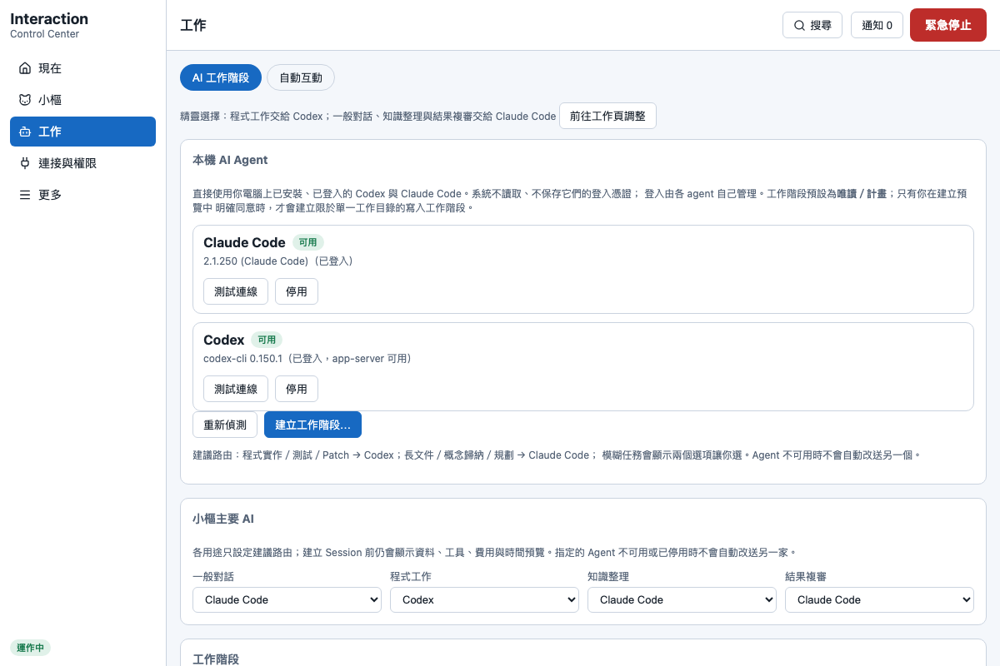

### 連接與權限

兩個分頁：**裝置與能力**、**同意與安全**。

**裝置與能力**以「裝置優先」用五個區塊回答，順序固定：

| 區塊 | 內容 | 按鈕 |
|---|---|---|
| 已連接的裝置 | 每台已配對 iPhone 一張卡（可以提供／可以執行／目前使用中的感測）＋硬體來源（六階：只發現／已配對／已安裝設定尚未連線／已連線尚未測試／已測試／已啟用）＋**角色如何接上系統** | 加入或掃描裝置 |
| 系統可以看見什麼 | 已啟用的感知來源（人話名稱、影響徽章） | 管理感知來源 |
| 系統可以做什麼 | 已啟用的回應方式 | 管理回應方式／工具操作 |
| 目前需要確認的權限 | iPhone 上還沒允許的系統權限、待決定（同意、agent 等待）、目前授權 | 處理 |
| 立即停止與撤銷 | 緊急停止狀態（觸發鍵仍在右上角）、停止所有感測、撤回全部授權 | 查看同意與安全 |

**iPhone 卡片**（同一個元件也用在第二層的 iPhone 區，只有一份真相）：卡片內容全部來自 Runtime 的真實狀態——
`mobile_status`（連線、手機自報的感測與 iPhone 上的權限）、能力清單（可以提供／可以執行，含每項的可用狀態）、
`status.activeSensors`（用 `startedBy` 精確比對這一台）。按鈕：管理權限／測試連接／停止感測／**重新配對**／移除此手機（二次確認）。
**重新配對**會把你帶到既有的配對區（「全部能力與裝置」裡的 iPhone 配對）；手機未連線時卡片會多一行提醒
「若桌面的網路位址變了，需要重新配對。」——桌面換 IP 後手機沒有 Bonjour 探索，位址是釘在配對當下的。
**連接診斷**（只在進階模式）把 deviceId、pairedAt、原始連線狀態與手機自報的感測旗標原始值收成一個區塊；
**一般模式完全不顯示這些**。
誠實階梯：**停止感測**送出後只說「已要求停止（以手機回報為準）」，只有後端回報手機已停止才寫「已停止」，送不到就寫「未送達（手機未連線）」；
非手機來源（例如經宣告式 adapter 的 Serial 裝置，回報在 `sources[]`）一台一句：`stopped`→「已停止（裝置回報已停止）」、`already-stopped`→「本來就沒有在感測」、
`unreachable`→「未送達（裝置未連線），感測狀態未變」、`refused`→「裝置拒絕停止，可能仍在感測」、其餘→「已要求停止；裝置還沒回報，結果不確定」；
名稱只用後端給的人話標籤，沒有就寫「某個裝置」，內部 id 不上畫面；
**測試連接**有回應只寫「有回應（N ms）——只代表連線還在，不代表手機 App 的功能都能用」，沒有回應一律「沒有回應（結果不確定）」，永遠不寫「已測試」。
手機未連線時這兩顆按鈕停用並說明原因。

> 目前的限制：**停止感測**（`POST /v1/mobile/devices/{id}/sensors/stop`）已於 2026-09-03 在 iPhone 11 真機
> 驗證（313 ms 內收到手機狀態確認），見 `docs/releases/v0.5.0-iphone-device-evidence.md`；**測試連接**
> （`POST /v1/mobile/devices/{id}/test`）仍只在程序內模擬器與 fixture 上驗證過，未經 iPhone 真機驗收。

五區下方是展開狀態的「**全部能力與裝置**」，裡面就是完整的能力中心（感知來源／回應方式／工具操作／裝置與來源／硬體掃描／iPhone 配對），
每張卡片都有誠實的確認層級（「可以確認：通知已送達作業系統／無法確認：你是否已經看見」）與「來源尚未提供完整的資料與影響說明」的保守提示。
一般模式不出現裝置識別碼、埠號、線路名稱（USB Serial／Bluetooth LE／mDNS／Bonjour）與原始能力 id——那些只在進階模式出現。

**角色如何接上系統**（在「已連接的裝置」內）：每個角色 adapter 一列——內建或第三方、本機或外部、是否有可執行程式、是否需要網路、
可以接收哪些資料、是否已測試、連線中與否；外部 adapter 可以在這裡**撤銷**（立即斷線，不會自己回來）。
桌面角色的呈現層 provider 也列在完整能力中心裡，並註明「這是桌面角色的呈現層：只負責演出，不持有任何權限。」

> 「可以接收」／「有可執行程式」／「需要網路」來自 adapter 的 manifest（`inputCapabilities`／`executable`／
> `network`），就算 adapter 從未連線也會顯示；只有連到不回報這些欄位的舊版 daemon 時才顯示「未回報」——那是
> 介面拿不到資料時的誠實文案，不是裝置真的沒有能力。

**同意與安全**：使用授權（能力選擇器授予／撤回，撤回後明確顯示「新動作已阻止；進行中的已要求取消」）、風險分級 L0–L4 的人話說明、
安全規則摘要（編輯在角色頁）、**緊急停止解除流程**（顯示停止原因與時間、列出「會恢復／不會自動恢復／你先前已停用因此仍為停用」三份能力清單、再次確認；
高風險與需同意能力永不自動恢復，解除也**不會**替你重新啟用你自己關掉的能力）。緊急停止由右上角紅鈕**二段確認**觸發，觸發後右上角變成「緊急停止中 — 前往解除」。

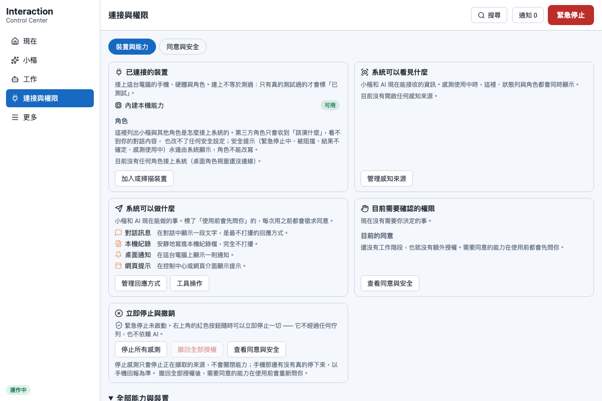
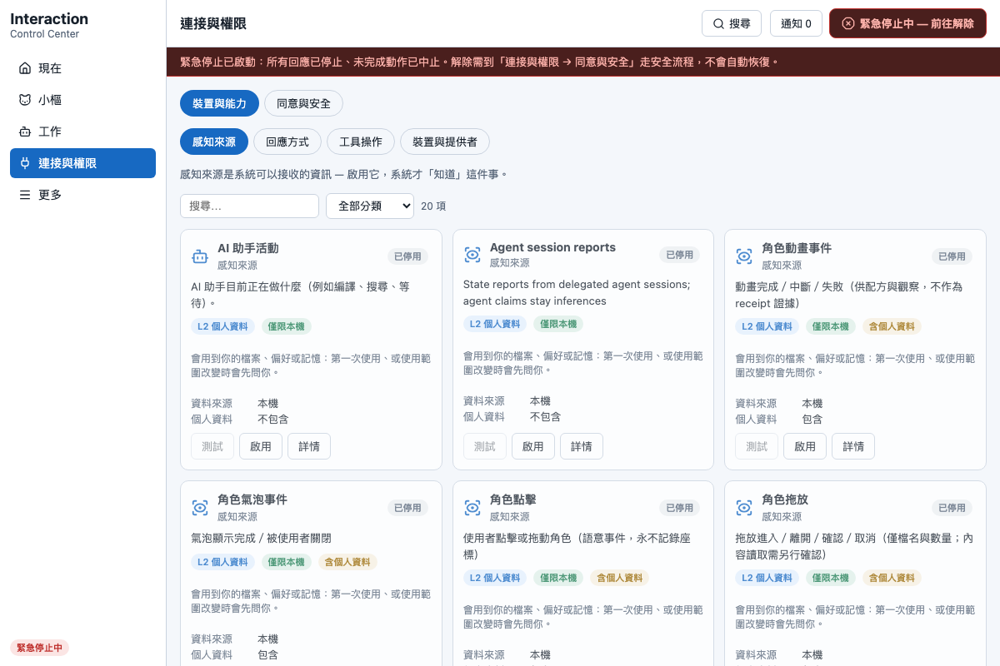

### 更多

| 分頁 | 內容 |
|---|---|
| 記憶與資料 | 一般模式只有三區：關於我的記憶／〔角色名〕學會的知識／素材與來源；可執行更新決策、送出使用者糾正、複審。使用者糾正不會直接變成普遍知識；匯出／還原搬到「備份與還原」，這裡留一顆指路按鈕 |
| 活動紀錄 | 人話的活動故事，嚴格區分 已規劃／已授權／已排入／已送出／已收到／說做完了／驗證成功／被擋下／已取消／結果不確定；原始 receipt 只在進階 |
| 外觀與語言 | 語言／外觀／縮放／Reduced Motion、視窗與啟動（關閉行為、登入時啟動、啟動時顯示角色／開啟控制中心）、重新執行首次設定 |
| 備份與還原 | 「匯出記憶」產出的是**匯出的記憶檔**，不是完整備份——範圍由後端回報並逐項轉述（含：記憶項目；不含：知識節點、素材與衍生物、知識收據、角色互動記憶）；單次上限 1,000 條與 5 MiB，達到上限會明說（以資料庫真實筆數判斷，剛好 1,000 條不會誤報截斷）、還原（JSON，一般模式的檔案選擇器 aria-label 為「選擇記憶備份檔」）、清除短期記憶 |
| 進階模式 | **「顯示進階功能」開關的唯一主人**；打開後這一頁展開第二層：版本與 Runtime、Provider 診斷／配方 YAML／政策原始設定、開發者工具與 api-token 路徑 |

「角色與整合管理」與「進階功能」不再是「更多」的分頁按鈕（角色管理併入「角色」頁，進階開關併入「進階模式」分頁）；
`manage` 仍是隱藏的相容路由（全域搜尋可找到，但沒有對應的分頁按鈕）。

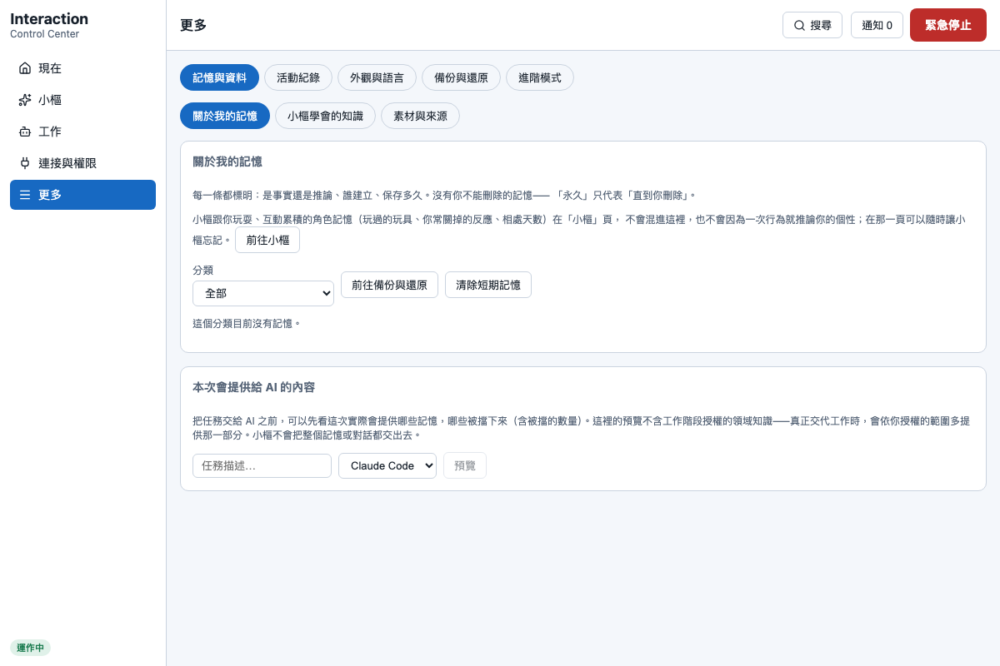

### 右上角 Inbox

同意、agent 等待、知識複審、說做完了／結果不確定／失敗與收據共用同一個資料源；待決定數量在截斷前計算；
鍵盤可完整操作（焦點圈養、Esc 關閉）。

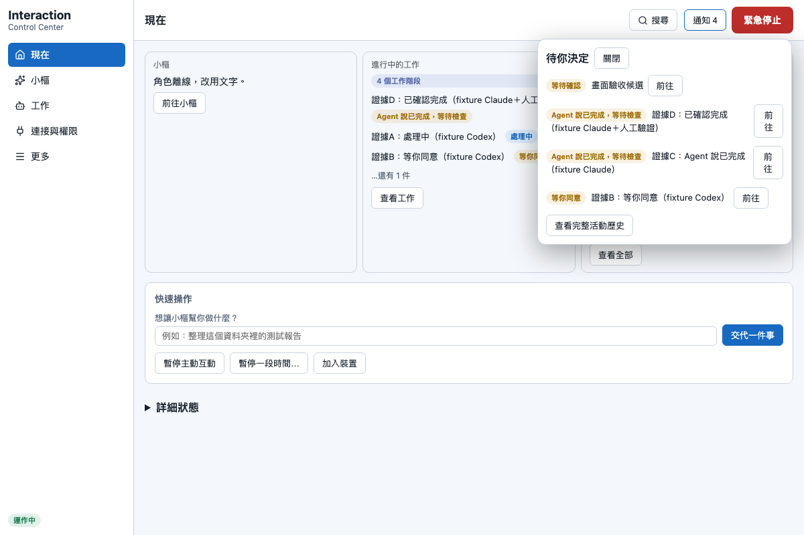

## 自動互動（工作 → 自動互動）

不寫 YAML 的句子式編輯器：「當〔感知來源＋條件〕，需要時〔AI 介入方式〕，就用〔回應方式＋模式〕，說什麼〔文字策略〕，
限制〔冷卻／頻率／允許不介入〕」。每個配方都有一段由結構自動生成的**自然語言摘要**（跟實際設定永不脫節）。

- **模擬**：切換情境（安靜時段／缺少同意／AI 無法使用／低信心／資料過期／最近已提醒過／緊急停止中），
  逐步顯示觸發→頻率→同意→AI→計畫→安全的判斷，保證零副作用。
- **啟用前影響預覽**：列出「這個自動互動會…／不會…」。
- 含進階結構（多重觸發、自訂欄位）的配方會標示「包含進階設定」，未知欄位在編輯與儲存過程中**原樣保留**（YAML↔JSON 無損轉換）。

## 主動互動暫停 vs 緊急停止

| | 暫停主動互動 | 緊急停止 |
|---|---|---|
| 定位 | 一般控制（休息一下） | 安全機制 |
| 自動互動 | 不觸發 | 不觸發 |
| 你的直接要求 | **照常執行** | 全部阻止 |
| 進行中動作 | 不受影響 | 立即取消 |
| 角色 | 照常演出、可設安靜 | 固定安全姿勢＋「緊急停止中」＋安全狀態覆蓋視窗 |
| 恢復 | 一鍵或到期自動 | 必須走安全解除流程，高風險不自動恢復 |

## 響應式與無障礙

- 視窗縮到 390px 寬仍可完成主要流程（側欄變頂列、卡片單欄；「更多」的五個分頁在窄版收成清單）。
- 完整鍵盤操作：對話框有焦點圈養與 Esc 關閉；緊急停止可用鍵盤觸發，但**單次 Enter 只會進入確認狀態，不會誤觸**。
- `prefers-reduced-motion` 尊重系統設定並轉給角色 adapter 協商（真靜態，不是慢動作）；狀態不只用顏色表達（都有文字）。

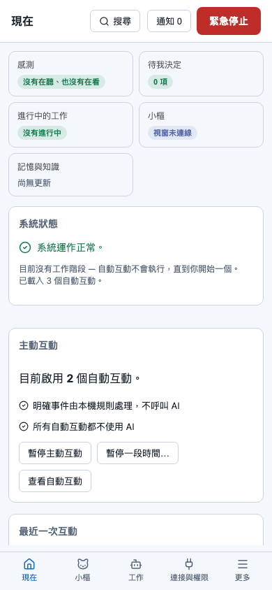

## 收據狀態機（進階）

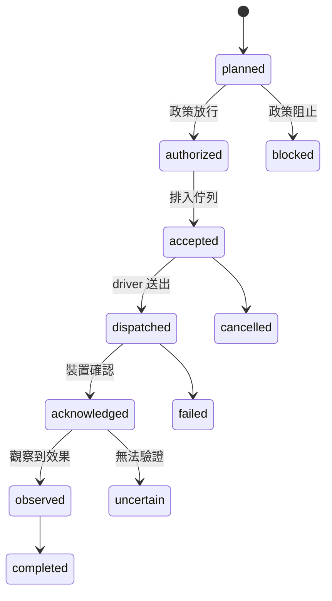

`accepted`（已排入）永遠不等於 `completed`（已完成）——UI 的每一處文案都遵守這條。

角色演出的回執是另一條獨立的階梯，永遠不回寫上面的工作驗證：

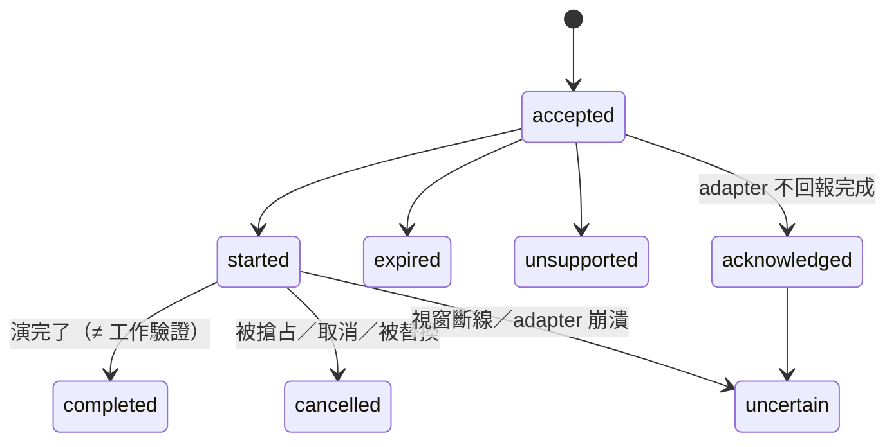

## 歷史畫面（v0.2–v0.4）

以下圖片是升級歷史，頁名與版面已不是現況，保留作為對照：
v0.4 一般模式首頁 `assets/simple-home.png`、進階模式 `assets/simple-advanced.png`、七步精靈 `assets/simple-onboarding.png`、
回應方式 `assets/simple-responses.png`、自動互動 `assets/simple-automations.png`、模擬 `assets/simple-simulate.png`、
緊急停止解除 `assets/simple-estop-recovery.png`、窄視窗 `assets/simple-narrow.png`；v0.3 關閉對話框 `assets/v03-close-dialog.png`、
sprite 版小樞 `assets/v03-companion-shu.png`、設定頁的桌面角色區塊 `assets/v03-settings-companion.png`；
v0.4 closing 證據在 [`assets/v04-evidence/`](assets/v04-evidence/)；v0.5 證據在 [`assets/v05-evidence/`](assets/v05-evidence/)，其中 39 張已由 v0.5.1 的 Playwright evidence spec 於 2026-09-04 重新產生（browser 等級），其餘為較早一輪的舊圖。
