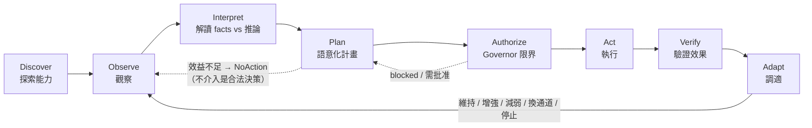
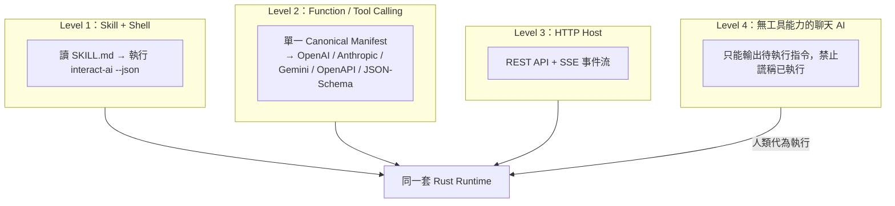
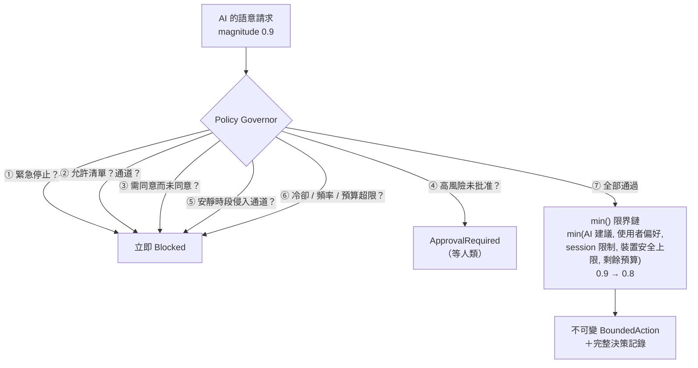

# 特點與能力

> 一句話：**讓任何 AI 先搞清楚「現在能感知什麼、能控制什麼」，再在硬性安全邊界內，
> 自己決定要不要互動、怎麼互動、以及——什麼都不做。**

## 核心循環



## 六大特點

### 1. 跨 AI——四種接入等級，不綁任何宿主



**完全不使用 MCP**——由測試強制（lockfile 斷言零 MCP 相依）。五種工具格式由同一份 canonical manifest 決定性產生，附 companion policy 保留各平台表達不了的風險 metadata，並有 golden tests 防漂移。

### 2. 受器／動器／工具三位一體

| 類別 | 內建 | 特性 |
|---|---|---|
| **受器** | `session.input`、`task.lifecycle`、`agent.activity`、`user.presence`、`system.time`、`manual.event`、`webhook.input`、`mock.receptor`、`mock.device-status` | Observation 嚴格區分 **facts**（可觀察事實）與 **inferences**（模型推論＋confidence）；過期資料自動作廢 |
| **動器** | `conversation`、`web-ui`、`local-log`、`local-notification`、`webhook.output`、`mock.actuator`（模擬實體裝置） | 每個動器自帶風險等級、裝置安全上限、是否需同意；實體／外部寫入**預設關閉** |
| **工具** | `interaction.*` 12 個 operation | 按 operation 分類角色（讀＝受器、寫＝動器）；工具結果回流成 Observation 形成閉環 |

動態擴充：執行期可新增 push 受器與 mock 裝置；第三方 driver 走 **Adapter SDK**（manifest builder＋driver receipt 協定），不必動 Orchestrator。

### 3. Deterministic 安全管家（不是提示詞，是 Rust）



- 任務重要性**永遠不會**直接變成實體強度
- pattern 一律 TTL lease＋watchdog；`repeat: forever` 被正規化為有界租約
- 派發前一刻還有 **pre-dispatch gate** 重驗（緊急停止／撤回同意的競態視窗已封死）
- 終態收據 **sticky**：一旦 stopped/expired，任何併發路徑都無法復活它

### 4. 誠實的收據狀態機——`accepted ≠ completed`

排入佇列不等於做完；`completed` 還會標注驗證等級（`observed` 環境確認 vs `acknowledged-only` 僅驅動確認 vs `uncertain` 不知道）。詳見 [DESKTOP-GUIDE.md](DESKTOP-GUIDE.md#收據狀態機) 的完整狀態圖。

### 5. 自適應配方（Recipes）——宣告式的自主行為

YAML 描述「何時（多受器融合觸發）→ 做什麼（語意 intent）→ 怎麼做（候選動器＋編排模式）→ 多克制（冷卻／預算／允許沉默）」。

- 觸發模式：`single / all / any / quorum / weighted / sequence`
- 編排模式：`single / parallel / sequence / fallback / adaptive / redundant`
- **事件消耗語意**：觸發成功即消耗匹配到的觀察事件，同一事件永不重複觸發；狀態跨重啟持久化
- 多受器融合：過期剔除、**明確人類輸入永遠壓過推論**、事實矛盾時拒絕自主行動
- 每一次「為何觸發／為何沒觸發／為何被擋」都有可讀解釋

### 6. 可解釋的效用決策＋合法的不介入

```text
Utility = 預期效益 − 干擾成本 − 風險 − 金錢/資源成本 − 重複疲勞
```

每個候選動器的分數與淘汰理由都寫進計畫；分數不過門檻且允許不介入時，產生 `NoAction` 計畫並記錄原因——**已感知但選擇沉默**是系統的一級輸出。

## 能力總覽

| 面向 | 內容 |
|---|---|
| Runtime | Rust + Tokio；watchdog TTL 掃描；crash 恢復（未完成動作→`uncertain`，高風險不自動恢復）；instance lock 單實例 |
| HTTP API | 40+ 端點、Bearer token（constant-time 比對）、SSE + Last-Event-ID 重播、payload 上限、OpenAPI |
| CLI | 40+ 子指令、`--json` 潔淨輸出、穩定 exit codes（3=離線、4=被拒、7=緊急停止中）、shell completion |
| 桌面 | Tauri 2 + React：總覽／受器／動器／工具／配方／政策／時間軸＋常駐緊急停止鈕 |
| 儲存 | File=Truth（YAML 設定人類可改）＋SQLite（收據/審計/會話）＋atomic write＋last-known-good |
| 稽核 | 每個敏感操作寫 audit；緊急停止全程留痕；敏感欄位遮罩 |
| 測試 | 105 個測試；含安全測試（未授權、撤回、超載、path traversal、雙 daemon、crash 恢復）；25-agent 對抗式審查後修復 14 項確認缺陷 |
