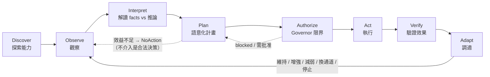
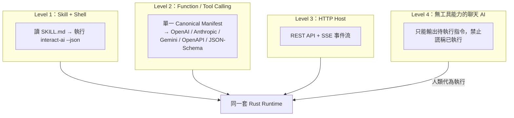
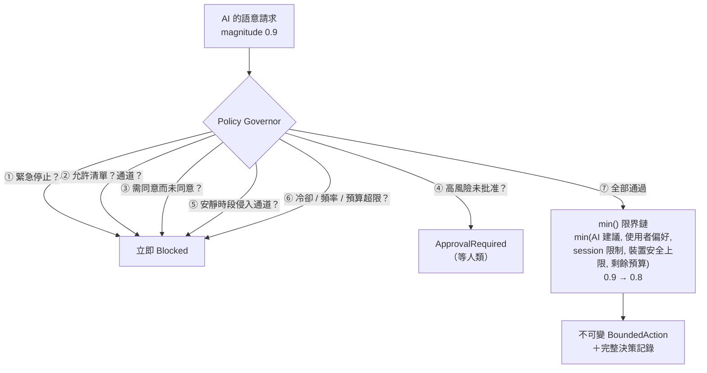

# 特點與能力

> 一句話：**讓任何 AI 先搞清楚「現在能感知什麼、能控制什麼」，再在硬性安全邊界內，
> 自己決定要不要互動、怎麼互動、以及——什麼都不做。**

## 核心循環



## 六大特點

### 1. 跨 AI——四種接入等級，不綁任何宿主



**完全不使用 MCP**——由測試強制（lockfile 斷言零 MCP 相依）。五種工具格式由同一份 canonical manifest 決定性產生，附 companion policy 保留各平台表達不了的風險 metadata，並有 golden tests 防漂移。

### 2. 受器／動器／工具三位一體

| 類別 | 內建 | 特性 |
|---|---|---|
| **受器** | `session.input`、`task.lifecycle`、`agent.activity`、`user.presence`、`system.time`、`manual.event`、`webhook.input`、`mock.receptor`、`mock.device-status` | Observation 嚴格區分 **facts**（可觀察事實）與 **inferences**（模型推論＋confidence）；過期資料自動作廢 |
| **動器** | `conversation`、`web-ui`、`local-log`、`local-notification`、`webhook.output`、`mock.actuator`（模擬實體裝置） | 每個動器自帶風險等級、裝置安全上限、是否需同意；實體／外部寫入**預設關閉** |
| **工具** | `interaction.*` 12 個 operation | 按 operation 分類角色（讀＝受器、寫＝動器）；工具結果回流成 Observation 形成閉環 |

動態擴充：執行期可新增 push 受器與 mock 裝置；第三方 driver 走 **Adapter SDK**（manifest builder＋driver receipt 協定），不必動 Orchestrator。

### 3. Deterministic 安全管家（不是提示詞，是 Rust）



- 任務重要性**永遠不會**直接變成實體強度
- pattern 一律 TTL lease＋watchdog；`repeat: forever` 被正規化為有界租約
- 派發前一刻還有 **pre-dispatch gate** 重驗（緊急停止／撤回同意的競態視窗已封死）
- 終態收據 **sticky**：一旦 stopped/expired，任何併發路徑都無法復活它

### 4. 誠實的收據狀態機——`accepted ≠ completed`

排入佇列不等於做完；`completed` 還會標注驗證等級（`observed` 環境確認 vs `acknowledged-only` 僅驅動確認 vs `uncertain` 不知道）。詳見 [DESKTOP-GUIDE.md](DESKTOP-GUIDE.md#收據狀態機) 的完整狀態圖。

### 5. 自適應配方（Recipes）——宣告式的自主行為

YAML 描述「何時（多受器融合觸發）→ 做什麼（語意 intent）→ 怎麼做（候選動器＋編排模式）→ 多克制（冷卻／預算／允許沉默）」。

- 觸發模式：`single / all / any / quorum / weighted / sequence`
- 編排模式：`single / parallel / sequence / fallback / adaptive / redundant`
- **事件消耗語意**：觸發成功即消耗匹配到的觀察事件，同一事件永不重複觸發；狀態跨重啟持久化
- 多受器融合：過期剔除、**明確人類輸入永遠壓過推論**、事實矛盾時拒絕自主行動
- 每一次「為何觸發／為何沒觸發／為何被擋」都有可讀解釋

### 6. 可解釋的效用決策＋合法的不介入

```text
Utility = 預期效益 − 干擾成本 − 風險 − 金錢/資源成本 − 重複疲勞
```

每個候選動器的分數與淘汰理由都寫進計畫；分數不過門檻且允許不介入時，產生 `NoAction` 計畫並記錄原因——**已感知但選擇沉默**是系統的一級輸出。

## 人類理解層（v0.2）

- **一般／進階雙模式**：預設一般模式全人話；進階模式保留全部技術頁面。同一套後端。
- **四層語意解析**：Adapter 宣告 → 中央能力目錄（44 個常見概念、zh-TW/en、alias glob）
  → 確定性 fallback（技術 ID 分詞＋schema 說明）→ AI 輔助說明（綁 manifest hash、
  變更即失效）。缺漏一律保守顯示為「未知」，永不猜成安全。
- **首次設定精靈**：三步（認識小樞／AI 幫手／安全預設）draft/commit；
  敏感與對外能力永不預選；硬體掃描與 iPhone 配對移到第一次需要時再問（v0.5 起）。
- **句子式配方編輯器**：不寫 YAML；自然語言摘要由結構確定性生成；
  YAML↔JSON 無損 round-trip（未知欄位 serde flatten 保留）。
- **情境模擬**：安靜時段／缺同意／AI 不可用／低信心／過期／已提醒過／緊急停止，
  重用同一套 pure governor/planner，零副作用。
- **主動互動暫停**：與緊急停止語意分離；暫停期間明確請求照常執行；持久化。
- **AI 介入決策閘門**：確定性事件永不呼叫 AI；`ai.mode: when-uncertain` 時證據模糊
  才發布 `ai.assist.requested`，逾時走確定性 fallback／no-action；外部 AI 可在期限內
  `assists resolve` 回應。
- **誠實文案不變量**：queued≠completed、acknowledged≠delivered、
  delivered≠「你已看見」——由元件測試鎖住。

## 能力總覽

| 面向 | 內容 |
|---|---|
| Runtime | Rust + Tokio；watchdog TTL 掃描；crash 恢復（未完成動作→`uncertain`，高風險不自動恢復）；instance lock 單實例 |
| HTTP API | 40+ 端點、human/restricted-agent Bearer tokens（constant-time 比對）、SSE + Last-Event-ID 重播、payload 上限、OpenAPI |
| CLI | 40+ 子指令、`--json` 潔淨輸出、穩定 exit codes（3=離線、4=被拒、7=緊急停止中）、shell completion |
| 桌面 | Tauri 2 + React：總覽／受器／動器／工具／配方／政策／時間軸＋常駐緊急停止鈕 |
| 儲存 | File=Truth（YAML 設定人類可改）＋SQLite（收據/審計/會話）＋atomic write＋last-known-good |
| 稽核 | 每個敏感操作寫 audit；緊急停止全程留痕；敏感欄位遮罩 |
| 測試 | v0.4.1 基線 Rust 336、Vitest 94、Playwright 23、Tauri 4、CLI E2E 51（v0.5 最新數字見 `docs/v05-recovery-matrix.md` 與 CHANGELOG [Unreleased]）；含未授權、撤回、超載、path traversal、雙 daemon、crash 恢復與 scoped-token 邊界 |

## v0.4

- 小樞＝Presentation Provider（逐項能力、誠實 receipt、隱藏≠停機）
- 小樞 v2 貓系角色（3 頭身、反應鏈、失敗專屬美術、三變體）＋本機確定性 Behavior Runtime
- 主動式對話五模式＋確定性頻率限制（安全提示永不被壓制）
- 本機 Agent 直連：Codex app-server（舊版 exec/resume fallback）／Claude Code
  stream-json（唯讀優先、限權寫入需明確 workdir＋二次確認、真子程序、
  claims≠verified、estop 殺程序樹、成本入預算）
- human／agent API token 分權；agent 不能授權、改安全上限、發布知識或解除 estop
- metadata-only 硬體掃描：17 類跨平台覆蓋結果，掃描不開感測，無法列舉時附原因
- 記憶 10 層＋保存期限三態＋Context Bundle（「本次提供了哪些」）
- CAS 素材庫＋知識圖譜＋FTS5＋candidate-only AI 寫入＋人類專屬 activate
- 知識更新決策器＋經驗轉知識（升格需反例＋適用範圍）＋Knowledge Receipt
- 控制中心 IA：v0.4 為 8 要求頁；**v0.5 起簡化為 5 個一級入口
  （現在／小樞／工作／連接與權限／更多）**，Activity 改為右上 Inbox，
  舊 tab id（tray 深連結、Inbox route）全部相容折疊＋全域搜尋/指令＋統一待辦收件匣＋真實畫面證據

## v0.5（開發中：角色・硬體・AI 三核心重定位；未發布）

- 產品定義：讓桌面角色能感知玩家與裝置、以具有生命感的方式呈現狀態、
  並透過 AI Agent 完成真實工作的互動 Runtime。
- **小樞 v3 女僕正式版**：Q 版貓娘女僕（約 2.5–2.6 頭身），執行期參數化分層 rig（非 sprite sheet）
  ＋組合通道（~40 有界參數＋`poseBlend`）＋36 正式表情（**真四段式**：進入／保持／小循環／離開；
  缺段派生並標示）＋3 調色盤；服裝參與功能呈現（左耳感知／右耳行動／核心=Runtime／頭飾=連線／裙光=輔助狀態／尾尖=工具）。
- **Interaction Director**：注意力、utility 競爭、變體與冷卻、被搶佔後恢復、quiet／勿擾／Reduced Motion 降級、
  個性模型（安靜／自然／活潑＋persona → 速度、距離、冷卻、變體、耳→視線→轉頭）；真相狀態只由 runtime 事件驅動——
  聲稱完成只點頭、綠勾只在人類驗證後（測試釘死）。
- **遊玩場**：6 種玩具（毛球／紙團／紙飛機／光點／逗貓棒／可拖曳小物件）＋輕量 2D 物理、追逐／撲抓／帶回／拒還、
  最多 3 隻使魔互相注意／打招呼／追逐，主角會回看；場景；Roll Call；拖曳四種落地；hover 短氣泡；
  氣泡／音效（預設關）／拖曳／游標／靠近／散步／勿擾各自開關；角色互動記憶（有界、不推論人格）。
- **AI 角色閉環**：agent session taxonomy（created/fetched/working/waiting-consent/claimed/verified/failed/timed-out/
  cancelled/closed/**unknown**）→ 角色演出；人類專屬 verify；resume（API／UI／CLI，codex 重新上鎖）；approval 裁決回寫信箱；
  Conversation Provider 介面＋本機模板降級。
- **真硬體**：裝置線協定 v1（hello 身分／proto／pairing 核對、配對碼、cmd＋id＋nonce、dedupe、cancel、state、stop-all、
  ack 逾時＝未知不重送、not-paired 重握手不重送）；Serial／MQTT／BLE 傳輸（健康度反映真實連線；停用即關閉）；
  ESP32 官方參考韌體（8 周邊、韌體硬限制、arduino-cli 已編譯，**未真板驗收**）；模擬器與真機分開標示；
  provider 六階人話（只發現／已配對／已安裝未連線／已連線未測試／**已測試**／已啟用）＋「測試裝置」。
- **iPhone Mobile Provider**：TLS wss＋指紋釘選＋配對碼 HMAC＋每機 token；4 受器／6 動器；撤銷即斷線；heartbeat；
  estop 同時停手機感測；感測不靜默；綠勾只走人類驗證；SwiftUI companion app（**模擬器**驗收、真機未驗）；BLE gateway 只有 scan。
- **控制中心**：5 入口＋3 步精靈＋右上 Inbox（鍵盤可用）＋單一主人守門測試＋L0–L4 風險分級標籤＋§11 記憶與知識三區人話。
- 測試：Rust 425、vitest 319、Playwright 24、Tauri 8、CLI E2E 63、iOS XCTest 19（模擬器）；詳見
  `docs/acceptance-evidence.md` v0.5 章節與 `docs/v05-recovery-matrix.md`。
