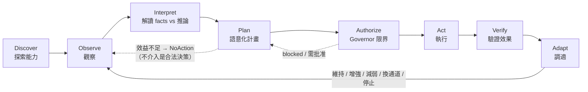
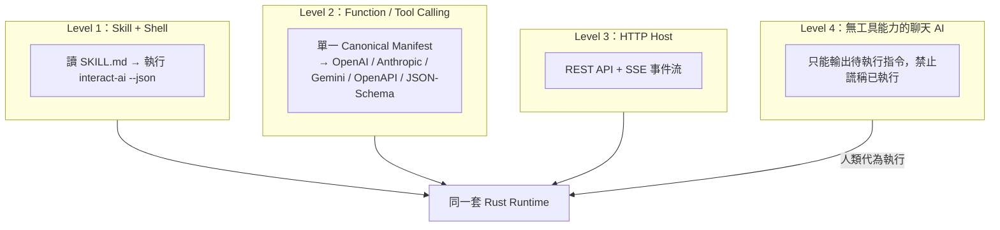
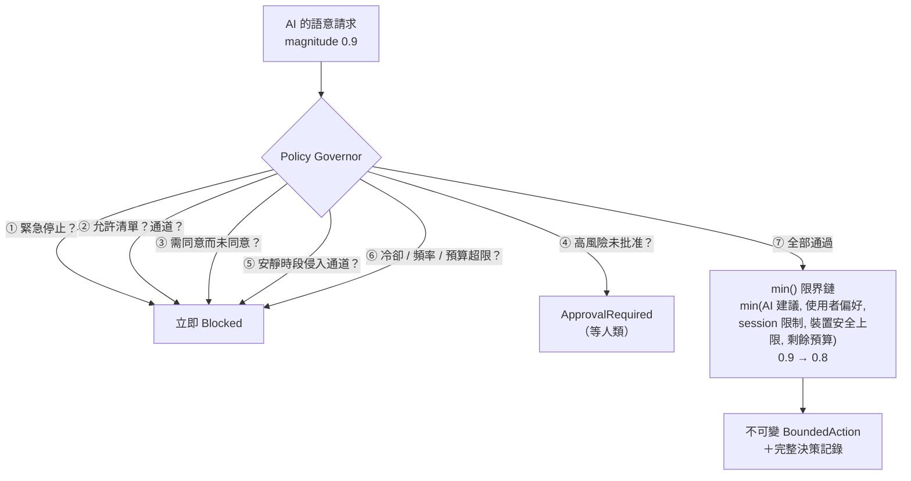

# 特點與能力

> 一句話：**讓任何 AI 先搞清楚「現在能感知什麼、能控制什麼」，再在硬性安全邊界內，
> 自己決定要不要互動、怎麼互動、以及——什麼都不做。**

## 核心循環



## 六大特點

### 1. 跨 AI——四種接入等級，不綁任何宿主



**完全不使用 MCP**——由測試強制（lockfile 斷言零 MCP 相依）。五種工具格式由同一份 canonical manifest 決定性產生，附 companion policy 保留各平台表達不了的風險 metadata，並有 golden tests 防漂移。

### 2. 受器／動器／工具三位一體

| 類別 | 內建 | 特性 |
|---|---|---|
| **受器** | `session.input`、`task.lifecycle`、`agent.activity`、`user.presence`、`system.time`、`manual.event`、`webhook.input`、`mock.receptor`、`mock.device-status` | Observation 嚴格區分 **facts**（可觀察事實）與 **inferences**（模型推論＋confidence）；過期資料自動作廢 |
| **動器** | `conversation`、`web-ui`、`local-log`、`local-notification`、`webhook.output`、`mock.actuator`（模擬實體裝置） | 每個動器自帶風險等級、裝置安全上限、是否需同意；實體／外部寫入**預設關閉** |
| **工具** | `interaction.*` 12 個 operation | 按 operation 分類角色（讀＝受器、寫＝動器）；工具結果回流成 Observation 形成閉環 |

動態擴充：執行期可新增 push 受器與 mock 裝置；第三方 driver 走 **Adapter SDK**（manifest builder＋driver receipt 協定），不必動 Orchestrator。

### 3. Deterministic 安全管家（不是提示詞，是 Rust）



- 任務重要性**永遠不會**直接變成實體強度
- pattern 一律 TTL lease＋watchdog；`repeat: forever` 被正規化為有界租約
- 派發前一刻還有 **pre-dispatch gate** 重驗（緊急停止／撤回同意的競態視窗已封死）
- 終態收據 **sticky**：一旦 stopped/expired，任何併發路徑都無法復活它

### 4. 誠實的收據狀態機——`accepted ≠ completed`

排入佇列不等於做完；`completed` 還會標注驗證等級（`observed` 環境確認 vs `acknowledged-only` 僅驅動確認 vs `uncertain` 不知道）。詳見 [DESKTOP-GUIDE.md](DESKTOP-GUIDE.md#收據狀態機) 的完整狀態圖。

### 5. 自適應配方（Recipes）——宣告式的自主行為

YAML 描述「何時（多受器融合觸發）→ 做什麼（語意 intent）→ 怎麼做（候選動器＋編排模式）→ 多克制（冷卻／預算／允許沉默）」。

- 觸發模式：`single / all / any / quorum / weighted / sequence`
- 編排模式：`single / parallel / sequence / fallback / adaptive / redundant`
- **事件消耗語意**：觸發成功即消耗匹配到的觀察事件，同一事件永不重複觸發；狀態跨重啟持久化
- 多受器融合：過期剔除、**明確人類輸入永遠壓過推論**、事實矛盾時拒絕自主行動
- 每一次「為何觸發／為何沒觸發／為何被擋」都有可讀解釋

### 6. 可解釋的效用決策＋合法的不介入

```text
Utility = 預期效益 − 干擾成本 − 風險 − 金錢/資源成本 − 重複疲勞
```

每個候選動器的分數與淘汰理由都寫進計畫；分數不過門檻且允許不介入時，產生 `NoAction` 計畫並記錄原因——**已感知但選擇沉默**是系統的一級輸出。

## 人類理解層（v0.2）

- **一般／進階雙模式**：預設一般模式全人話；進階模式保留全部技術頁面。同一套後端。
- **四層語意解析**：Adapter 宣告 → 中央能力目錄（44 個常見概念、zh-TW/en、alias glob）
  → 確定性 fallback（技術 ID 分詞＋schema 說明）→ AI 輔助說明（綁 manifest hash、
  變更即失效）。缺漏一律保守顯示為「未知」，永不猜成安全。
- **首次設定精靈**：三步（選擇角色與陪伴方式／選擇 AI 工作方式／確認安全與權限預設）draft/commit；
  敏感與對外能力永不預選；硬體掃描與 iPhone 配對移到第一次需要時再問（v0.5 起）。
- **句子式配方編輯器**：不寫 YAML；自然語言摘要由結構確定性生成；
  YAML↔JSON 無損 round-trip（未知欄位 serde flatten 保留）。
- **情境模擬**：安靜時段／缺同意／AI 不可用／低信心／過期／已提醒過／緊急停止，
  重用同一套 pure governor/planner，零副作用。
- **主動互動暫停**：與緊急停止語意分離；暫停期間明確請求照常執行；持久化。
- **AI 介入決策閘門**：確定性事件永不呼叫 AI；`ai.mode: when-uncertain` 時證據模糊
  才發布 `ai.assist.requested`，逾時走確定性 fallback／no-action；外部 AI 可在期限內
  `assists resolve` 回應。
- **誠實文案不變量**：queued≠completed、acknowledged≠delivered、
  delivered≠「你已看見」——由元件測試鎖住。

## 能力總覽

| 面向 | 內容 |
|---|---|
| Runtime | Rust + Tokio；watchdog TTL 掃描；crash 恢復（未完成動作→`uncertain`，高風險不自動恢復）；instance lock 單實例 |
| HTTP API | 40+ 端點、human/restricted-agent Bearer tokens（constant-time 比對）、SSE + Last-Event-ID 重播、payload 上限、OpenAPI |
| CLI | 40+ 子指令、`--json` 潔淨輸出、穩定 exit codes（3=離線、4=被拒、7=緊急停止中）、shell completion |
| 桌面 | Tauri 2 + React：總覽／受器／動器／工具／配方／政策／時間軸＋常駐緊急停止鈕 |
| 儲存 | File=Truth（YAML 設定人類可改）＋SQLite（收據/審計/會話）＋atomic write＋last-known-good |
| 稽核 | 每個敏感操作寫 audit；緊急停止全程留痕；敏感欄位遮罩 |
| 測試 | v0.4.1 基線 Rust 336、Vitest 94、Playwright 23、Tauri 4、CLI E2E 51（v0.5 最新數字見 `docs/releases/v0.5.0-test-matrix.md` 與 CHANGELOG [0.5.0]）；含未授權、撤回、超載、path traversal、雙 daemon、crash 恢復與 scoped-token 邊界 |

## v0.4

- 小樞＝Presentation Provider（逐項能力、誠實 receipt、隱藏≠停機）
- 小樞 v2 貓系角色（3 頭身、反應鏈、失敗專屬美術、三變體）＋本機確定性 Behavior Runtime
- 主動式對話五模式＋確定性頻率限制（安全提示永不被壓制）
- 本機 Agent 直連：Codex app-server（舊版 exec/resume fallback）／Claude Code
  stream-json（唯讀優先、限權寫入需明確 workdir＋二次確認、真子程序、
  claims≠verified、estop 殺程序樹、成本入預算）
- human／agent API token 分權；agent 不能授權、改安全上限、發布知識或解除 estop
- metadata-only 硬體掃描：17 類跨平台覆蓋結果，掃描不開感測，無法列舉時附原因
- 記憶 10 層＋保存期限三態＋Context Bundle（「本次提供了哪些」）
- CAS 素材庫＋知識圖譜＋FTS5＋candidate-only AI 寫入＋人類專屬 activate
- 知識更新決策器＋經驗轉知識（升格需反例＋適用範圍）＋Knowledge Receipt
- 控制中心 IA：v0.4 為 8 要求頁；**v0.5 起簡化為 5 個一級入口
  （現在／〔目前角色〕／工作／連接與權限／更多，第二項顯示你目前角色的名字，預設小樞）**，
  Activity 改為右上 Inbox，
  舊 tab id（tray 深連結、Inbox route）全部相容折疊＋全域搜尋/指令＋統一待辦收件匣＋真實畫面證據

## v0.5（角色・硬體・AI 三核心重定位；v0.5.0 已於 2026-09-03 發布，v0.5.1 修補版本已於 2026-09-04 發布）

- 產品定義：讓桌面角色能感知玩家與裝置、以具有生命感的方式呈現狀態、
  並透過 AI Agent 完成真實工作的互動 Runtime。
- **小樞 v3 女僕正式版**：Q 版貓娘女僕（約 2.5–2.6 頭身），執行期參數化分層 rig（非 sprite sheet）
  ＋組合通道（~40 有界參數＋`poseBlend`）＋36 正式表情（**真四段式**：進入／保持／小循環／離開；
  缺段派生並標示）＋3 調色盤；服裝參與功能呈現（左耳感知／右耳行動／核心=Runtime／頭飾=連線／裙光=輔助狀態／尾尖=工具）。
- **Interaction Director**：注意力、utility 競爭、變體與冷卻、被搶佔後恢復、quiet／勿擾／Reduced Motion 降級、
  個性模型（安靜／自然／活潑＋persona → 速度、距離、冷卻、變體、耳→視線→轉頭）；真相狀態只由 runtime 事件驅動——
  聲稱完成只點頭、綠勾只在人類驗證後（測試釘死）。
- **遊玩場**：6 種玩具（毛球／紙團／紙飛機／光點／逗貓棒／可拖曳小物件）＋輕量 2D 物理、追逐／撲抓／帶回／拒還、
  最多 3 隻使魔互相注意／打招呼／追逐，主角會回看；場景；Roll Call；拖曳四種落地；hover 短氣泡；
  氣泡／音效（預設關）／拖曳／游標／靠近／散步／勿擾各自開關；角色互動記憶（有界、不推論人格）。
- **AI 角色閉環**：agent session taxonomy（created/fetched/working/waiting-consent/claimed/verified/failed/timed-out/
  cancelled/closed/**unknown**）→ 角色演出；人類專屬 verify；resume（API／UI／CLI，codex 重新上鎖）；approval 裁決回寫信箱；
  Conversation Provider 介面＋本機模板降級。
- **真硬體**：裝置線協定 v1（hello 身分／proto／pairing 核對、配對碼、cmd＋id＋nonce、dedupe、cancel、state、stop-all、
  ack 逾時＝未知不重送、not-paired 重握手不重送）；Serial／MQTT／BLE 傳輸（健康度反映真實連線；停用即關閉）；
  ESP32 官方參考韌體（8 周邊、韌體硬限制、arduino-cli 已編譯，**未真板驗收**）；模擬器與真機分開標示；
  provider 六階人話（只發現／已配對／已安裝未連線／已連線未測試／**已測試**／已啟用）＋「測試裝置」。
- **iPhone Mobile Provider**：TLS wss＋指紋釘選＋配對碼 HMAC＋每機 token；4 受器／6 動器；撤銷即斷線；heartbeat；
  estop 同時停手機感測；感測不靜默；綠勾只走人類驗證；SwiftUI companion app（**iOS 模擬器**驗收完整，
  **iPhone 11／iOS 26.3.1 真機部分驗收**——配對、動器、緊急停止投影＋停感測、撤銷等列已過，動作觀察與
  BLE connect／GATT 未涵蓋，見 `docs/releases/v0.5.0-iphone-device-evidence.md`）；BLE gateway 桌面端只有
  scan（真機 CoreBluetooth scan 已驗，connect／GATT 未驗）。
- **控制中心**：5 入口＋3 步精靈＋右上 Inbox（鍵盤可用）＋單一主人守門測試＋L0–L4 風險分級標籤＋§11 記憶與知識三區人話。
- **Character Presentation Protocol 1.0**（`docs/character-protocol/`）：可版本化 manifest（characterId 穩定身分、adapterKind、
  assets、capabilities／inputCapabilities、channels、intents、variants、pronouns、preferencesSchema、securityRequirements、
  resourceLimits、fallbacks、compatibility）＋能力協商（exact／substituted／reduced／unsupported／failed）＋20 個語意 intent
  ＋15 個 truthState（只由 Runtime 決定）＋priority 下限（emergency 100…AI 上限 50）＋13 種受限 input event（節流、量化、
  不存原始軌跡、file-drop 只 metadata＋短效 grant）＋10 種回執狀態（accepted≠started≠completed；acknowledged→uncertain）
  ＋世代／去重／過期／有界佇列；transports：in-process（TS）、Runtime↔桌面視窗（SSE／IPC＋HTTP）、外部 WebSocket
  （adapter token 分權）、stdio 規格；reference adapters：小樞 rig、sprite（舊 pack 相容層）、文字、外部 Node fixture。
  可信 host overlay（Tauri）保證 estop／感測指示不依賴任何 renderer；角色匯入只收純資料（Rust 驗證＋magic bytes）。
- **一般模式狀態投影**：所有工作／收件匣狀態走同一份 exhaustive 人話表；未知原始值顯示「結果不確定」而非原始字串。
- 測試：以 `docs/acceptance-evidence.md` v0.5 最新章節（Phase 9）與 `docs/releases/v0.5.0-test-matrix.md`
  的實跑數字為準；詳見 `docs/acceptance-evidence.md` v0.5 章節與 `docs/v05-recovery-matrix.md`。

## v0.7.0（已於 2026-09-06 發布，tag `v0.7.0` → `630b429`）

跨平台接收決策表（三端同一份 `receiveDecisions`／`canonicalVectors` fixtures）、裝置線 v1.2 分片與成員 `syncProfile`、宣告式裝置免重啟 rebind 與未解決停止三層、陪伴預設交易化恢復、一般模式任務分類與真 Tauri 走查、AI 可維護性入口（`AGENTS.md`／`docs/MAINTAINERS-MAP.md`／`docs/aip/deprecation-ledger.md`／`scripts/tests/architecture-checks.sh`）。逐條見 `CHANGELOG.md` `[0.7.0]`；證據等級見 `docs/releases/v0.7.0-final-report.md` §8。

## v0.6.0 Foundation（已於 2026-09-05 發布，tag `v0.6.0` → `4bd55fe`）

> 保守、可回退的架構升級：先建立修改前基線與恢復矩陣，再以 Strangler／feature flag 逐條路徑替換，
> 不重寫既有功能。本節只記錄**已提交並經回歸**的事實，逐項標「證據等級」（單元／integration／fixture／
> 模擬器／browser／real-device），**沒有任何一項標成真機**——iPhone 真機上的 AIP／Character Session
> 閉環目前是 implemented-unverified。完整數字見 `docs/releases/v0.6.0-test-matrix.md`；契約見
> `docs/aip/README.md`。

- **AIP 1.0（Adaptive Interaction Protocol）**：新 crate `interaction-aip`（純函式、無 tokio／I/O）——
  versioned envelope、十二種 message type 與各自的必填 profile、十二值 Outcome 誠實階梯（`received≠
  accepted≠applied≠observed≠claimed-completed≠verified`）、19 個穩定錯誤碼、確定性版本協商（同 major、
  min minor）與確定性能力協商（交集＋min）、身分綁定（宣稱不符一律拒絕，不「修正後執行」）、有界去重環
  （256）、離線事件政策表（drop-if-offline／expire-by-deadline／queue-idempotent／require-reconfirmation／
  state-reconcile）、canonical JSON hash 與訊息／payload／字串／深度上限。schema 由 Rust 型別產生（golden：
  `schemas/aip-1.0.schema.json`），TypeScript 與 Swift 由同一份 schema 產生、`pnpm aip:check` 擋手改漂移。
  三方（Rust／TS／Swift）共用同一組 golden fixture 做 conformance。
  **證據等級：單元**（`interaction-aip` 14 個 lib 測試＋`tests/conformance.rs` 10 個；TS
  `aip-conformance.test.ts` 73 個實跑＋`aip-envelope.test.ts` 22 個；Swift `AIPConformanceTests` 14 個，
  iPhone 17 **模擬器**）。契約：`docs/aip/README.md`。
- **權威 Character Session**：新 crate `interaction-session`（純函式）——語意狀態（mood／activity／
  attention／truth／lastInteraction／members）與唯一 owner、確定性 Director（touch→反應 intent；
  `task.verified`→proud＋celebrate；emergency→凍結且拒絕互動）、單調 revision／sequence、RFC 7396 JSON
  Merge Patch＋SHA-256 state hash、有界事件日誌（512）delta replay／snapshot fallback、epoch-aware
  resume、每成員去重環、deadline 過期、rate limit、membership／presence、十三關固定順序安全管線、CPP 投影
  （celebrate 不投影到桌面，避免與既有 `verified-success` 雙播）。掛在 Runtime 上，綁定 iPhone wire、
  HTTP、SSE、Tauri IPC 四種 transport。
  **證據等級：單元**（`interaction-session` 77 個：lib 14＋`pure_functions.rs` 13＋`security_matrix.rs`
  7＋`session.rs` 43）**＋integration**（`character_session_loop.rs` 17 個，真 Runtime）。契約：
  `docs/aip/character-session.md`。
- **iPhone 語意事件閉環**：iPhone（模擬 fixture／模擬器）送 touch → Desktop 權威狀態前進、Behavior Intent
  回送；Desktop 真相變化（`task.verified`）→ iPhone 收到 celebrate Behavior Intent；斷線→重連→resume
  優先送 delta patch（超出 512 筆事件環才 snapshot fallback）；撤銷裝置後需重新確認、不自動恢復同步；
  緊急停止中觸摸一律被拒。iOS 端新增 `SessionClient.swift`（純函式決策）＋`CharacterSemantic.swift`
  （語意狀態鏡射／RFC 7396 merge patch／canonical hash），手機是 `remote-renderer`，不擁有任何共享狀態，
  且**永遠宣告 `haptic:false`**（震動只走受 Policy Governor 管的動器路徑，Behavior Intent 不得自己讓
  手機震動）。
  **證據等級：fixture（模擬 iPhone）＋integration**（CLI E2E「Character Session」段 14 個斷言：配對→
  協商→touch→revision 前進→重複 messageId 不重套用→斷線→重連→resume→未知 type 誠實拒絕）
  **＋browser**（Playwright `character-session.spec.ts` 4 個：桌面寬度全流程、390px 同流程、緊急停止中
  觸摸被拒、鍵盤可達＋Reduced Motion；`docs/assets/v06-evidence/` 9 張截圖）**＋iOS 模擬器**
  （`SessionClientTests` 28 個＋`ios-sim-character-session-*.png`）。**iPhone 真機上的完整閉環零執行
  （implemented-unverified）**；Desktop→iPhone celebrate 這條路只有單元／integration 證據，沒有端到端
  UI 截圖；多裝置同時連線同一 session 未覆蓋。契約：`docs/aip/iphone-companion.md`、
  `docs/aip/transport-bindings.md`。
- **小樞脫離協定核心＋第二個 Reference Character（`ref-shape`）**：Strangler 重構——
  `crates/interaction-character`（CPP 核心）不再含任何小樞字串，`SHU_RIG_VARIANTS`／
  `shu_rig_capabilities()`／rig-pack 遷移搬到新 crate `interaction-character-shu`；核心新增
  `PackMigrator` trait 與有界 `MigrationRegistry`（sprite 遷移留在核心，小樞遷移移出）；
  `ValidationLimits::default().builtin_whitelist` 改為空，host 必須注入（Runtime
  `character_host_registry()`：shu-rig／shape／sprite／text）；桌面 TS 的 `character/adapterRegistry.ts`
  取代 entrypoint if-chain，四個內建 adapter 各自註冊並共用同一套生命週期契約。新增第二個
  Reference Character `ref-shape`（純幾何圓形，只有 visual.presence／visual.expression／input.click，
  無耳尾、無音效、無玩具）證明核心對新角色零分岔：加入它只動 manifest、adapter、兩個 host 白名單清單、
  測試與文件。
  **證據等級：單元**（`interaction-character-shu` 7 個：conformance 1＋rig_pack 6；
  `migration_registry.rs` 10 個；`character_host_registry.rs` 4 個；TS
  `architecture-no-entrypoint-switch.test.ts` 4 個讀原始碼鎖住不再有字面分岔、`adapter-contract.test.ts`
  31 個、`character-ref-shape.test.ts` 9 個；Tauri backend +4）。契約：`docs/aip/reference-character.md`。
- **一般模式同步狀態**：角色同步**不是**第六個一級入口——主入口永遠恰好五個（現在／〔角色名〕／工作／
  連接與權限／更多），角色同步住在第二個入口的頁內「同步」卡。十種狀態窮舉文案表（`synced`／
  `reconnecting`／`offline`／`partial-capability`／`syncing`／`unrecoverable`／`needs-reconfirmation`／
  `no-device`／`disabled`／`store-reset`），`satisfies Record<CharacterSyncState, …>` 保證少一個狀態就
  typecheck 失敗；空狀態（`no-device`）是中性色不是成就，不出現綠色徽章；一般模式**會**讀
  `GET /v1/character-session/diagnostics` 但不顯示任何數字，連接診斷收合區塊只在進階模式出現；
  緊急停止的固定安全句永遠壓過同步狀態文案。
  **證據等級：單元**（TS `statusProjection-session.test.ts` 24 個、`character-sync-card.test.tsx` 16 個、
  `regressions-v06-general-mode.test.tsx` 10 個五入口守門測試）**＋browser**（Playwright `narrow.spec.ts`
  ／`a11y.spec.ts` 各 +1 個同步卡相關案例）。**真 Tauri 視窗**（而非 Playwright／jsdom）尚未針對同步卡
  重新走查一次，屬本輪已知缺口。契約：`docs/aip/general-mode-ux.md`。
- 回歸總數（HEAD `6683403`，四個 wave 疊加後）：Rust 985/0（82 target，基線 827／66）、Tauri 54/0（基線
  50）、vitest 1366/0（68 檔，基線 1168／60）、CLI E2E 96/0（基線 82）、Playwright 71/0（基線 65）、iOS
  XCTest 92/0（基線 46）；ESP32／iPhone 真機本輪未動、沿用 v0.5.1 邊界句。逐項數字、效能前後對照與
  未執行清單見 `docs/releases/v0.6.0-test-matrix.md`；完成定義逐條核對見 `docs/acceptance-evidence.md`
  「v0.6.0 Foundation」章節。

## 可維護性（誰擁有什麼、什麼時候可以刪）

`AGENTS.md` 是任何 AI 的入口地圖，`docs/MAINTAINERS-MAP.md` 逐能力列出 owner／入口／狀態來源／公開契約／
擴充點／必要測試／已知限制，`docs/aip/deprecation-ledger.md` 把每一條相容路徑登記成「移除前需要什麼證據」，
`scripts/tests/architecture-checks.sh` 則把架構邊界的可執行檢查收成一個入口（`--list` 零成本列出，
`--rust`／`--ts`／`--docs` 分組跑，未執行的組印 SKIP 而不冒充通過）。
