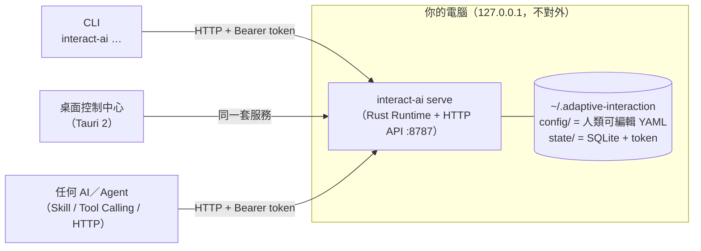

# 安裝與部署（ELI5 版）

> **這是什麼？（像對五歲小孩解釋）**
> 想像你養了一隻很聰明的 AI，但它沒有眼睛、沒有手，也不懂分寸。
> 這個專案就是幫它蓋一座「小總部」：
> - **受器（Receptors）**＝眼睛和耳朵——讓 AI 知道發生了什麼事
> - **動器（Actuators）**＝手——讓 AI 能說話、發通知、點燈、震一下
> - **安全管家（Governor）**＝一個永遠清醒的大人——AI 想做的每件事都要先經過他，太大力會被調小、沒同意的直接擋掉
> - **紅色大按鈕（Emergency Stop）**＝隨時按下去，一切立刻停
>
> 全部都在**你自己的電腦**上運作，不需要雲端帳號，也完全不用 MCP。

---

## 1. 你需要準備什麼

| 工具 | 用途 | 必要性 |
|---|---|---|
| [Rust](https://rustup.rs)（stable） | 編譯 Runtime 與 CLI | ✅ 必要 |
| Node.js ≥ 20 ＋ [pnpm](https://pnpm.io) | 桌面控制中心（Tauri UI） | ⬜ 只有要用視覺化介面才需要 |
| macOS / Linux | 已驗證平台 | ✅ |

檢查一下：

```bash
cargo --version   # 有版本號就 OK
node --version    # （可選）
pnpm --version    # （可選）
```

## 2. 安裝

### 方式 A：從 Release 下載（推薦，免編譯）

到 [Releases](https://github.com/miles990/adaptive-interaction/releases) 下載
`install.sh`，或直接：

```bash
curl -fsSL https://github.com/miles990/adaptive-interaction/releases/latest/download/install.sh -o install.sh
bash install.sh        # ← all-in-one 互動選單：勾選要裝的元件
```

選單長這樣（輸入編號切換、Enter 開始）：

```text
adaptive-interaction all-in-one 安裝 — 選擇元件（輸入編號切換）
  [x] 1. interact-ai CLI（必裝：runtime／daemon／所有指令）
  [x] 2. 跨 AI Skill → ~/.claude/skills/（給 Claude Code 等 agent）
  [ ] 3. 桌面控制中心（下載本平台安裝包）
  [ ] 4. Shell completion（zsh）
```

非互動（CI／腳本）用旗標：

```bash
bash install.sh --all                          # 全裝
bash install.sh --with-skill --with-completion # 指定元件
bash install.sh --cli-only                     # 只裝 CLI
bash install.sh --version v0.1.0               # 固定版本
```

每個 Release 附：四平台 CLI 壓縮檔（macOS arm64/x64、Linux x64、Windows x64，
各附 `.sha256`）、桌面安裝包（.dmg／.AppImage＋.deb／.msi＋.exe）、
版本一致的 skill 套件 zip、`QUICKSTART.md` 與本安裝腳本。

之後的更新／移除全部用內建自我管理：

```bash
interact-ai self version --check   # 有沒有新版？
interact-ai self update            # 一鍵更新（sha256 驗證＋原子替換）
interact-ai self update --version v0.1.0
interact-ai self install-skill     # 裝／更新跨 AI skill（與 CLI 同版本，離線可用）
interact-ai self install-desktop   # 下載本平台桌面版
interact-ai self uninstall --yes [--purge]   # 移除（--purge 連資料目錄）
```

### 方式 B：從原始碼編譯

```bash
# ① 取得程式碼
git clone https://github.com/miles990/adaptive-interaction.git
cd adaptive-interaction

# ② 編譯（第一次約 2–5 分鐘）
cargo build --release -p interaction-cli

# ③ 啟動總部（daemon）
./target/release/interact-ai serve
```

看到這行就代表活了：

```text
interact-ai daemon listening on http://127.0.0.1:8787
token file: ~/.adaptive-interaction/state/api-token
```

> 💡 想把 `interact-ai` 裝進 PATH：`cargo install --path crates/interaction-cli`
> 或直接執行 `skills/orchestrate-adaptive-interaction/scripts/install.sh`。

## 3. 第一次互動（60 秒體驗）

開**另一個**終端機：

```bash
interact-ai session start --label demo     # 開一個 session（同意的邊界）
interact-ai receptors push task.lifecycle --fact event=task.completed
interact-ai plan --intent celebration --candidate conversation \
    --min-channels 1 --max-channels 1      # 產生計畫 → 記下 planId
interact-ai simulate <planId>              # 先看安全管家會怎麼裁決
interact-ai execute <planId>               # 執行 → 記下 actionId
interact-ai actions show <actionId>        # 看收據：accepted ≠ completed！
interact-ai outbox                         # 看 AI 實際說了什麼
```

隨時想全部停下來：

```bash
interact-ai emergency-stop                 # 不用問任何人，立刻停
interact-ai emergency-stop --clear         # 想清楚了再手動解除
```

## 4. 部署拓撲



三種啟動模式：

| 模式 | 指令 | 適合 |
|---|---|---|
| **前景 daemon** | `interact-ai serve` | 日常使用、給 AI 接入 |
| **桌面託管** | `pnpm tauri dev`（見下） | 人類想用圖形介面管理；桌面 app 內嵌同一套 Runtime，關窗即安全停止 |
| **背景服務** | `nohup interact-ai serve &` 或自行掛 launchd/systemd | 長駐 |

> ⚠️ **同一時間只能有一個 Runtime**：instance lock 會擋下第二個（避免兩個大腦搶同一雙手）。桌面 app 啟動時若 daemon 已在跑，會直接告訴你。

## 5. 桌面控制中心（可選）

```bash
cd apps/interaction-desktop
pnpm install
pnpm tauri dev          # 開發模式啟動視窗
```

詳細操作見 **[DESKTOP-GUIDE.md](DESKTOP-GUIDE.md)**。

## 6. 給 AI 接入的三條路

```bash
# ① Skill＋Shell 型 AI（Claude Code、Codex CLI…）：
#    把 skills/orchestrate-adaptive-interaction/ 裝進它的 skill 目錄即可

# ② Function/Tool Calling 型 AI：匯出工具定義給宿主程式
interact-ai tools export --format openai    --out tools-openai.json
interact-ai tools export --format anthropic --out tools-anthropic.json
interact-ai tools export --format gemini    --out tools-gemini.json

# ③ 自建 HTTP Host：完整規格
curl -H "Authorization: Bearer $(cat ~/.adaptive-interaction/state/api-token)" \
     http://127.0.0.1:8787/v1/openapi.json
```

## 7. 常見問題

| 症狀 | 原因與解法 |
|---|---|
| `daemon offline: cannot reach…`（exit 3） | daemon 沒開：先 `interact-ai serve` |
| `another runtime (pid …) already holds…` | 已有一個 Runtime 在跑；先停掉它，或直接用 CLI 連現有的 |
| 401 unauthorized | token 不對：CLI 會自動讀 `state/api-token`，跨機器連線要用 `--token` |
| 執行回 423 / exit 7 | 緊急停止啟動中：`interact-ai emergency-stop --clear` 手動解除 |
| 實體/模擬裝置不動 | 預設關閉是「特性」：先 `interact-ai actuators enable mock.actuator`＋`session consent channel:haptic` |

## 8. 解除安裝

```bash
rm -rf ~/.adaptive-interaction    # 所有設定、狀態、token（不影響程式碼）
cargo uninstall interaction-cli   # 若有 cargo install 過
```
