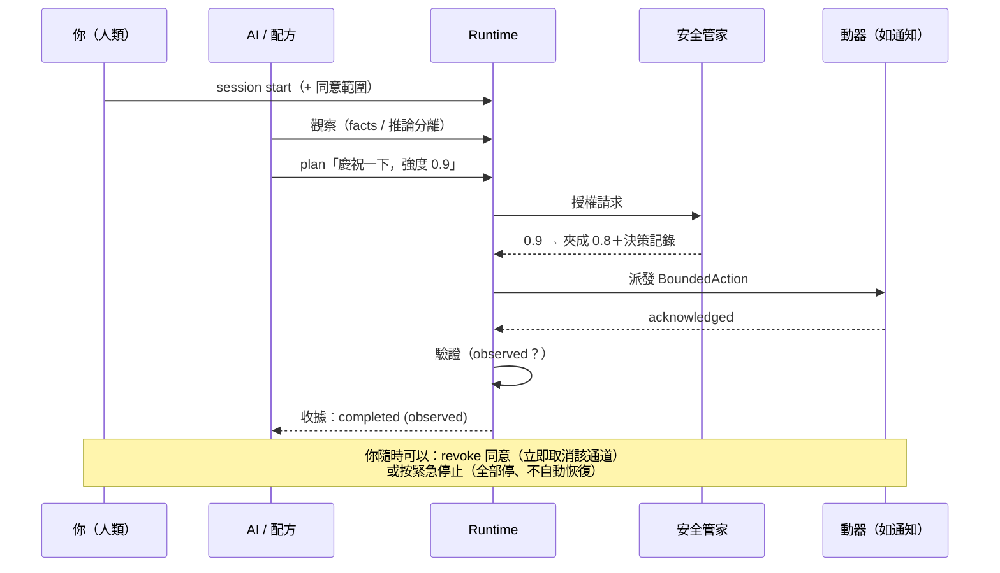

# 人類使用手冊

這份手冊寫給**人**：你如何日常操作這套系統、授權 AI、看懂它做了什麼、以及隨時喊停。
（AI 的操作手冊在 `skills/orchestrate-adaptive-interaction/`，不用給人看。）

## 先看這裡：不想讀技術細節的話

打開桌面控制中心就夠了：首次啟動有**設定精靈**，之後照著「首頁／現在 →
小樞 → AI 與工作階段 → 能力與裝置 → 記憶與知識 → 活動與確認 →
隱私與安全 → 設定」的順序逛一圈，每一頁都是人話。
完整的圖文說明在《[視覺化工具使用說明](DESKTOP-GUIDE.md)》。

幾個對應關係（括號內是技術名稱，CLI/API 會用到）：

| 你看到的 | 技術名稱 | 意思 |
|---|---|---|
| 感知來源 | Receptor（受器） | 系統可以接收的資訊 |
| 回應方式 | Actuator（動器） | 系統可以採取的行動 |
| 工具操作 | Tool Operation | AI 可以讀取／建立／修改的軟體能力 |
| 自動互動 | Recipe（配方） | 「當…就…」的自動規則 |
| 安全規則 | Policy | 本機強制執行的限制，AI 繞不過 |
| 使用授權 | Consent | 你授予、可隨時撤回的權限 |
| 活動紀錄 | Timeline / Receipt | 每次互動的完整歷程與憑證 |
| 暫停主動互動 | Pause | 一般控制：自動互動休息，你的直接要求照常 |
| 緊急停止 | Emergency Stop | 安全機制：全部停下，解除要走確認流程 |

以下章節寫給想用 CLI／API、或想理解內部模型的你。

## 0. 心智模型：一次互動的完整旅程



## 1. Session 與同意——你的授權邊界

一切互動都發生在 session 裡。session 結束或過期，AI 就什麼都做不了。
人類 CLI 預設讀 `state/api-token`；讓 AI/Skill 呼叫 CLI 時應加
`--agent-scope`，改讀 `state/api-agent-token`。限權 token 無法開／授權 session、
改 policy、發布知識或解除緊急停止；不要把 human token 傳進 Agent 子程序。

```bash
interact-ai session start --label work            # 開始（預設 4 小時過期）
interact-ai session show                          # 目前狀態與已授同意
interact-ai session consent channel:haptic        # 授權整個 haptic 通道
interact-ai session consent actuator:mock.actuator --expires-minutes 30   # 限時授權
interact-ai session revoke channel:haptic         # 撤回（立即取消進行中的動作）
interact-ai session stop                          # 結束
```

同意範圍格式：`channel:<通道>`、`actuator:<id>`、`receptor:<id>`、`tool:<名稱>`。

> **高風險就是要煩你**：風險 `high` 以上的動作會回 `approval_required`。
> 批准方式＝你親手授一個（通常限時的）actuator 同意。AI 沒有任何辦法繞過。

## 2. 看見世界：受器與觀察

```bash
interact-ai receptors list                        # 有哪些感官、誰開著
interact-ai observe --receptor task.lifecycle     # 查歷史觀察
interact-ai observe --receptor system.time --fresh  # 現場讀一次
interact-ai receptors push manual.event --fact event=demo   # 手動餵事件（測試）
interact-ai receptors enable mock.receptor        # 開 / 關
```

讀觀察時注意兩個欄位：**`facts`**（直接觀察到的）與 **`inferences`＋`confidence`**（模型猜的）。
系統永遠不會把「可能疲累」當成「確實疲累」——你也不該。

要掃描目前可見的互動硬體 metadata（不會打開攝影機或麥克風）：

```bash
interact-ai providers scan
```

結果只表示「這次掃描看得到」，不代表找到所有硬體；沒有穩定身分的
路徑不能直接當成已配對裝置。

## 3. 出手：計畫 → 模擬 → 執行 → 驗證

```bash
# 語意化描述你要的效果——不是裝置指令
interact-ai plan --intent celebration --magnitude 0.5 --duration-ms 2000 \
    --channel visual --channel haptic --max-channels 2

interact-ai simulate <planId>     # 乾跑：安全管家會怎麼裁決、夾到多少（無副作用）
interact-ai execute <planId>      # 真的執行
interact-ai actions show <actionId>   # 收據：完整狀態歷史＋政策決策
interact-ai verify <actionId>     # 對照最新觀察重新驗證
interact-ai cancel <actionId>     # 取消單一動作
interact-ai stop --all            # 軟停：取消所有未完成動作
```

**讀收據的三個重點**：
1. `currentStatus`——`accepted` 只是排進佇列，**不是做完**
2. `requestedParameters` vs `effectiveBoundedParameters`——AI 要的 vs 管家放行的
3. `verification.verdict`——`observed`（環境確認）＞`acknowledged-only`（僅驅動回報）＞`uncertain`（不知道，老實說）

## 4. 配方：教系統自己看時機做事

配方＝「條件到了就自動做」的宣告式 YAML。範本：

```yaml
id: my-recipe
name: 任務完成輕聲慶祝
enabled: true
trigger:
  mode: sequence          # single|all|any|quorum|weighted|sequence
  within: 10m
  steps:
    - receptor: task.lifecycle
      condition: { event: task.completed }
    - receptor: user.presence
      condition: { state: present }
decision:
  objective: celebrate-without-interrupting
  allowNoAction: true     # 允許判斷後選擇沉默
intent: celebration
message:
  mode: adaptive          # fixed|random|adaptive|ai-generated|none
  templates: ["完成了，所有檢查都已通過。"]
  allowSilence: true
actuation:
  mode: adaptive          # single|parallel|sequence|fallback|adaptive|redundant
  candidates: [conversation, web-ui, local-notification]
  minChannels: 0
  maxChannels: 2
limits:
  cooldown: 15m
  expiresAfter: 30s
  maxExecutionsPerSession: 3
```

```bash
interact-ai recipes validate my-recipe.yaml   # 錯在哪個欄位會直接告訴你
interact-ai recipes apply my-recipe.yaml
interact-ai recipes simulate my-recipe        # 現在會不會觸發？為什麼？計畫長怎樣？
interact-ai recipes run my-recipe             # 手動跑（跳過觸發、不跳過安全）
interact-ai recipes disable my-recipe
```

配方防呆機制（都是內建，不用設）：同一事件觸發過就被**消耗**，不會重複觸發；
冷卻與次數預算**跨重啟**保留；受器彼此矛盾時不自主行動。

## 5. 調整政策：系統的憲法

```bash
interact-ai policy show
interact-ai policy set '{"initiative": "active"}'          # passive|suggest|active
interact-ai policy set '{"quietHours": [{"start":"22:00","end":"08:00"}]}'
interact-ai policy set '{"channelLimits": {"haptic": {"maxMagnitude": 0.5, "sessionBudgetMs": 60000}}}'
```

| 常用旋鈕 | 意義 |
|---|---|
| `initiative` | AI 主動程度：`passive` 不許自主、`suggest` 只許低風險本機、`active` 允許有界自主 |
| `quietHours` | 安靜時段自動封掉音效/震動/通知（文字與 UI 不受影響） |
| `channelLimits` | 各通道強度/時長/頻率/冷卻/每 session 累積預算 |
| `actuatorAllowlist` / `allowedChannels` | 白名單；不在名單上直接擋 |
| `sessionMonetaryBudget` | 花錢動器的每 session 上限（超過即擋） |

政策存在 `~/.adaptive-interaction/config/policies/policy.yaml`——直接改檔案也行（File=Truth）。

## 6. 看發生了什麼

```bash
interact-ai outbox              # AI 說過的話（conversation / web-ui）
interact-ai events --seconds 30 # 即時事件流（SSE）
interact-ai actions list        # 最近的動作收據
interact-ai audit               # 稽核軌跡（誰做了什麼敏感操作）
interact-ai status              # Runtime 總覽
```

## 7. 🔴 緊急停止

```bash
interact-ai emergency-stop --reason "不對勁"
```

按下去的瞬間：所有未完成動作標記 `stopped`、所有動器急停、**所有同意撤回**、寫入稽核。
**永遠不會自動恢復**——想清楚後：

```bash
interact-ai emergency-stop --clear
```

三個入口效果完全相同：CLI（上面）、API（`POST /v1/emergency-stop`）、桌面 app 右上角紅鈕。

## 8. 疑難排解速查

| 訊息／現象 | 意思 | 你要做的 |
|---|---|---|
| exit 3 / `daemon offline` | 總部沒開 | `interact-ai serve` |
| `policy_blocked` | 管家依規則擋下 | `simulate` 看是哪條規則；改政策或換通道 |
| `approval_required` | 高風險等你點頭 | `session consent actuator:<id> --expires-minutes 15` |
| `consent_required` | 該通道沒授權 | `session consent channel:<通道>` |
| exit 7 / HTTP 423 | 緊急停止中 | 想清楚 → `emergency-stop --clear` |
| 收據 `uncertain` | 真的不知道有沒有生效 | `verify <actionId>`；仍不確定就人工查看 |
| 配方不觸發 | 觸發/冷卻/同意任一未滿足 | `recipes simulate <id>` 會列出精確原因 |
