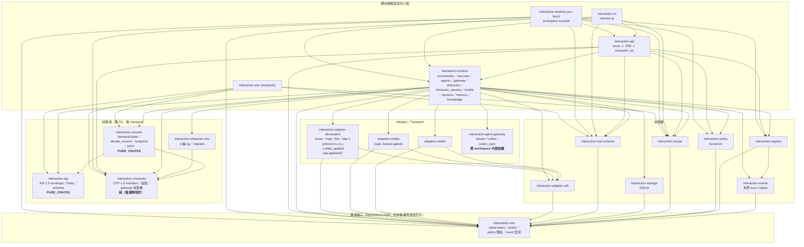
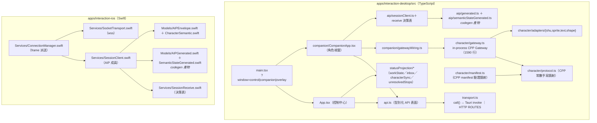
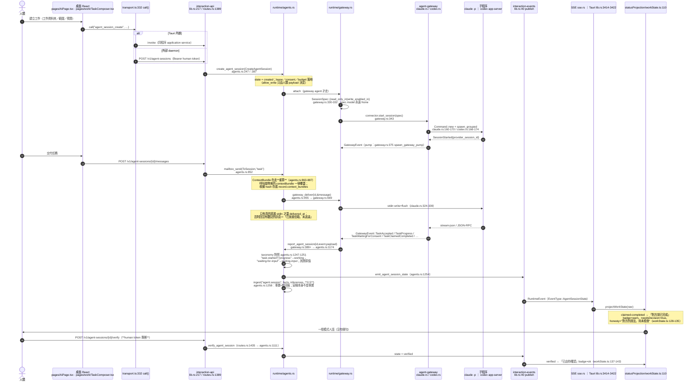
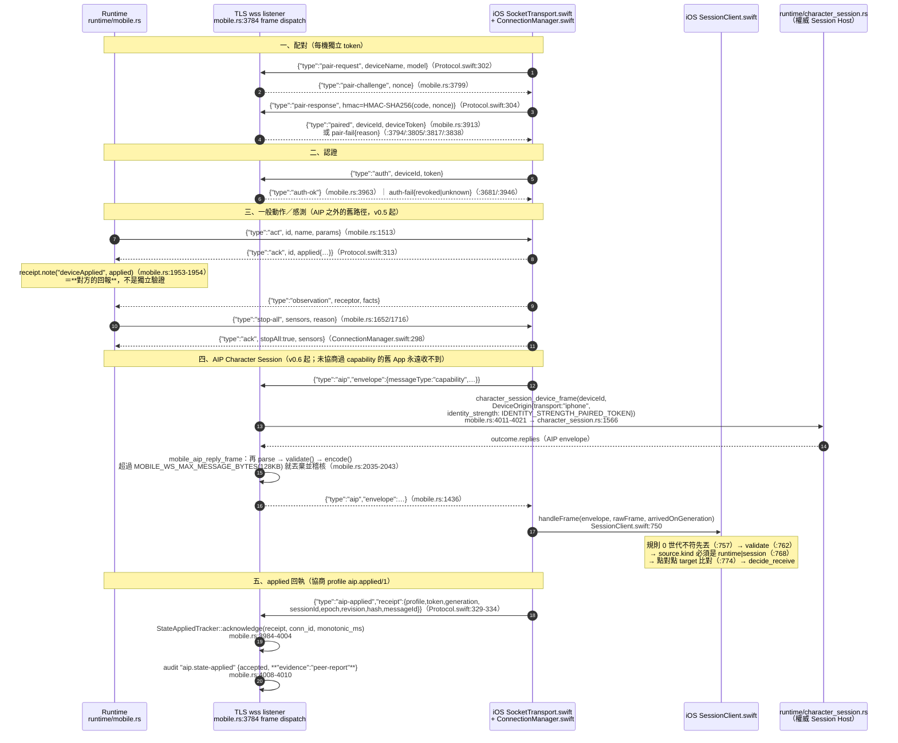
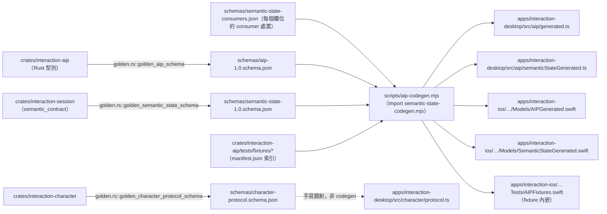

# 階段 0 · 維度 H：架構依賴與資料流

Repo `/Users/user/Workspace/claude-lab/adaptive-interaction`，branch `phase-0/state-recovery-baseline`，HEAD `78dcda1`。
本檔只做靜態盤點（Read/Grep/Bash 讀檔），**未執行任何 cargo／pnpm／測試**；所有證據層級一律標
`static-inspection`，除非該事實在 repo 內有已存在的測試檔可指名（那時標該測試的層級，但**不代表本輪跑過**）。
文件宣稱一律以程式碼覆核；文件說有、程式沒接線的都在 §7 逐條列出。

---

## 1. 模組依賴圖（crate 層級，依各 Cargo.toml `[dependencies]` 實際邊）

來源：`Cargo.toml`（workspace）、`crates/*/Cargo.toml`、`adapters/*/Cargo.toml`、
`apps/interaction-desktop/src-tauri/Cargo.toml`、`tests/e2e/Cargo.toml`。只畫 workspace 內部邊，
`dev-dependencies` 不畫（測試工具不進成品，與 `dependency_boundaries.rs` 的判準一致）。

桌面／iOS 主要模組（不是 crate，但同屬依賴圖）：

要點：

- `interaction-agent-gateway` **一個 workspace 內部依賴都沒有**（`crates/interaction-agent-gateway/Cargo.toml:8-16`）
  ——連 `interaction-core` 都不依賴。真 Agent 子程序的正規化完全靠自有型別（`GatewayEvent`／`SessionSpec`），
  轉成領域語彙發生在 `crates/interaction-runtime/src/gateway.rs`。這條邊界是全 repo 最乾淨的一段。
- `interaction-desktop`（Tauri）在 workspace `exclude` 內（`Cargo.toml:27`），所以
  `cargo test --workspace` **不會**編它；CI 用獨立 job 補（`.github/workflows/ci.yml:60-62`
  `cargo clippy --manifest-path … -- -D warnings` ＋ `cargo test --manifest-path …`）。
- `interaction-runtime` 是唯一的匯流點：16 條 workspace 內部邊。這是應用服務層的正常形狀，
  不構成拆分理由。

---

## 2. 資料流：人類 → 核心 → Agent → 成果（含 file:line 與狀態值）

**依賴方向與資料流刻意分開畫**：上面的圖是「誰可以 use 誰」，下面是「一筆工作實際怎麼走」。

同一條事實另外投影到角色層（Character Presentation Protocol）：

- `crates/interaction-runtime/src/character.rs:467 session_projection`：
  `created|queued→(Wait, Queued)`、`fetched→(Think, Working)`、`working|active→(Work, Working)`、
  `waiting-input→(Ask, WaitingInput)`、`waiting-consent→(RequestConsent, WaitingConsent)`、
  **`claimed-completed→(ClaimCompleted, Claimed)`**、`verified→(VerifiedSuccess, Verified)`、
  `failed→(Failed, Failed)`、`timed-out→(Failed, TimedOut)`、`unknown→(Unknown, Unknown)`、
  `cancelled→(Cancelled, Cancelled)`、`closed→(Idle, None)`、`expired→(Unknown, Expired)`、
  其餘 `None`（不猜）。
- `character.rs:488 action_projection`：`ActionCompleted→(ClaimCompleted, Claimed)`、
  `ActionObserved→(VerifiedSuccess, Verified)`——**動器回 completed 只到 claimed**，
  要看到 observed（真的觀察到效果）才是 verified。這條映射是誠實階梯在 Rust 端的權威落點。

已核對的誠實性質（全部 static-inspection）：

| 檢查 | 結果 | 證據 |
|---|---|---|
| queued≠completed | 通過 | `workState.ts:110-118`（created/queued→「正在準備」pending） |
| acknowledged≠completed | 通過 | `appstate.tsx:195`「裝置或程式已確認收到／無法確認實際效果」；`appstate.tsx:219`「已收到（效果未確認）」 |
| completed≠verified | 通過 | `workState.ts:128-143`；`character.rs:490-491`；Swift `CharacterSemantic.swift:496`「宣稱完成（尚未驗證）」 |
| 送達≠完成 | 通過 | `apps/interaction-desktop/src/work/delivery.ts:41`「送達不是完成，所以沒有任何一態用成功綠」 |
| UI 自行推測成功 | **未發現** | 見 §6 |

---

## 3. 資料流：電腦 ↔ iPhone

要點：

- `state_applied` 這個 AIP profile（`aip.applied/1`）的權威實作住在
  `crates/interaction-adapter-declarative/src/state_applied.rs`（模組頭已寫明「two production consumers
  (DeviceLink and MobileBridge)」），由 `runtime/mobile.rs:29` 與
  `runtime/character_session.rs:179`／`:1118`、`runtime/declarative_session.rs:158` 消費。
  `docs/MAINTAINERS-MAP.md:62` 已把 owner 指到那裡，**不是隱藏耦合**；代價是「一個 AIP 層概念住在
  serial／MQTT／BLE 裝置 crate 裡」，讀契約的人要跳一次。`interaction-runtime` 本來就依賴該 crate，
  沒有新增依賴邊——不建議為此拆檔。
- 回執一律標 `evidence: "peer-report"`（mobile.rs:4009），符合「acknowledged≠completed」。
- iOS 端 frame 型別集中在 `apps/interaction-ios/InteractionCompanion/Models/Protocol.swift:302-503`
  （`DeviceMsg` 出站 / `HostMsg` 入站兩個 enum），與 Rust 端字面字串手動對齊；**沒有**跨語言 frame fixture
  （AIP envelope 有，wss 外殼沒有）。

---

## 4. 逐項核對

### 4.1 核心是否依賴平台／特定角色／transport

| 問題 | 答案 | 證據 |
|---|---|---|
| `interaction-aip`／`interaction-session` 依賴 transport？ | **否**，且由可執行測試釘住（宣告層＋遞移層＋反向控制組三個測試） | `tests/e2e/tests/dependency_boundaries.rs:19-31`（FORBIDDEN 9 個：tokio/axum/tauri/tungstenite/rumqttc/serialport/btleplug/reqwest/hyper）、`:75`、`:170`、`:190` |
| `interaction-character` 有被釘住嗎？ | **遞移涵蓋**：`PURE_CRATES` 只有 aip/session（`:31`），但 `interaction-session → interaction-character`（`crates/interaction-session/Cargo.toml:10`），所以 character 長出 tokio 會讓 session 那條遞移測試失敗 | `dependency_boundaries.rs:145-183` `reachable_packages` 走 normal 邊 |
| `interaction-core` 有被釘住嗎？ | **沒有。** core 不在 `PURE_CRATES`，也不是 aip/session 的（遞移）依賴（session 只依賴 aip＋character），所以邊界測試走不到它。目前實際乾淨（Cargo.toml 只有 serde/schemars/thiserror/uuid/chrono/async-trait/futures/tracing），`lib.rs:3` 也自述「no Tokio runtime, no HTTP」，但**這句話沒有可執行的守門** | `crates/interaction-core/Cargo.toml:8-17`、`crates/interaction-core/src/lib.rs:3-5`、`dependency_boundaries.rs:31` |
| 核心綁特定角色？ | **否**（`rg -wi 'shu\|maid'` 在 `crates/interaction-core/src` 零命中） | grep 結果 |
| 核心綁特定呈現面？ | **是（一處）**：`PolicyConfig::default()` 的 allowlist 逐項列出 `companion.*` 7 個受器＋7 個動器，channel 含 `desktop-pet` | `crates/interaction-core/src/policy.rs:148-172`、`:182` |
| 核心綁特定裝置（iPhone）？ | **否**：`iphone.*`／`provider.mobile.*` 在 `crates/interaction-runtime/src` 除 `mobile.rs` 外只出現在註解（`sensor_source.rs:248`／`:514`、`character_session.rs:167`）與測試（`character_session.rs:2755`），符合 `docs/aip/architecture-boundaries.md` §4.1 的驗收條件 | grep 結果 |

關於 `companion.*` 進 core 的實際影響：`interaction-policy` 對不在 allowlist 的動器直接 blocked
（`crates/interaction-policy/src/lib.rs:135-141`），而 repo 內**沒有**任何 production code 會在配對新
provider 時把它的動器加進 allowlist（`actuator_allowlist` 的寫入點只有 `interaction-policy/src/lib.rs:598`／`:711`，兩處都在測試裡）。
所以 `iphone.*` 動器預設被 Governor 擋下、要使用者自己 PATCH `/v1/policy`。這一點**已經被記錄成既有行為**
（`docs/acceptance-evidence.md:698-699` 明寫「policy allowlist 未含 `iphone.*` → `blocked(actuator.allowlist)`」），
與「外部副作用動器預設關閉」的不變量一致 → 不是缺陷，是**設計上的預設關閉**。真正的架構味道是：
「哪一家呈現面是內建的」這件事寫死在領域核心的預設值裡，新增第二個 host 呈現面家族需要改 `interaction-core`。

### 4.2 各契約的版本責任與常數位置（每個只有一個產生點）

| 契約 | 版本常數 | 位置 | 三端如何取得 |
|---|---|---|---|
| AIP | `SPEC_VERSION = "aip/1.0"` | `crates/interaction-aip/src/lib.rs:48` | Rust 直接用；schema `schemas/aip-1.0.schema.json`（`schema.rs:69` 寫入）；TS `AIP_SPEC_VERSION`（`aip-codegen.mjs:255` → `src/aip/generated.ts`）；Swift 同 codegen |
| CPP | `PROTOCOL_VERSION = "1.0"`＋`PROTOCOL_MAJOR/MINOR` | `crates/interaction-character/src/lib.rs:46` | Rust 權威；golden `schemas/character-protocol.schema.json`（`character/schema.rs:80`）；TS **手寫鏡射** `src/character/protocol.ts:11-13` |
| Semantic State | `SEMANTIC_STATE_PROFILE = "semantic-state/1.0"` | `crates/interaction-session/src/semantic_contract.rs:8` | schema `schemas/semantic-state-1.0.schema.json`；TS/Swift 由 `scripts/semantic-state-codegen.mjs` 產生 |
| Session snapshot | `SNAPSHOT_FORMAT: u32 = 1` | `crates/interaction-session/src/types.rs:197` | 只有 Rust 讀寫（`JsonSessionStore`），format>1 → parked 不覆寫（`ports.rs:24-31`） |
| 裝置線協定 | `PROTO_VERSION: u32 = 1`（v1.0→v1.1 `aip`→v1.2 `aip-frag` 都是追加訊息，`proto` 不 bump） | `crates/interaction-adapter-declarative/src/protocol.rs:34` | 韌體 `firmware/esp32-companion`；ledger §3.1／§3.2 |
| applied 回執 | `APPLIED_PROFILE = "aip.applied/1"` | `crates/interaction-adapter-declarative/src/state_applied.rs:20` | DeviceLink ＋ MobileBridge |
| sensor journal | `FORMAT: u32 = 1`、`SENSOR_JOURNAL_KEY` | `crates/interaction-runtime/src/sensor_journal.rs:10-11` | 只有 Runtime；SQLite meta |
| 陪伴預設 marker | `companion_preset_revision`（DesktopPrefs 欄位，預設 `"0"`） | `apps/interaction-desktop/src-tauri/src/supervisor.rs:325`（default）；比對在 `preset_service.rs:197` | 只有 Tauri host |
| mobile wss | 沒有數字版本常數；用 frame `type` 字串＋能力協商 | `crates/interaction-runtime/src/mobile.rs:3784`、`apps/interaction-ios/.../Protocol.swift:302-503` | 手動對齊（見 §5） |

**結論**：每個契約都只有一個常數產生點，沒有發現同一版本號在兩個地方各寫一份的情況。
唯一例外是 CPP 的 `PROTOCOL_VERSION`／`PROTOCOL_MAJOR`／`PROTOCOL_MINOR` 在 TS 端是手打的字面值
（`protocol.ts:11-13`），不是 codegen。

### 4.3 schema／codegen 與三端 consumer

- 產出檔（`aip-codegen.mjs:25-34`、`semantic-state-codegen.mjs:97-99`）：TS 2 檔、Swift 3 檔。
- consumer：`src/api.ts:7`、`companion/sessionTouch.ts:17`、`aip/semanticState.ts:4`、
  `aip/sessionClient.ts`；Swift `Models/AIPEnvelope.swift:5`（自述「型別在 AIPGenerated.swift」）、
  `Services/SessionReceive.swift:9`、四個 XCTest 檔。
- drift gate：`.github/workflows/ci.yml:81-84` 跑 `pnpm aip:check`
  （＝`node scripts/aip-codegen.mjs --check`，`apps/interaction-desktop/package.json:17`）；
  發布流程 `scripts/release-prepare.sh:73-74` 重生、`scripts/release-verify.sh:94-95` 再驗一次。
- **CPP 不在 codegen 範圍**：`schemas/character-protocol.schema.json` 是 golden 產物，但
  `src/character/protocol.ts` 是人手鏡射（檔頭自述「Rust（interaction-character）是權威實作，
  這裡只鏡射同一份契約」），只有一項欄位（`AssetDecl.required` 含 `mediaType`）被 TS 測試對 golden 逐字比對
  （`src/test/regressions-v06-round2-desktop.test.ts:329-335`）。

跨語言 conformance fixture（三端讀同一份）：`crates/interaction-aip/tests/fixtures/manifest.json`，
段別 `envelopes / generated / negotiations / identity / offlinePolicy / outcomeTransitions /
outcomeProfiles / nameScope / stateHashes / stateHashDoublePaths / receiveDecisions /
canonicalVectors / semanticStates`。三端消費者：
Rust `crates/interaction-aip/tests/conformance.rs`、`crates/interaction-session/tests/{receive_decision_fixtures,receive_decisions_from_json}.rs`；
TS `src/test/{aip-conformance,canonical-hash,canonical-vectors,receive-decision-fixtures,semantic-state-contract,session-client}.test.ts`；
Swift `InteractionCompanionTests/{AIPConformanceTests,ReceiveDecisionConformanceTests,StateHashConformanceTests}.swift`
（fixture 由 codegen 內嵌成 `AIPFixtures.swift`，因為 XCTest 讀不到 repo 檔）。
**這是本 repo 最強的一段架構保證。**

### 4.4 Ports（`crates/interaction-session/src/ports.rs`）：誰有 production consumer

| Port | production impl | 消費者 | 狀態 |
|---|---|---|---|
| `SessionStore`（`ports.rs:73`） | **有**：`JsonSessionStore`（`runtime/character_session.rs:331`／`impl` at `:558`） | `character_session.rs:672` `CharacterSessionHost::open` | implemented-and-connected |
| `SaveOutcome`／`PortError`（含 `FutureFormat`） | — | `character_session.rs:1545`／`:2189`／`:787` | implemented-and-connected |
| `Clock`（`ports.rs:47`） | 只有 `FixedClock`（`ports.rs:142`，測試用） | **零**——`CharacterSession` 的每個方法都直接吃 `now: Timestamp` 參數（`session.rs:289/342/474/575/…`），host 沒有經 `Clock` 注入 | **defined-only** |
| `IdentityVerifier`（`ports.rs:82`） | 只有 `StrictIdentityVerifier`（`ports.rs:117`） | **零**（`rg IdentityVerifier` 在 ports.rs 之外零命中） | **defined-only** |
| `ConsentVerifier`（`ports.rs:99`） | 只有 `DenyAllConsent`（`ports.rs:126`） | **零**；只在註解出現（`session.rs:1026`、`lib.rs:43`）。ports.rs 自己的 doc 已誠實寫明「1.0 沒有接進 gate，而且刻意如此」 | **defined-only（已自陳）** |
| `RendererPort`（`ports.rs:108`） | 零 | 零 | **defined-only（ledger §1.3 已登記）** |
| `DevicePort`（`ports.rs:113`） | 零 | 零 | **defined-only（ledger §1.3 已登記）** |
| `EventLog` | — | — | **文件寫錯**：`docs/aip/architecture-boundaries.md:31` 把它列成 `interaction-session::EventLog` port，但它是 `session.rs:1966` 的**私有 struct**（沒有 `pub`），也不在 `lib.rs:65-91` 的 re-export 清單裡 |

`MemoryStore`（`ports.rs:159`）只在 `crates/interaction-session/tests/session.rs:1230` 用；
但它守著與 production store 同一條 `(epoch, revision)` guard（`ports.rs:194-200` ＋測試 `:262-289`），
所以測試替身不會掩蓋真實 store 才會出現的亂序覆寫——這個做法是對的，值得保留。

### 4.5 相同規則是否重複實作

| 規則 | 實作份數 | 是否共用 fixture／golden |
|---|---|---|
| AIP envelope 驗證、limits、canonical hash、身分綁定、outcome 轉移、offline policy、receive 決策表 | 3（Rust／TS／Swift） | **是**——`crates/interaction-aip/tests/fixtures/manifest.json`，三端各有讀同一份檔的測試 |
| SemanticState 驗證＋投影 | 3 | **是**——`semanticStates` 段＋`schemas/semantic-state-consumers.json` 逐欄位處置 |
| CPP intent → 候選能力表 | 2（Rust `interaction-character` ／ TS `character/protocol.ts::INTENT_CAPABILITIES`） | **是（僅此一項）**——`crates/interaction-character/tests/golden/intent-capabilities.json`，TS 端逐項斷言（`src/test/character-protocol.test.ts:545-583`） |
| CPP §4–§7 gateway 狀態機（priority 下限、去重環 256、pending 上限 64、channel mixer／搶佔、回執合法性、`acknowledged→uncertain`、cancel 冪等、crash→uncertain＋世代+1、輸入事件正規化） | **2**：`crates/interaction-character/src/gateway.rs`（1580 行，Runtime 端／外部 WS adapter）＋`apps/interaction-desktop/src/character/gateway.ts`（1590 行，視窗內 in-process） | **否**——除 intent→能力表外沒有任何共用 fixture |
| CPP manifest 驗證 | **2**：`crates/interaction-character/src/manifest.rs`（1830 行）＋`src/character/manifest.ts`（1212 行） | **幾乎沒有**——只有 `AssetDecl.required` 一欄對 golden 比對（`regressions-v06-round2-desktop.test.ts:329-335`） |
| `TruthState` 15 個值 | 5 份（Rust `intent.rs:177/197` 權威／golden schema／TS `protocol.ts:241` 手寫／TS `semanticStateGenerated.ts:289` 產生／Swift `CharacterSemantic.swift:461` 手寫） | 手寫的兩份都**沒有**對值比對；TS 只斷言長度 15（`character-protocol.test.ts:107`） |
| 誠實階梯人話（claimed 的說法） | 3 份獨立字串表：Rust `interaction-character/src/gateway.rs:250`「AI 宣稱已完成（尚未驗證）。」／TS `statusProjection/workState.ts:130`「對方說已完成」＋honesty「對方的說法，尚未檢查」／Swift `CharacterSemantic.swift:496`「宣稱完成（尚未驗證）」 | **否**——三份都誠實，但沒有共用 fixture 保證第四個實作也誠實 |
| 桌面兩種傳輸的指令表 | 2（Tauri `generate_handler!` 144 個 `#[tauri::command]` ／ `transport.ts` `ROUTES` 表） | **否**（無 parity 測試）；缺項在 http 模式會擲 `no HTTP route for command X`（`transport.ts:341`）——誠實失敗，但只在執行期才知道。實際缺的都是 host 專屬指令（`desktop_prefs_*`／`companion_*`／`character_import`／`overlay_attach`／`supervisor_info`／`full_quit`），沒有 runtime 語意漏接 |
| `interaction.yaml` 的 apiHost/apiPort | 2（Rust `runtime/config.rs:80` 讀 serde_yaml ／ Tauri `supervisor.rs:415-425` 自己再 parse 一次） | 只讀、格式極簡，風險低 |

**判讀**：AIP／Session 層做得非常好（共用 fixture 是唯一正解，而且做到三端）。CPP 層是相反的極端：
約 3400 行 TypeScript 與 Rust 各自實作同一份契約，只有一張表被跨語言釘住。這是本 repo 最大的
「同一條規則兩份實作」風險，而且它落在**呈現層的安全語意**上（priority 下限、安全 intent 不得被 fallback 換掉、
回執不得偽造 verified）。

### 4.6 設定與狀態 owner 是否唯一

| store | 落地位置 | owner（權威寫入點） | 讀者 | 重疊？ |
|---|---|---|---|---|
| RuntimeConfig | `config/interaction.yaml` | `crates/interaction-runtime/src/config.rs:27-55/80` | runtime；Tauri `supervisor.rs:415`（唯讀重複解析 apiHost/apiPort） | 讀重疊（低風險） |
| PolicyConfig | `config/policies/policy.yaml` | 預設值 `interaction-core/src/policy.rs:132-195`；強制 `interaction-policy`；入口 `PATCH /v1/policy` | executor／governor | 無 |
| UiPreferences | SQLite meta `ui_prefs` | `crates/interaction-runtime/src/human.rs:107-153`（`update_ui_preferences` `:568`；onboarding commit `:900`） | 控制中心 `App.tsx:229`、`SettingsPage.tsx:63` | **`reduce_motion` 與角色視窗的 OS media query 重疊 → 見 §6 缺陷** |
| Onboarding draft／完成標記 | SQLite meta `onboarding` / `onboarding_draft` | `human.rs:31-32`、`:644/:651/:675` | `pages/Onboarding.tsx` | 無 |
| Proactive dialogue（頻率／quiet_until／DND） | SQLite meta `PROACTIVE_META_KEY` | `crates/interaction-runtime/src/proactive.rs:288-289`（`quiet_for`）、`:544` `proactive_dialogue_quiet`、`:594` `persist_proactive` | `/v1/proactive-dialogue*`；Tauri `lib.rs:1223` | **與 DesktopPrefs 的 `companion_do_not_disturb`／`companion_proactive_quiet_until` 概念重疊**（見下） |
| Policy quietHours | policy.yaml | `interaction-core::PolicyConfig.quiet_hours` | `proactive.rs:571`／`:627` 判定後傳進 gate | 三個「安靜」來源（policy quietHours ／ runtime quiet_until ／ desktop DND）由不同 owner 持有 |
| DesktopPrefs | `state/desktop.json`（0600 原子寫） | `apps/interaction-desktop/src-tauri/src/supervisor.rs:349-353`（`prefs_path`／`load_prefs`／`save_prefs`／`save_prefs_at:365`） | 角色視窗＋角色頁；`src/desktop.ts` 型別 | 見上 |
| 陪伴預設 marker／revision | DesktopPrefs 內的 `companion_pending_preset_op`／`companion_preset_revision`／`companion_last_preset_op` | `src-tauri/src/preset_service.rs`（`:140` run、`:197` revision 比對、`:358` complete） | `companion/applyPresetPlan.ts` | 契約 `docs/aip/settings-recovery.md`；ledger §6.5 已登記 |
| Character Session snapshot | `state/character-session.json`＋`.epoch` | `runtime/character_session.rs:90-93`、`JsonSessionStore:331` | Session Host | 無 |
| 已配對 iPhone | `state/mobile-devices.json` | `runtime/mobile.rs:2174` | mobile bridge | 無 |
| Sensor stop journal | SQLite meta `sensor_stop_journal` | `runtime/sensor_journal.rs:10-11` | `sensors.rs`／`statusProjection/unresolvedStops.ts`／`host_safety.rs` | 無 |
| 匯入角色 | `state/characters/` | `src-tauri/src/character_store.rs:134` | 角色頁 | 無 |
| 宣告式 adapter spec | `config/adapters/*.yaml` | `runtime/providers.rs:702`＋`runtime/hardware.rs:257` 各自讀同一個目錄 | providers／hardware scan | 讀重疊（低風險） |
| API token | `state/api-token`／`api-agent-token`（0600） | `runtime/config.rs:98-101` | CLI／Tauri `supervisor.rs:452` | 無 |

**「安靜／勿擾」三個 owner**：`policy.quiet_hours`（時段，Governor 壓制侵擾頻道）、
runtime `ProactiveDialogueState.quiet_until`（一次性「今天安靜一點」，SQLite）、
DesktopPrefs `companion_do_not_disturb` ＋ `companion_proactive_quiet_until`（角色視窗本地，desktop.json）。
桌面 UI 把後兩者當成不同層次（`CompanionPage.tsx:579-613` 同時讀 local 與 runtime 的值），
`companion/presets.ts:6` 也註明「`companionDoNotDisturb`（桌面偏好；不主動靠近、不主動說話）」——
**是刻意的兩層（呈現層 vs 內容產生層）**，不是重複 owner。可維護性成本是：使用者看到的一個「安靜」概念，
需要同時看三處才知道現在到底安不安靜。這是設計取捨，不建議合併。

### 4.7 UI 是否自行推測成功

在 `apps/interaction-desktop/src`（排除 `src/test/`）**沒有找到**把 exit code／ack／claimed 升級成
completed／verified 的地方。反向證據：

- `statusProjection/workState.ts:128-135`：`claimed-completed` → badge `warn`、`needsDecision: true`、
  `honesty: "對方的說法，尚未檢查"`；`verified` 才是 badge `ok`（`:137-143`）。
- `workState.ts:179-183` `UNRECOGNIZED`：介面不認得的原始值 → 「結果不確定」＋`known: false`，
  **不回傳原始字串當標籤**（`projectWorkState:186-189`）。
- `appstate.tsx:189-206` `confirmationLabel`：每一層都同時給「可以說什麼」與「不能說什麼」。
- `appstate.tsx:208` 註解 `NEVER upgrades`，對照表 `:210-236` 逐項符合。
- `work/delivery.ts:41`：「送達不是完成，所以沒有任何一態用成功綠（`ok`）」。
- `character/spriteIntents.ts:58`：「success→claim-completed，永不升級成 verified」。
- `companion/rig/timeline.ts:173`：`wanted = frameSlice ? "success-claimed" : "success-verified"`——
  綠勾只由 Runtime 給的 truthState 決定，adapter 不能自己選。
- `character/adapters/shuTables.ts:256`：`truthState === "verified"` 才播完整 success。

唯一需要留意的不是「升級」而是**接受層**：`ui.tsx:12-16` 把 `completed` 歸為 `ok` 綠色。
這在 receipt／action 語彙裡是對的（`ActionCompleted` 是動器回報，不是 verified），但同一個
`statusBadgeKind` 也會被角色／工作以外的地方共用；`appstate.tsx:198`「已實際完成」的措辭
（`completed` 的 `can`）在動器語境下比 `actionStatusLabel` 的「已完成」更強。這是措辭層面的細節，
不是狀態升級，列為觀察不列為缺陷。

### 4.8 deprecated／experimental 標示是否正確

`docs/aip/deprecation-ledger.md` 登記 18 條。抽查：

| ledger 條目 | 程式現況 | 一致？ |
|---|---|---|
| §1.1 `migrate_legacy_pack` 唯一有 `#[deprecated]` | `crates/interaction-character/src/manifest.rs` 確有 `#[deprecated(since="0.6.0")]` | ✅ |
| §1.3 `RendererPort`／`DevicePort` 零 impl，experimental | 確認零命中（ports.rs 之外） | ✅ **且誠實**（ledger 自己寫「在此之前不得因為『介面存在』就宣稱這條擴充點可用」） |
| §2.1 snapshot `format: 0 → 1` | `SNAPSHOT_FORMAT=1`（`types.rs:197`）；備份／遷移在 `character_session.rs` | ✅ |
| §2.2 未來格式不覆寫 | `PortError::FutureFormat`（`ports.rs:24-31`）＋`SaveOutcome::SkippedParked`（`character_session.rs:575/588`） | ✅ |
| §3.1／§3.2 裝置線 `aip`／`aip-frag` 追加訊息 | `protocol.rs:34 PROTO_VERSION=1` 不 bump | ✅ |
| §4.1 `INTERACT_AI_CHARACTER_SESSION` | `character_session.rs::character_session_enabled_from_env` | ✅ |
| §4.3 sensor journal format 1 | `sensor_journal.rs:10-11` | ✅ |

**未登記但同樣是零 production consumer 的 port**：`Clock`、`IdentityVerifier`、`ConsentVerifier`
（§4.4）。`ConsentVerifier` 在 `ports.rs:92-98` 的 doc comment 已誠實自陳，
`Clock`／`IdentityVerifier` 兩個則沒有任何標示——`architecture-boundaries.md:29-30` 把它們列在
穩定 port 表裡，讀者會以為可以拿來擴充。ledger §1.3 的判準（「有第一個 production 實作者才轉正，
否則刪掉並修文件」）應該一體適用。

---

## 5. 依賴方向 vs 資料流：兩張圖的落差

| 事實 | 說明 |
|---|---|
| 依賴只朝核心，但**資料是雙向**的 | `interaction-runtime` 依賴 `interaction-session`（單向），但 session 要把 Output 回送 host：靠回傳值（`Vec<Output>`）而非 callback，所以沒有反向依賴。這是對的做法。 |
| `interaction-agent-gateway` 不依賴任何 workspace crate，但資料要進 `RuntimeEvent` | 轉換點集中在 `runtime/gateway.rs:379+` 的事件泵（`GatewayEvent` → `report_agent_session`），單一翻譯層。 |
| CPP 有**兩條**資料路徑進 renderer | 外部 adapter：`/v1/character/ws`（`crates/interaction-api/src/character_ws.rs`）→ Rust `Gateway`（`character.rs:597`）。視窗內建 adapter：`companion/gatewayWiring.ts` → TS `character/gateway.ts`。兩條各自跑一套 CPP 狀態機（見 §4.5）。 |
| iOS 只有 wss 一條 | iOS 不打 HTTP API；所有東西走 `mobile.rs` 的 frame（`Protocol.swift:302-503`）。 |
| SSE 與 Tauri event 是同一個 bus 的兩個出口 | `interaction-events::EventBus::subscribe`（`lib.rs:60`）→ `interaction-api/src/sse.rs`（路由 `crates/interaction-api/src/lib.rs:317`） ｜ `src-tauri/src/lib.rs:3414-3422`（`runtime-event` ＋ `runtime-event-raw`）。SSE 端另有 token scope 過濾（`sse.rs:22-52`），Tauri 端沒有——因為 Tauri 視窗本來就是 human 主體。 |

---

## 6. 缺陷（可指出具體錯誤路徑）

### H-DEF-1 `UiPreferences.reduce_motion` 從來沒有到達角色視窗、CPP 協商與權威 SemanticState

- 設定頁的開關寫著「減少非必要動畫（**會與作業系統 Reduced Motion 一併生效**）」
  （`apps/interaction-desktop/src/pages/SettingsPage.tsx:62-66`），寫進
  `UiPreferences.reduce_motion`（`crates/interaction-runtime/src/human.rs:116`，
  doc 自述「Explicitly reduce non-essential motion **in addition to** the OS setting」）。
- 這個值在整個 desktop 前端**只有一個消費者**：`App.tsx:229`
  `document.documentElement.classList.toggle("reduce-motion", prefs.reduceMotion === true)`。
- 但 `App` 只掛在控制中心視窗；角色視窗掛的是 `CompanionApp`
  （`src/main.tsx:19-30`：`windowKind === "companion"` → `<CompanionApp />`），
  所以那行 class toggle 在角色視窗根本不會執行。
- 角色視窗的 reduced motion **只**來自 OS media query：
  `CompanionApp.tsx:925-928` `window.matchMedia("(prefers-reduced-motion: reduce)")` →
  `gateway.reconfigure(PRIMARY_INSTANCE_ID, { reducedMotion })` → `renderer.setReducedMotion()`；
  `:934-945` 監聽 change 事件同樣只讀 media query。
- 這個值再往上送成 CPP hello（`companion/gatewayWiring.ts:581/590`）→
  `POST /v1/character/hello` → `runtime/character.rs:1051`
  `character_session_join_desktop(input.reduced_motion)` →
  `runtime/character_session.rs:1453/1473` 寫進 features 與
  `RuntimeFact::ReducedMotion`，最後成為權威 SemanticState 的 `reducedMotion` 欄位。
- **錯誤路徑**：使用者在設定頁打開「減少非必要動畫」，OS 沒開 Reduced Motion →
  控制中心的 CSS 過場停掉了，**角色仍然全動**，CPP 協商仍以 `reducedMotion: false` 進行
  （不會走 `reducedMotionBehavior` 降級），iPhone／外部 adapter 收到的 SemanticState
  `reducedMotion` 也是 `false`。介面文字宣稱「一併生效」，實際只生效一半。
- 現有測試不會抓到：`apps/interaction-desktop/e2e/a11y.spec.ts:92-115` 只驗控制中心的
  `<html class="reduce-motion">` 與 `.app` 的 transitionDuration，然後在 `:117-120` 另外用
  `page.emulateMedia({ reducedMotion: "reduce" })` 驗 media query——**兩條路各自綠燈，交叉那格沒人看**。
- 分類：`confirmed-defect`｜證據層級：`static-inspection`（既有 browser 測試只覆蓋到控制中心那一半）。
- 修法（最小）：`CompanionApp` 取 `prefs`（runtime UiPreferences，不是 DesktopPrefs）並與 media query
  取 OR，或由 Tauri host 把 `reduce_motion` 併進送給角色視窗的 hello 輸入。無論哪一種，
  **權威來源必須只有一個**——目前是兩個都自認權威。

### H-DEF-2（文件缺陷）`architecture-boundaries.md` §2 把私有 struct 列成 port

`docs/aip/architecture-boundaries.md:31` 寫 `EventLog | interaction-session::EventLog（有界環，內建實作）`，
但 `crates/interaction-session/src/session.rs:1966` 是 `struct EventLog`（無 `pub`），
且不在 `lib.rs:65-91` 的 re-export 清單。任何依這張表寫 adapter 的人會發現這個 port 不存在。
分類：`defined-only`（文件宣稱 vs 程式）｜證據層級：`static-inspection`。

### H-DEF-3 `SessionSpec.model` 在 production 是死欄位，且 Codex 主路徑根本不讀它

- 欄位定義 `crates/interaction-agent-gateway/src/lib.rs:167`。
- 兩個建構子都設 `None`（`lib.rs:187`、`lib.rs:200-205` 走 `..Self::read_only_in`）。
- `crates/interaction-runtime/src/gateway.rs:330-342` 建 spec 後只設
  `disable_tools`／`resume_provider_session`／`max_cost_usd`／`session_capability_token`／`runtime_api_base`
  ——**沒有一行寫 `spec.model`**（`rg '\.model' crates/interaction-runtime/src` 只命中 `mobile.rs:2687` 的無關欄位）。
- 讀取端：`claude.rs:103-104`（`--model`）、`codex_exec.rs:87-88`／`:105-106`（fallback 才用）。
  **`codex.rs`（app-server JSON-RPC，Codex 的主路徑）完全沒有 `model` 字樣**。
- `CreateAgentSession`（`crates/interaction-runtime/src/agents.rs:247-278`）也沒有 `model` 欄位，
  所以 HTTP create payload 傳不進來。
- 結論：`SessionSpec.model` = `defined-only`。任務書提到的「API create payload 是否能傳 model 未確認」
  → **確認為不能**。就算日後補上 payload 欄位，Codex 主路徑仍會靜默忽略——那時必須誠實拒絕
  （像 `gateway.rs:311-316` 對 `intent-only` + codex 的做法），不能假裝限制成立。

---

## 7. 文件說有、程式沒接線 / 反向

| 文件宣稱 | 程式現況 | 判定 |
|---|---|---|
| `architecture-boundaries.md:29` `Clock` 是穩定 port | 零 production 消費者；session 直接吃 `now: Timestamp` | defined-only（未登記） |
| `architecture-boundaries.md:30` `IdentityVerifier` 是穩定 port | 零消費者 | defined-only（未登記） |
| `architecture-boundaries.md:31` `ConsentVerifier` | 零消費者；`ports.rs:92-98` 已自陳 1.0 未接線 | defined-only（已自陳，未進 ledger） |
| `architecture-boundaries.md:31` `EventLog` port | 私有 struct，未 export | **文件錯誤** |
| `architecture-boundaries.md:24-25` `RendererPort`／`DevicePort` | 零 impl | defined-only（ledger §1.3 **有**登記，一致） |
| `SettingsPage.tsx:65`「會與作業系統 Reduced Motion 一併生效」 | 角色視窗不讀這個偏好 | **confirmed-defect（H-DEF-1）** |
| `docs/MAINTAINERS-MAP.md` 10 個能力歸屬 | 未涵蓋 Policy Governor／consent、UiPreferences／onboarding、memory／knowledge／curator、recipe、tool-schema | 涵蓋不全（該檔 `## 加一列的時機` 有說明擴充方式，非錯誤） |
| `interaction-core/src/lib.rs:3`「no Tokio runtime, no HTTP」 | 目前為真，但**沒有可執行的守門**（不在 `PURE_CRATES`，也不在 aip/session 的遞移可達集合） | 宣稱正確、保證缺席 |
| `docs/aip/architecture-boundaries.md` §4.1 驗收「`rg '"iphone[.-]\|provider\.mobile\.' crates/interaction-runtime/src --glob '!mobile.rs'` 為 0」 | 現況 4 個命中，全部在**註解與測試**（`sensor_source.rs:248/514`、`character_session.rs:167` 註解；`character_session.rs:2755` 測試） | production 意義上仍成立；驗收指令本身會誤報 |

---

## 8. 建議（只列實際造成維護或正確性問題的）

依「有沒有具體錯誤路徑 / 有沒有真實維護成本」排序，不因檔案大或名稱相似而建議拆合。

1. **修 H-DEF-1**：把「reduced motion 的權威值」收成一個來源。目前是 UiPreferences 與 OS media query
   兩個各自認為自己是權威，而 UI 文字承諾兩者一併生效。這條同時是正確性問題（設定沒作用）
   與誠實性問題（SemanticState 對三端說 `reducedMotion: false`）。
2. **把 CPP §4–§7 的行為釘成跨語言 fixture**（做法就是 AIP 那一套，不用發明新東西）。
   目前 Rust `interaction-character/src/gateway.rs` 與 TS `character/gateway.ts` 各約 1580/1590 行，
   共用的只有一張 intent→能力表。優先釘：priority 下限與安全 intent 不得被 fallback 換掉、
   去重環行為、`acknowledged→uncertain` 逾時、crash→uncertain＋世代 +1、回執 resolution 只能變差。
   這些都是純函式輸入→輸出，可以直接進 `crates/interaction-aip/tests/fixtures` 那個模式。
3. **`TRUTH_STATES` 與 `CHARACTER_INTENTS` 對 golden schema 逐值比對**，不要只斷言長度。
   一行測試（讀 `schemas/character-protocol.schema.json` 的 `$defs.TruthState.enum` 與
   `$defs.CharacterIntent`，與 TS 常數 `toEqual`）就能把「長度對但值錯」這一格關掉。
   Swift 端同理可加進 `AIPFixtures` 的內嵌 fixture。
4. **把 `Clock`／`IdentityVerifier`（必要時 `ConsentVerifier`）比照 ledger §1.3 登記為 experimental，
   或刪掉並修 `architecture-boundaries.md` §2**；同時修掉 `EventLog` 那一列。
   ledger 已經替 RendererPort／DevicePort 立了正確的判準，套用即可。
5. **`interaction-core` 加進依賴邊界測試的守護範圍**。它自述「no Tokio runtime, no HTTP」，
   但那句話目前沒有測試。`dependency_boundaries.rs` 已經有現成的走圖＋反向控制組，
   把 `interaction-core` 加進 `PURE_CRATES`（或另開一組較寬的 FORBIDDEN）成本極低。
6. **（可選，低優先）`transport.ts` 的 ROUTES 與 Tauri command 清單加 parity 測試**：
   把「這些指令是 host 專屬、不該有 HTTP 路由」寫成一份明確清單，其餘必須有 route。
   目前缺項會在執行期誠實失敗，所以不是正確性缺陷，只是「只有走到才知道」。

**明確不建議動的**：
`state_applied` 住在 `interaction-adapter-declarative`（已由 MAINTAINERS-MAP §4 指名 owner，
runtime 本來就依賴該 crate，沒有新增依賴邊）；`interaction-runtime` 的 16 條內部依賴邊
（應用服務匯流點的正常形狀）；三個「安靜」概念的分層（呈現層 vs 內容產生層，是刻意取捨）。

---

## 9. 未追到 / 需要別的維度接手

- Tauri IPC 那 144 個 `#[tauri::command]` 我只做了與 HTTP 的名稱比對，沒有逐一追到
  application service；「Tauri 專屬指令有沒有繞過 Governor」屬於安全維度。
- `docs/aip/transport-bindings.md`／`character-session.md`／`semantic-state.md` 我只交叉引用，
  沒有逐條對契約文字核對（本輪重點是依賴與資料流）。
- iOS 端只讀了 frame 型別、`SessionClient.handleFrame` 與 `CharacterSemantic`；
  `BleGateway.swift`／`SensorCenter.swift`／`ActuatorCenter.swift` 的資料流未追。
- `interaction-recipe`／`interaction-tool-schema`／`knowledge`／`curator`／`memory` 的內部資料流
  本輪未展開（它們在依賴圖上位置明確，但沒有畫 sequence）。
