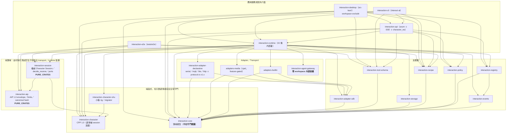
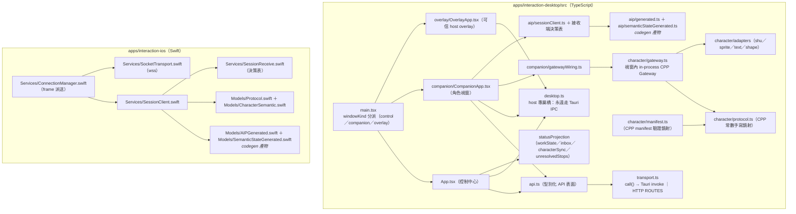
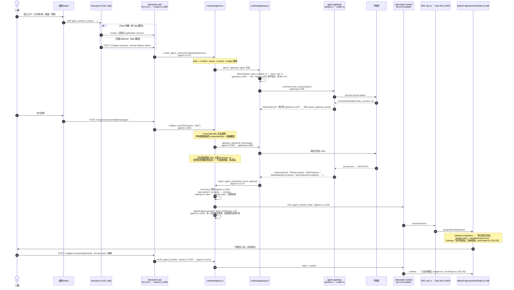
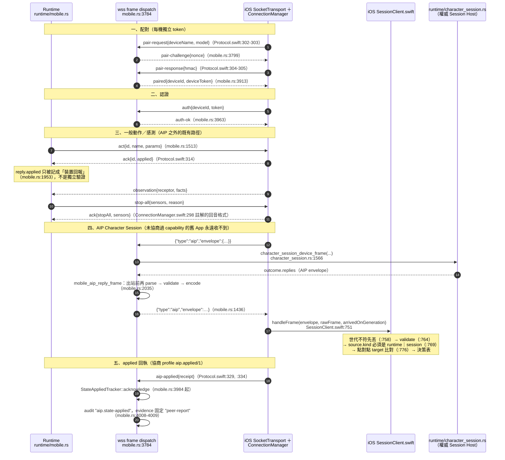
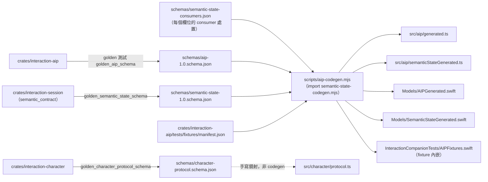

# 階段 0：架構依賴與資料流核對

> **這份文件是什麼**：階段 0「真實狀態恢復」的架構面交付物，回答四個問題——
> (1) crate 與桌面／iOS 模組之間**誰依賴誰**；(2) 一筆工作從人類到真 Agent 再回到人類**實際怎麼走**；
> (3) 電腦與 iPhone 之間**傳什麼訊息**；(4) 一份逐項核對表：核心有沒有被平台／角色／transport 汙染、
> 每個契約的版本責任在哪、schema／codegen 的三端 consumer 是誰、ports 有沒有 production 使用者、
> 同一條規則有沒有被實作兩次、設定與狀態的 owner 是否唯一、UI 有沒有自行把「宣稱」升級成「完成」。
>
> **來源**：階段 0 靜態盤點維度 H 的完整報告與其獨立懷疑者判決，已歸檔於
> [`docs/releases/evidence/2026-09-07-phase-0/static-matrix/dim-H.md`](evidence/2026-09-07-phase-0/static-matrix/dim-H.md)
> 與 [`dim-H.json`](evidence/2026-09-07-phase-0/static-matrix/dim-H.json)（27 條獨立懷疑者 verdict，逐條對應 dim-H.md 全文中的敘述式 findings；findings 本身未逐條編號）。
> 撰寫本文件時，所有引用的 `file:line`、計數與 grep 結論都以 `grep`／`sed` 在 HEAD 上**重跑覆核過**；
> 與原始報告不一致之處一律以覆核結果為準，並在[附錄 A](#附錄-a與原始盤點報告的差異) 逐條列出。
>
> **狀態基準**：branch `phase-0/state-recovery-baseline`，HEAD `78dcda1`（= `origin/main`，v0.8.0 之後只有 docs／test commit）。
>
> **證據層級**：本文件**全部是 `static-inspection`**。本輪**未執行** `cargo`／`pnpm`／daemon／Playwright／
> iOS Simulator／真 iPhone／真硬體；提到的測試檔與測試函式只代表「這支測試存在於 HEAD」，
> **不代表本輪跑過、更不代表通過**。真 iPhone 與真硬體證據在本階段架構核對中為 **0 筆**。
> 唯一實際執行的命令是 §7 記錄的 `scripts/tests/architecture-checks.sh --docs`。
>
> **狀態分類只用**：`implemented-and-connected`／`implemented-partial`／`defined-only`／`absent`／
> `confirmed-defect`／`needs-investigation`。**證據層級只用**：`static-inspection`／`unit`／`contract`／
> `fixture`／`simulator`／`integration`／`browser`／`native-desktop`／`real-agent`／`real-iphone`／
> `real-hardware`／`not-run`。
>
> **怎麼再產生**：
>
> ```bash
> git -C /Users/user/Workspace/claude-lab/adaptive-interaction rev-parse HEAD   # 應為 78dcda1…
> # §1 crate 依賴邊（只算 [dependencies]，不含 dev-dependencies）
> grep -n 'path = \|workspace = true' crates/*/Cargo.toml adapters/*/Cargo.toml \
>   apps/interaction-desktop/src-tauri/Cargo.toml tests/e2e/Cargo.toml
> # §4.4 ports
> grep -n '^pub trait' crates/interaction-session/src/ports.rs
> grep -rn 'impl .*\(SessionStore\|Clock\|IdentityVerifier\|ConsentVerifier\|RendererPort\|DevicePort\) for' crates/ apps/ adapters/ tests/
> # §4.9 桌面兩種傳輸的指令表差集
> #   （比對 src-tauri/src/lib.rs 的 generate_handler! 清單與 src/transport.ts 的 ROUTES 頂層 key）
> bash scripts/tests/architecture-checks.sh --docs
> ```
>
> 階段 0 的入口文件是 [phase-0-progress.md](phase-0-progress.md)；開工前的 repo 實況見
> [phase-0-repository-state.md](phase-0-repository-state.md)。分層與 ports 的**契約**是
> `docs/aip/architecture-boundaries.md`，能力歸屬是 `docs/MAINTAINERS-MAP.md`——本文件核對它們，不取代它們。

---

## 1. 模組依賴圖

### 1.1 Crate 層級（workspace 內部邊）

只畫 workspace 內部的 `[dependencies]` 邊；`dev-dependencies` 不畫（測試工具不進成品，
與 `tests/e2e/tests/dependency_boundaries.rs` 的判準一致）。箭頭方向 = 「A 依賴 B」。



逐 crate 的內部邊數（`[dependencies]` 段，不含 dev／build／target）：

| Crate | 內部依賴數 | 依賴的 workspace crate |
|---|---|---|
| `interaction-core` | 0 | — |
| `interaction-aip` | 0 | — |
| `interaction-character` | 0 | — |
| `interaction-agent-gateway` | 0 | — |
| `interaction-adapter-sdk`／`interaction-events`／`interaction-policy`／`interaction-recipe`／`interaction-storage`／`interaction-tool-schema` | 1 | `interaction-core` |
| `interaction-character-shu` | 1 | `interaction-character` |
| `interaction-session` | 2 | `interaction-aip`、`interaction-character` |
| `interaction-registry` | 2 | `interaction-core`、`interaction-events` |
| `adapters-builtin`／`adapters-media`／`interaction-adapter-declarative` | 2 | `interaction-core`、`interaction-adapter-sdk` |
| `interaction-cli` | 5 | api、core、recipe、runtime、tool-schema |
| `interaction-e2e` | 5 | aip、character、recipe、session、tool-schema |
| `interaction-api` | 7 | character、core、policy、recipe、registry、runtime、tool-schema |
| `interaction-desktop`（src-tauri） | 8 | api、character、core、policy、recipe、registry、runtime、tool-schema |
| `interaction-runtime` | 15 | core、registry、policy、recipe、events、storage、adapter-sdk、adapters-builtin、adapters-media、adapter-declarative、agent-gateway、aip、session、character、character-shu |

要點（全部 `static-inspection`）：

- **`interaction-agent-gateway` 一個 workspace 內部依賴都沒有**（`crates/interaction-agent-gateway/Cargo.toml:8-15` 只有
  async-trait／chrono／serde／serde_json／thiserror／tokio／tracing，`:17-18` 另有 unix 專屬 libc）——連 `interaction-core`
  都不依賴。真 Agent 子程序層與領域模型完全解耦；轉成領域語彙的翻譯只發生在
  `crates/interaction-runtime/src/gateway.rs`。這是全 repo 邊界最乾淨的一段。
- **`interaction-runtime` 是唯一匯流點**（15 條內部邊）。這是應用服務層的正常形狀，**不構成拆分理由**。
  它**沒有**依賴 `interaction-tool-schema`（tool-schema 由 api／cli／tauri／e2e 直接用）。
- **Tauri crate 在 workspace `exclude` 內**（`Cargo.toml:27`），所以 `cargo test --workspace`
  （`.github/workflows/ci.yml:35`）不會編它；CI 用獨立 job 補
  （`.github/workflows/ci.yml:60` `cargo clippy --manifest-path … -- -D warnings`、`:62` `cargo test --manifest-path …`）。
  這個排除**有被涵蓋**，不是覆蓋缺口。
- `tests/e2e` 是 workspace member（`Cargo.toml:23`），所以依賴邊界測試跟著 `cargo test --workspace` 一起跑。

### 1.2 桌面與 iOS 主要模組（非 crate，但同屬依賴圖）



- `main.tsx:17` 依 `windowKind` 分派：`overlay → OverlayApp`、`companion → CompanionApp`、其餘 `→ App`
  （`apps/interaction-desktop/src/main.tsx:25-33`）。**這條分派是 §6 缺陷 A-1 的根因**。
- 桌面有**兩條 IPC 路徑**：`transport.ts` 的 `call()`（會依模式在 Tauri invoke 與 HTTP route 之間切換）
  與 `desktop.ts`（檔頭 `apps/interaction-desktop/src/desktop.ts:1-2` 自述「always Tauri IPC,
  even when the runtime traffic itself flows over HTTP to an external daemon」）。詳見 §4.9。

---

## 2. 資料流：人類 → 核心 → Agent → 成果

**依賴方向與資料流刻意分開畫**：§1 是「誰可以 use 誰」，本節是「一筆工作實際怎麼走」。
每個 hop 標 `file:line`；狀態值用程式裡的字面值。



同一條事實另外投影到角色層（Character Presentation Protocol）：

- `crates/interaction-runtime/src/character.rs:467 session_projection(state)`：session 狀態字串 → `(CharacterIntent, TruthState)`，
  其中 `claimed-completed → (ClaimCompleted, Claimed)`、`verified → (VerifiedSuccess, Verified)`，
  不認得的值回 `None`（**不猜**）。
- `crates/interaction-runtime/src/character.rs:488` 起的 `action.*` 投影：`ActionCompleted → Claimed`、
  `ActionObserved → Verified`——**動器回 completed 只到 claimed**，要真的觀察到效果才是 verified。
  這兩張表是誠實階梯在 Rust 端的權威落點。

### 2.1 誠實階梯在資料流上的落點（狀態：implemented-and-connected；證據層級：static-inspection）

| 檢查 | 結果 | 證據（HEAD 上覆核） |
|---|---|---|
| queued ≠ completed | 通過 | `apps/interaction-desktop/src/statusProjection/workState.ts:113-114`（`created`／`queued` 都映到 `PREPARING`） |
| acknowledged ≠ completed | 通過 | `apps/interaction-desktop/src/appstate.tsx:195`「裝置或程式已確認收到／無法確認實際效果」 |
| completed ≠ verified | 通過 | `workState.ts:129-135`（claimed：badge `warn`＋`needsDecision: true`）vs `:136-142`（verified：badge `ok`）；`character.rs:488` 起的動器投影 |
| 送達 ≠ 完成 | 通過 | `apps/interaction-desktop/src/work/delivery.ts:41`「送達不是完成，所以沒有任何一態用成功綠（`ok`）」 |
| 未知狀態不猜 | 通過 | `workState.ts:179-182` `UNRECOGNIZED`：honesty「介面不認得這個狀態，不猜測結果」；`projectWorkState`（`:196`）不回傳原始字串當標籤 |
| 綠勾只認 Runtime 的 verified | 通過 | `apps/interaction-desktop/src/character/adapters/shuTables.ts:256`（`truthState === "verified"` 才播完整 success，否則帶 frame slice）→ `companion/rig/timeline.ts:172-173`（有 frame slice 就換成 `success-claimed`） |
| 動畫名反查 intent 不升級 | 通過 | `apps/interaction-desktop/src/character/spriteIntents.ts:58`「success→claim-completed，永不升級成 verified」 |

---

## 3. 資料流：電腦 ↔ iPhone

iOS **不打 HTTP API**；所有東西走 `crates/interaction-runtime/src/mobile.rs` 的 TLS wss frame。



要點（全部 `static-inspection`）：

- **回執一律標 `"evidence":"peer-report"`**（`crates/interaction-runtime/src/mobile.rs:4009`）——
  回執是對方的說法，不是獨立驗證。這與「acknowledged ≠ completed」一致。
- `state_applied` 這個 AIP profile（`APPLIED_PROFILE = "aip.applied/1"`，
  `crates/interaction-adapter-declarative/src/state_applied.rs:20`）的權威實作住在**宣告式裝置 crate**，
  模組頭 `state_applied.rs:1-5` 自述「A receipt is a peer's report, never independent verification」
  ＋「two production consumers (DeviceLink and MobileBridge)」；owner 已由
  `docs/MAINTAINERS-MAP.md:62` 指名。`interaction-runtime` 本來就依賴該 crate，**沒有新增依賴邊**——
  代價只是「一個 AIP 層概念住在 serial／MQTT／BLE crate 裡」，讀契約要跳一次。**不建議為此拆檔**。
- iOS 端 frame 型別集中在 `apps/interaction-ios/InteractionCompanion/Models/Protocol.swift`：
  出站 `enum ClientMessage`（`:301`）、入站 `enum ServerMessage`（`:479`），與 Rust 端的字面字串**手動對齊**。
  **wss 外殼沒有跨語言 fixture**（AIP envelope 有，見 §4.3）。
- 本階段**沒有任何真 iPhone 證據**支持本節；本節純粹是讀碼結果（`static-inspection`）。

---

## 4. 逐項核對表

### 4.1 核心是否依賴平台／特定角色／transport

| 問題 | 答案 | 狀態 | 證據 |
|---|---|---|---|
| `interaction-aip`／`interaction-session` 會拉進 transport／runtime 套件嗎？ | 否，而且有可執行守門＋反向控制組 | implemented-and-connected | `tests/e2e/tests/dependency_boundaries.rs:14`（`FORBIDDEN: [&str; 9]`＝tokio／axum／tauri／tungstenite／rumqttc／serialport／btleplug／reqwest／hyper）、`:27`（`PURE_CRATES: [&str; 2]`）、`:71` 宣告層、`:191` 遞移層、`:210` `the_transitive_check_actually_detects_a_banned_crate` 反向控制組 |
| `interaction-character` 有被釘住嗎？ | **遞移涵蓋**：它不在 `PURE_CRATES`，但 `interaction-session` 對它有 path 依賴，所以它長出 tokio 會讓 session 的遞移測試失敗 | implemented-and-connected（間接） | `crates/interaction-session/Cargo.toml` 的 `interaction-character` path 依賴；`dependency_boundaries.rs:125 reachable_packages` 走 normal 邊 |
| `interaction-core` 有被釘住嗎？ | **沒有**。core 不在 `PURE_CRATES`，也不是 aip／session 的可達節點（session 只依賴 aip＋character），守門走不到它 | `defined-only`（宣稱有、保證缺席） | `crates/interaction-core/src/lib.rs:3-4` 自述「no Tokio runtime, no HTTP, no storage, no device protocols」；`crates/interaction-core/Cargo.toml:8-16` 目前確實乾淨（serde／serde_json／schemars／thiserror／uuid／chrono／async-trait／futures／tracing）；`dependency_boundaries.rs:27` 不含 core |
| 核心綁特定角色？ | 否 | implemented-and-connected | `grep -rin 'shu\|maid' crates/interaction-core/src` 零命中 |
| 核心綁特定呈現面？ | **是（一處）**：`PolicyConfig::default()` 的 allowlist 逐項列出 `companion.*` 受器 7 個（`policy.rs:148-154`）與動器 7 個（`:166-172`），channel 含 `desktop-pet`（`:182`） | implemented-and-connected（是設計上的預設關閉，不是缺陷） | `crates/interaction-core/src/policy.rs:136`（`receptor_allowlist`）／`:156`（`actuator_allowlist`）／`:175`（`allowed_channels`） |
| 核心綁特定裝置（iPhone）？ | production 意義上否 | implemented-and-connected | 見下方驗收指令重跑 |

關於 `companion.*` 進 core 的**實際影響**：`interaction-policy` 對不在 allowlist 的動器直接 blocked
（`crates/interaction-policy/src/lib.rs:135-141`，理由字串 `actuator.allowlist`），而 repo 內**沒有**
production code 會在配對新 provider 時把它的動器加進 allowlist——`actuator_allowlist` 的寫入點只有
`crates/interaction-policy/src/lib.rs:598` 與 `:711`，兩處都在 `#[cfg(test)]`（該檔測試模組起於 `:546`）。
所以 `iphone.*` 動器預設被 Governor 擋下、要使用者自己改 policy。這一點**已被既有文件記錄為預期行為**
（`docs/acceptance-evidence.md` 記有 `blocked(actuator.allowlist)`），與「外部副作用動器預設關閉」的不變量一致。
真正的架構味道是：**「哪一家呈現面是內建的」寫死在領域核心的預設值裡**，新增第二個 host 呈現面家族需要改 `interaction-core`。

`docs/aip/architecture-boundaries.md:99` 的 §4.1 驗收指令本輪重跑結果（`static-inspection`）：

```
rg -n '"iphone[.-]|provider\.mobile\.' crates/interaction-runtime/src --glob '!mobile.rs'
  crates/interaction-runtime/src/sensor_source.rs:248      （doc comment）
  crates/interaction-runtime/src/sensor_source.rs:514      （doc comment）
  crates/interaction-runtime/src/character_session.rs:167  （doc comment）
  crates/interaction-runtime/src/character_session.rs:2755 （測試；該檔 #[cfg(test)] 起於 :2209）
```

文件寫「為 0 命中」，實際 4 個命中，逐一核對**全部是註解或測試**——production 邊界仍成立，
**但驗收指令本身會誤報**（狀態：`confirmed-defect`，屬文件缺陷，見 §6 A-4）。

### 4.2 各契約的版本責任（每個只有一個產生點）

| 契約 | 版本常數 | 唯一產生點 | 三端如何取得 |
|---|---|---|---|
| AIP 1.0 | `SPEC_VERSION = "aip/1.0"` | `crates/interaction-aip/src/lib.rs:48` | Rust 直接用；golden `schemas/aip-1.0.schema.json`；TS／Swift 由 `scripts/aip-codegen.mjs` 產生 |
| CPP 1.0 | `PROTOCOL_VERSION = "1.0"` | `crates/interaction-character/src/lib.rs:46` | Rust 權威；golden `schemas/character-protocol.schema.json`；TS **手寫鏡射** `apps/interaction-desktop/src/character/protocol.ts:10-12` |
| Semantic State | `SEMANTIC_STATE_PROFILE = "semantic-state/1.0"` | `crates/interaction-session/src/semantic_contract.rs:8` | golden `schemas/semantic-state-1.0.schema.json`；TS／Swift 由 `scripts/semantic-state-codegen.mjs` 產生 |
| Session snapshot | `SNAPSHOT_FORMAT: u32 = 1` | `crates/interaction-session/src/types.rs:197` | 只有 Rust 讀寫；未來格式不覆寫（`ports.rs` 的 `PortError::FutureFormat`） |
| 裝置線協定 | `PROTO_VERSION: u32 = 1` | `crates/interaction-adapter-declarative/src/protocol.rs:34` | ESP32 參考韌體；`aip`／`aip-frag` 是追加訊息，`proto` 不 bump |
| applied 回執 | `APPLIED_PROFILE = "aip.applied/1"` | `crates/interaction-adapter-declarative/src/state_applied.rs:20` | DeviceLink ＋ MobileBridge |
| sensor journal | `SENSOR_JOURNAL_KEY`＋`FORMAT: u32 = 1` | `crates/interaction-runtime/src/sensor_journal.rs:10-11` | 只有 Runtime（SQLite meta） |
| 陪伴預設 marker | `companion_preset_revision`（DesktopPrefs 欄位，預設 `"0"`） | `apps/interaction-desktop/src-tauri/src/supervisor.rs:152` 定義／`:328` 預設 | 只有 Tauri host；比對在 `preset_service.rs:197` |
| mobile wss 外殼 | **沒有數字版本常數**；用 frame `type` 字串＋能力協商 | `crates/interaction-runtime/src/mobile.rs:3784` 的 dispatch ／ `apps/interaction-ios/.../Protocol.swift:301, :479` | 手動對齊（見 §4.5） |

**結論**：每個契約都只有一個常數產生點，**沒有發現同一版本號在兩個地方各寫一份**。
唯一手打字面值的例外是 TS 端 CPP 的 `PROTOCOL_VERSION`／`PROTOCOL_MAJOR`／`PROTOCOL_MINOR`
（`protocol.ts:10-12`），不是 codegen 產物。

### 4.3 schema／codegen 與三端 consumer



- 產出檔路徑：`scripts/aip-codegen.mjs:25`（TS `generated.ts`）、`:26-29`（`AIPGenerated.swift`）、
  `:30-33`（`AIPFixtures.swift`）；`scripts/semantic-state-codegen.mjs:104`（`semanticStateGenerated.ts`）、
  `:105`（`SemanticStateGenerated.swift`）。共 TS 2 檔、Swift 3 檔。
- golden 測試：`tests/e2e/tests/golden.rs:58 golden_character_protocol_schema`、`:174 golden_aip_schema`、
  `:180 golden_semantic_state_schema`（存在於 HEAD；本輪 `not-run`）。
- drift gate：`.github/workflows/ci.yml:84` `pnpm aip:check`；發布流程
  `scripts/release-prepare.sh:73-74` 重生、`scripts/release-verify.sh:95` 與 `:146` 再驗兩次。
  狀態：`implemented-and-connected`。
- **CPP 不在 codegen 範圍**：`schemas/character-protocol.schema.json` 是 golden 產物，但
  `src/character/protocol.ts` 是人手鏡射（檔頭 `:1-8` 自述「Rust（interaction-character）是權威實作，
  這裡只鏡射同一份契約」）。TS 端**只有一項**欄位對 golden 逐字比對：`AssetDecl.required` 含 `mediaType`
  （`apps/interaction-desktop/src/test/regressions-v06-round2-desktop.test.ts:328-334`；
  repo 內只有這一支測試讀 `schemas/character-protocol.schema.json`）。

**跨語言 conformance fixture**（三端讀同一份）：`crates/interaction-aip/tests/fixtures/manifest.json`，
13 個資料段：`envelopes`／`generated`／`negotiations`／`identity`／`offlinePolicy`／`outcomeTransitions`／
`outcomeProfiles`／`nameScope`／`stateHashes`／`stateHashDoublePaths`／`receiveDecisions`／
`canonicalVectors`／`semanticStates`。三端消費者（檔案存在於 HEAD，本輪 `not-run`）：

| 端 | 讀 fixture 的測試檔 |
|---|---|
| Rust | `crates/interaction-aip/tests/conformance.rs`、`crates/interaction-aip/tests/canonical_vectors.rs`、`crates/interaction-session/tests/{receive_decision_fixtures,receive_decisions_from_json,state_hash_fixtures,semantic_contract}.rs` |
| TypeScript | `apps/interaction-desktop/src/test/`（`aip-conformance`／`canonical-hash`／`canonical-vectors`／`receive-decision-fixtures`／`semantic-state-contract`／`session-client` 等 `.test.ts`） |
| Swift | `apps/interaction-ios/InteractionCompanionTests/`（`AIPConformanceTests`／`ReceiveDecisionConformanceTests`／`StateHashConformanceTests`／`SemanticStateConformanceTests`／`CanonicalVectorsTests`）；fixture 由 codegen 內嵌成 `AIPFixtures.swift`，因為 XCTest 讀不到 repo 檔 |

**這是本 repo 最強的一段架構保證**（狀態：`implemented-and-connected`）。

### 4.4 Ports：誰有 production consumer

`crates/interaction-session/src/ports.rs` **只有 6 個 `pub trait`**（不是 7；見附錄 A）：

| Port trait | 定義 | production impl | production 消費者 | 狀態 |
|---|---|---|---|---|
| `SessionStore` | `ports.rs:59` | `JsonSessionStore`（`crates/interaction-runtime/src/character_session.rs:331` 定義、`:558` impl） | `character_session.rs:672` `CharacterSessionHost::open` | **implemented-and-connected** |
| `Clock` | `ports.rs:47` | 無（只有 `FixedClock`，`ports.rs:142` impl） | 零 | **defined-only** |
| `IdentityVerifier` | `ports.rs:65` | 無（只有 `StrictIdentityVerifier`，`ports.rs:99` impl） | 零 | **defined-only** |
| `ConsentVerifier` | `ports.rs:79` | 無（只有 `DenyAllConsent`，`ports.rs:109` impl） | 零 | **defined-only**（`ports.rs` 自己的 doc 已誠實自陳 1.0 未接進 gate） |
| `RendererPort` | `ports.rs:84` | **零 impl**（連測試替身都沒有） | 零 | **defined-only**（`docs/aip/deprecation-ledger.md` §1.3 已登記為 experimental） |
| `DevicePort` | `ports.rs:90` | **零 impl** | 零 | **defined-only**（同上，已登記） |

覆核指令與結果（`static-inspection`）：

```
grep -n '^pub trait' crates/interaction-session/src/ports.rs
  47:pub trait Clock  59:pub trait SessionStore  65:pub trait IdentityVerifier
  79:pub trait ConsentVerifier  84:pub trait RendererPort  90:pub trait DevicePort
grep -rn 'impl .*SessionStore for' crates/ apps/ adapters/ tests/
  crates/interaction-runtime/src/character_session.rs:558   （JsonSessionStore：production）
  crates/interaction-session/src/ports.rs:181               （MemoryStore：測試替身）
grep -rn 'impl .*(Clock|IdentityVerifier|ConsentVerifier|RendererPort|DevicePort) for' crates/ apps/ adapters/ tests/
  只有 ports.rs 自己的 :99 / :109 / :142
```

`MemoryStore`（`ports.rs:181` impl）是測試替身，但它守著與 production store 同一條 `(epoch, revision)` guard，
所以測試替身不會掩蓋真實 store 才會出現的亂序覆寫——這個做法值得保留。

**`EventLog` 不是 port**：`docs/aip/architecture-boundaries.md:35` 把它列成
`interaction-session::EventLog（有界環，內建實作）`，`:12` 的分層圖也把它列進 `ports.rs` 的 7 個名字裡；
但它是 `crates/interaction-session/src/session.rs:1966` 的 `struct EventLog`（**沒有 `pub`**），
所在的 `mod session` 在 `lib.rs:62` 是**私有**模組，`lib.rs:70-73` 的 `pub use session::{…}` 清單也不含它。
同一個錯誤在 `docs/ARCHITECTURE.md` 的 v0.6.0 Foundation §1 分層區塊（工作樹當下為 `:218`，
該檔本輪正被其他階段 0 交付物修改，行號可能位移）也有一份。
（`docs/aip/character-session.md:132` 與 `docs/aip/privacy.md:173` 把 `EventLog` 當**內部實作**描述，那兩處是正確的。）
狀態：**作為 port 是 `absent`**（見 §6 A-2）。

### 4.5 相同規則是否被實作兩次

| 規則 | 實作份數 | 有沒有共用 fixture／golden |
|---|---|---|
| AIP envelope 驗證、limits、canonical hash、身分綁定、outcome 轉移、offline policy、receive 決策表 | 3（Rust／TS／Swift） | **有**——`crates/interaction-aip/tests/fixtures/manifest.json`，三端各有讀同一份檔的測試（§4.3） |
| SemanticState 驗證＋投影 | 3 | **有**——`semanticStates` 段＋`schemas/semantic-state-consumers.json` 逐欄位處置 |
| CPP intent → 候選能力表 | 2（Rust `interaction-character` ／ TS `character/protocol.ts`） | **有（僅此一項）**——golden `crates/interaction-character/tests/golden/intent-capabilities.json`，TS 端在 `src/test/character-protocol.test.ts:546` 讀它逐項比對 |
| CPP §4–§7 gateway 狀態機（priority 下限、去重環、pending 上限、channel mixer／搶佔、回執合法性、`acknowledged→uncertain`、cancel 冪等、crash→uncertain＋世代 +1、輸入事件正規化） | **2**：`crates/interaction-character/src/gateway.rs`（1580 行）＋`apps/interaction-desktop/src/character/gateway.ts`（1590 行） | **沒有**——除 intent→能力表外沒有任何共用 fixture |
| CPP manifest 驗證 | **2**：`crates/interaction-character/src/manifest.rs`（1830 行）＋`apps/interaction-desktop/src/character/manifest.ts`（1212 行） | **幾乎沒有**——只有 `AssetDecl.required` 一欄對 golden 比對 |
| `TruthState` 的 15 個值 | 多份（Rust 權威／golden schema／TS 手寫 `protocol.ts:241`／TS 產生 `semanticStateGenerated.ts`／Swift 手寫 `CharacterSemantic.swift`） | 手寫的兩份**沒有**對值比對；TS 只斷言**長度**（`src/test/character-protocol.test.ts:107` `expect(TRUTH_STATES).toHaveLength(15)`） |
| 誠實階梯人話（claimed 的說法） | 3 份獨立字串表（Rust `interaction-character/src/gateway.rs`／TS `statusProjection/workState.ts:130`「對方說已完成」／Swift `Models/CharacterSemantic.swift`） | **沒有**——三份目前都誠實，但沒有 fixture 保證第四個實作也誠實 |
| 桌面兩種傳輸的指令表 | 2（Tauri `generate_handler!` 144 個 ／ `transport.ts` 的 `ROUTES` 122 個頂層 key） | **沒有 parity 測試**（`src/test/transport.test.ts` 只有 39 行，不含差集比對）；詳見 §4.9 |
| `interaction.yaml` 的 apiHost／apiPort | 2（Rust `runtime/config.rs:80` ／ Tauri `supervisor.rs:415` 各自 parse 一次） | 只讀、格式極簡，風險低 |
| `config/adapters/*.yaml` 目錄 | 2 個讀者（`runtime/providers.rs:702`、`runtime/hardware.rs:257` 各自組同一條路徑） | 只讀，風險低 |

**判讀**：AIP／Session 層做得非常好（共用 fixture 是唯一正解，而且做到三端）。
CPP 層是相反的極端：約 3400 行 TypeScript 與 Rust 各自實作同一份契約，只有一張表被跨語言釘住。
這是本 repo 最大的「同一條規則兩份實作」風險，而且它落在**呈現層的安全語意**上
（priority 下限、安全 intent 不得被 fallback 換掉、回執不得偽造 verified）。
**本輪沒有逐條 diff 兩份實作**，所以「有沒有已經漂掉」是 `needs-investigation`，不是「沒問題」。

### 4.6 設定與狀態的 owner 是否唯一

| store | 落地位置 | 權威寫入點 | 主要讀者 | 重疊？ |
|---|---|---|---|---|
| RuntimeConfig | `config/interaction.yaml` | `crates/interaction-runtime/src/config.rs:80` | runtime；Tauri `supervisor.rs:415`（**唯讀**重複解析 apiHost／apiPort） | 讀重疊（低風險） |
| PolicyConfig | `config/policies/policy.yaml` | 預設值 `interaction-core/src/policy.rs:136` 起；強制在 `interaction-policy`；入口 `PATCH /v1/policy` | executor／governor | 無 |
| UiPreferences | SQLite meta `ui_prefs` | `crates/interaction-runtime/src/human.rs:30`（key）、`:107`（型別）、`:568` `update_ui_preferences` | 控制中心 `App.tsx`、`pages/SettingsPage.tsx` | **`reduce_motion` 與角色視窗的 OS media query 重疊 → §6 A-1** |
| Onboarding draft／完成標記 | SQLite meta `onboarding`／`onboarding_draft` | `human.rs:31-32` | `pages/Onboarding.tsx` | 無 |
| 主動對話狀態（頻率／quiet_until／DND） | SQLite meta `proactive_dialogue` | `crates/interaction-runtime/src/proactive.rs:14`（key）、`:289`（設定 quiet_until）、`:544`（`proactive_dialogue_quiet`）、`:593`（`persist_proactive`） | `/v1/proactive-dialogue*`；Tauri | **與 DesktopPrefs 的 DND 概念分層**（見下） |
| Policy quietHours | policy.yaml | `interaction-core/src/policy.rs:82`（欄位）、`:184`（預設空） | proactive gate | 同上 |
| DesktopPrefs | `state/desktop.json` | `apps/interaction-desktop/src-tauri/src/supervisor.rs:349 prefs_path`（載入／儲存同檔） | 角色視窗＋角色頁；型別鏡射 `src/desktop.ts` | 見下 |
| 陪伴預設 marker／revision | DesktopPrefs 內的 `companion_preset_revision` 等欄位 | `supervisor.rs:152`／`:328`；比對與推進在 `preset_service.rs:197` | `companion/applyPresetPlan.ts` | 無 |
| Character Session snapshot | `state/character-session.json` ＋ `.epoch` | `crates/interaction-runtime/src/character_session.rs:90`／`:93`（檔名常數）、`JsonSessionStore`（`:331`／`:558`） | Session Host | 無 |
| 已配對 iPhone | `state/mobile-devices.json` | `crates/interaction-runtime/src/mobile.rs:2174` | mobile bridge | 無 |
| Sensor stop journal | SQLite meta `sensor_stop_journal` | `crates/interaction-runtime/src/sensor_journal.rs:10-11` | `sensors.rs`／`statusProjection/unresolvedStops.ts`／`host_safety.rs` | 無 |
| 匯入角色 | `state/characters/` | `apps/interaction-desktop/src-tauri/src/character_store.rs:134` | 角色頁 | 無 |
| 宣告式 adapter spec | `config/adapters/*.yaml` | `runtime/providers.rs:702` ＋ `runtime/hardware.rs:257` 各自讀同一個目錄 | providers／hardware scan | 讀重疊（低風險） |
| API token | `state/api-token`／`api-agent-token` | `crates/interaction-runtime/src/config.rs:98`／`:100` | CLI／Tauri | 無 |

**沒有發現兩個 owner 寫同一個欄位。** 唯一需要說明的是「安靜／勿擾」有三個不同層次的持有者：

1. `policy.quiet_hours`（時段，Governor 壓制侵擾頻道）——`interaction-core/src/policy.rs:82`
2. runtime `quiet_until`（一次性「今天安靜一點」，SQLite meta）——`proactive.rs:289`
3. DesktopPrefs `companion_do_not_disturb`（`supervisor.rs:122`）＋`companion_proactive_quiet_until`（`:132`）——角色視窗本地

桌面把後兩者當成不同層次（`apps/interaction-desktop/src/companion/presets.ts:4-6` 註明
「`companionDoNotDisturb`（桌面偏好；不主動靠近、不主動說話）」，且明講預設「**不是**新的設定層，
只是**既有欄位**的一組值」）——**是刻意的兩層（呈現層 vs 內容產生層），不是重複 owner**。
可維護性成本是：使用者看到的一個「安靜」概念，需要同時看三處才知道現在到底安不安靜。
這是設計取捨，**不建議合併**。

### 4.7 UI 是否自行推測成功

在 `apps/interaction-desktop/src`（排除 `src/test/`）**沒有找到**把 exit code／ack／claimed
升級成 completed／verified 的地方。反向證據見 §2.1 的七列（全部在 HEAD 上逐行覆核過）。
狀態：`implemented-and-connected`；證據層級：`static-inspection`。

一個**觀察，不是缺陷**：`appstate.tsx:199` 對 `completed` 的措辭是「已實際完成」且 `cannot` 為空字串。
在 receipt／action 語彙裡這是對的（`ActionCompleted` 是動器回報，要 `ActionObserved` 才是 verified，
見 `character.rs:488` 起的投影），但這句話比同檔 `actionStatusLabel`（`:208` 起，註解寫 `NEVER upgrades`）
的中性用語更強。**這是措辭層面的細節，不是狀態升級**，列為觀察。

### 4.8 deprecated／experimental 標示是否正確

`docs/aip/deprecation-ledger.md` 的登記與程式現況抽查（`static-inspection`）：

| ledger 條目 | 程式現況 | 一致？ |
|---|---|---|
| §1.3 `RendererPort`／`DevicePort` 零 impl、experimental | 覆核為零 impl（§4.4） | 一致，**而且誠實**——ledger 自己寫明「在此之前不得因為『介面存在』就宣稱這條擴充點可用」 |
| §2.1 snapshot `format` 遷移 | `SNAPSHOT_FORMAT = 1`（`types.rs:197`） | 一致 |
| §2.2 未來格式不覆寫 | `PortError::FutureFormat` ＋ `SaveOutcome::SkippedParked`（`ports.rs`／`character_session.rs`） | 一致 |
| §3.1／§3.2 裝置線 `aip`／`aip-frag` 是追加訊息 | `PROTO_VERSION = 1`（`protocol.rs:34`）未 bump | 一致 |
| §4.1 `INTERACT_AI_CHARACTER_SESSION` feature flag | `character_session_enabled_from_env`（`character_session.rs`） | 一致 |
| §4.3 sensor journal format 1 | `sensor_journal.rs:10-11` | 一致 |

**未登記但同樣零 production consumer 的 port**：`Clock`、`IdentityVerifier`、`ConsentVerifier`（§4.4）。
`ConsentVerifier` 在 `ports.rs` 的 doc comment 已誠實自陳；`Clock`／`IdentityVerifier` **沒有任何標示**，
而 `docs/aip/architecture-boundaries.md:32-33` 把它們列在穩定 port 表裡，讀者會以為可以拿來擴充。
ledger §1.3 的判準（「有第一個 production 實作者才轉正，否則刪掉並修文件」）應該一體適用。

### 4.9 桌面兩條 IPC 路徑（Tauri command ↔ HTTP route）

覆核方法：把 `apps/interaction-desktop/src-tauri/src/lib.rs:3604` 的 `generate_handler![…]` 清單
與 `apps/interaction-desktop/src/transport.ts:101` 起的 `ROUTES` **頂層 key** 做差集。結果：

- Tauri command：**144** 個（`generate_handler!` 清單；`grep -c '#\[tauri::command\]'` 同為 144）
- `ROUTES` 頂層 key：**122** 個
- 只有 Tauri 沒有 HTTP route：**22** 個

這 22 個的**實際呼叫路徑**（逐一 grep 覆核，`static-inspection`）：

| 分組 | 指令 | 呼叫點 |
|---|---|---|
| 動態組名的 native-only raw 版本（3） | `character_session_snapshot_raw`、`character_session_resume_raw`、`events_recent_raw` | `apps/interaction-desktop/src/transport.ts:334-336`：非 http 模式時對這三個**基底**指令改用 ``invoke(`${cmd}_raw`)`` 並以 `parseJsonWithNumberSources` 保留數字字面；基底名 `character_session_snapshot`／`character_session_resume`／`events_recent` 本身**有** route（`transport.ts:251`／`:252`／`:135`） |
| host 專屬橋（14） | `supervisor_info`、`desktop_prefs_get`、`desktop_prefs_patch`、`companion_preset_apply`、`companion_apply_prefs`、`companion_set_visible`、`companion_window_adjust`、`companion_reset_position`、`close_decision`、`full_quit`、`character_import`、`character_list_imported`、`character_asset`、`character_remove` | 全部只在 `apps/interaction-desktop/src/desktop.ts`（例：`:140`、`:150`、`:152`、`:153`），該檔用 `@tauri-apps/api/core` 的 `invoke` 直呼，並在多處以 `isTauri` 守門（`:131`／`:139`／`:144`／`:149`／`:176`…） |
| 角色視窗直呼（2） | `companion_set_interactive`、`companion_open_control_center` | `apps/interaction-desktop/src/companion/CompanionApp.tsx:2027`／`:2033`／`:2073` |
| 命中區回報（2） | `companion_hit_regions`、`companion_hit_rect` | `apps/interaction-desktop/src/companion/hitRegions.ts:382`／`:392`（以注入的 `invoke` 呼叫） |
| overlay 掛載（1） | `overlay_attach` | `apps/interaction-desktop/src/overlay/OverlayApp.tsx:36` |

結論：

- **這 22 個都不是 runtime 語意漏接**，全是 host 專屬或 native-only 的資料保真路徑。
- `transport.ts:341` 的 `no HTTP route for command X` **不會**為這 22 個觸發——
  `grep 'call("<cmd>")'` 對這 22 個名字全部零命中，它們從不經過 `call()` 的 route 查表。
- **沒有 parity 測試**（`apps/interaction-desktop/src/test/transport.test.ts` 只有 39 行）。
  所以「哪些指令**應該**沒有 HTTP route」目前只存在於閱讀者腦中，狀態：`defined-only`（作為一條約定）。

---

## 5. 依賴方向 vs 資料流：兩張圖的落差

| 事實 | 說明 |
|---|---|
| 依賴只朝核心，但**資料是雙向**的 | `interaction-runtime` 依賴 `interaction-session`（單向），但 session 要把 Output 回送 host——靠**回傳值**（`Vec<Output>`）而不是 callback，所以沒有反向依賴。這是對的做法。 |
| `interaction-agent-gateway` 零 workspace 依賴，但資料要進 `RuntimeEvent` | 轉換點集中在 `crates/interaction-runtime/src/gateway.rs` 的事件泵（`:367` 啟動／`:380` 定義 → `agents.rs:1174 report_agent_session`），**單一翻譯層**。 |
| CPP 有**兩條**資料路徑進 renderer | 外部 adapter：`/v1/character/ws`（`crates/interaction-api/src/character_ws.rs`）→ Rust `Gateway`；視窗內建 adapter：`companion/gatewayWiring.ts` → TS `character/gateway.ts`。**兩條各自跑一套 CPP 狀態機**（§4.5）。 |
| iOS 只有 wss 一條 | iOS 不打 HTTP API；所有東西走 `mobile.rs` 的 frame（`Protocol.swift:301`／`:479`）。 |
| SSE 與 Tauri event 是同一個 bus 的兩個出口 | `interaction-events::EventBus::publish`（`crates/interaction-events/src/lib.rs:40`）／`subscribe`（`:60`）→ SSE 路由 `crates/interaction-api/src/lib.rs:317` ｜ Tauri `apps/interaction-desktop/src-tauri/src/lib.rs:3414-3422`（`runtime-event` ＋ `runtime-event-raw`）。SSE 端另有 token scope 過濾（`crates/interaction-api/src/sse.rs:22 event_allowed`），Tauri 端沒有——因為 Tauri 視窗本來就是 human 主體。`runtime-event-raw` 保留原始 JSON 文字，讓桌面能維持 hash 所需的數字字面（消費點 `transport.ts:517`）。 |

---

## 6. 缺陷（可指出具體錯誤路徑）

### A-1 `UiPreferences.reduce_motion` 從來沒有到達角色視窗、CPP 協商與權威 SemanticState

- **狀態**：`confirmed-defect`｜**證據層級**：`static-inspection`（既有 browser 測試只覆蓋到控制中心那一半，本輪 `not-run`）
- 設定頁的開關寫著「減少非必要動畫（**會與作業系統 Reduced Motion 一併生效**）」
  （`apps/interaction-desktop/src/pages/SettingsPage.tsx:62-66`），寫進 `UiPreferences.reduce_motion`
  （`crates/interaction-runtime/src/human.rs:115-116`，doc 自述「Explicitly reduce non-essential motion
  **in addition to** the OS setting」）。
- 這個值在整個桌面前端**只有一個消費者**：`apps/interaction-desktop/src/App.tsx:229`
  `document.documentElement.classList.toggle("reduce-motion", prefs.reduceMotion === true)`
  （`grep -rn 'reduceMotion' apps/interaction-desktop/src`，排除 `src/test/`，其餘命中都只是型別宣告或預設值）。
- 但 `App` **只掛在控制中心視窗**；角色視窗掛的是 `CompanionApp`（`src/main.tsx:25-33` 依 `windowKind` 分派），
  所以那行 class toggle 在角色視窗根本不會執行。
- 角色視窗的 reduced motion **只**來自 OS media query：`companion/CompanionApp.tsx:925-927`
  `window.matchMedia("(prefers-reduced-motion: reduce)")` → `gateway.reconfigure(…, { reducedMotion })`；
  `:935-937` 監聽 change 事件同樣只讀 media query。
- 這個值再往上送成 CPP hello（`companion/gatewayWiring.ts:581`／`:590`）→ `runtime/character.rs:1051`
  `character_session_join_desktop(input.reduced_motion)` → `runtime/character_session.rs:1448`／`:1453`
  （寫進 features）／`:1473`（`RuntimeFact::ReducedMotion`），最後成為權威 SemanticState 的 `reducedMotion`。
- **錯誤路徑**：使用者在設定頁打開「減少非必要動畫」、OS 沒開 Reduced Motion →
  控制中心的 CSS 過場停掉了，**角色仍然全動**；CPP 協商仍以 `reducedMotion: false` 進行
  （不走 `reducedMotionBehavior` 降級，`src/character/negotiate.ts:175`／`:190-193`）；
  iPhone 與外部 adapter 收到的 SemanticState `reducedMotion` 也是 `false`。介面文字宣稱「一併生效」，實際只生效一半。
- **現有測試抓不到**：`apps/interaction-desktop/e2e/a11y.spec.ts:92` 那支測試先驗控制中心的
  `html.reduce-motion` 與 `.app` 的 `transitionDuration`，再在 `:117` 之後改用
  `page.emulateMedia({ reducedMotion: "reduce" })` 驗 media query——**兩條路各自綠燈，交叉那格沒人看**。
- **修法（最小）**：讓 `CompanionApp` 也讀 runtime 的 `UiPreferences`（與 media query 取 OR），
  或由 Tauri host 把 `reduce_motion` 併進送給角色視窗的 hello 輸入。無論哪一種，
  **權威來源必須只有一個**——目前是兩個都自認權威。

### A-2 `architecture-boundaries.md` 把私有 struct 列成 port

- **狀態**：`absent`（作為 port）／文件缺陷｜**證據層級**：`static-inspection`
- `docs/aip/architecture-boundaries.md:35` 寫 `EventLog | interaction-session::EventLog（有界環，內建實作）`，
  `:12` 的分層圖也把 `EventLog` 列進 `ports.rs` 的名單；但 `crates/interaction-session/src/session.rs:1966`
  是 `struct EventLog`（無 `pub`），所在的 `mod session` 在 `lib.rs:62` 是私有模組，`lib.rs:70-73`
  的 re-export 清單也不含它。**任何依這張表寫 adapter 的人會發現這個 port 不存在。**
  同一個錯誤另有一份在 `docs/ARCHITECTURE.md` 的 v0.6.0 Foundation §1 分層區塊
  （工作樹當下為 `:218`；該檔本輪正被其他階段 0 交付物修改，行號可能位移），修的時候要兩處一起改。

### A-3 `SessionSpec.model` 在 production 是死欄位，且 Codex 主路徑不讀它

- **狀態**：`defined-only`｜**證據層級**：`static-inspection`
- 欄位定義在 `crates/interaction-agent-gateway/src/lib.rs`；兩個建構子都設 `None`。
- `crates/interaction-runtime/src/gateway.rs:330`／`:332` 建 spec 之後，只設
  `disable_tools`／`resume_provider_session`／`max_cost_usd`／`session_capability_token`／`runtime_api_base`
  ——**沒有一行寫 `spec.model`**。
- `CreateAgentSession`（`crates/interaction-runtime/src/agents.rs:247`）也沒有 `model` 欄位，
  所以 HTTP create payload 傳不進來。
- 讀取端只有 `claude.rs`（`--model`）與 `codex_exec.rs`（fallback）；
  **`codex.rs`（app-server JSON-RPC，Codex 的主路徑）完全沒有 `model` 字樣**。
- 結論：任務書「API create payload 是否能傳 model 未確認」→ **確認為不能**。
  就算日後補上 payload 欄位，Codex 主路徑仍會靜默忽略——那時必須**誠實拒絕**，不能假裝限制成立。

### A-4 `architecture-boundaries.md` §4.1 的驗收指令會誤報

- **狀態**：`confirmed-defect`（文件／驗收指令）｜**證據層級**：`static-inspection`
- `docs/aip/architecture-boundaries.md:99` 寫「驗收：`rg …` 為 0 命中」，實際 4 個命中，
  全部是註解或測試（見 §4.1）。**production 邊界仍成立，但指令本身無法當關卡用**：
  它現在永遠紅燈，讀者只能靠人工判斷「這 4 個沒關係」。

---

## 7. 耦合改善建議（只列實際造成維護或正確性問題的）

排序依據是「有沒有具體錯誤路徑／有沒有真實維護成本」。
**明說：不因為檔案大、行數多或名稱相似而要求拆分或合併。**

1. **修 A-1（reduced motion 的權威來源收成一個）**。這同時是正確性問題（設定沒作用）
   與誠實性問題（權威 SemanticState 對三端說 `reducedMotion: false`）。
   證據：`SettingsPage.tsx:62-66` ↔ `App.tsx:229` ↔ `main.tsx:25-33` ↔ `CompanionApp.tsx:925-937`。
2. **把 CPP §4–§7 的行為釘成跨語言 fixture**（做法就是 AIP 那一套，不用發明新東西）。
   證據：`crates/interaction-character/src/gateway.rs`（1580 行）與
   `apps/interaction-desktop/src/character/gateway.ts`（1590 行）各自實作同一份契約，
   共用的只有 `intent-capabilities.json` 一張表。優先釘：priority 下限與安全 intent 不得被 fallback 換掉、
   去重環行為、`acknowledged→uncertain` 逾時、crash→uncertain＋世代 +1、回執 resolution 只能變差。
   這些都是純函式輸入→輸出，可直接沿用 `crates/interaction-aip/tests/fixtures` 的模式。
3. **`TRUTH_STATES`／`CHARACTER_INTENTS` 對 golden schema 逐值比對**，不要只斷言長度。
   證據：`src/test/character-protocol.test.ts:106-107` 只有 `toHaveLength`；
   repo 內唯一讀 `schemas/character-protocol.schema.json` 的 TS 測試是
   `regressions-v06-round2-desktop.test.ts:328-334`，而且只驗一個欄位。
   加一支讀 `$defs` 逐值 `toEqual` 的測試就能關掉「長度對但值錯」這一格。
4. **把 `Clock`／`IdentityVerifier`（必要時 `ConsentVerifier`）比照 ledger §1.3 登記為 experimental，
   或刪掉並修 `architecture-boundaries.md` §2**；同時修掉 `EventLog` 那一列（A-2），
   並一併修 `docs/ARCHITECTURE.md` 的同一份名單（兩處寫了同一個不存在的 port）。
   證據：§4.4 的 grep 結果 vs `architecture-boundaries.md:32-35`。ledger 已替
   `RendererPort`／`DevicePort` 立了正確判準，套用即可。
5. **把 `interaction-core` 納入依賴邊界測試的守護範圍**。
   證據：`crates/interaction-core/src/lib.rs:3-4` 自述「no Tokio runtime, no HTTP」，
   但 `dependency_boundaries.rs:27` 的 `PURE_CRATES` 不含它，遞移走圖也到不了它（§4.1）。
   `dependency_boundaries.rs` 已有現成的走圖（`:125`）與反向控制組（`:210`），成本極低。
6. **修 A-4 的驗收指令**（例如把 glob 換成只掃非註解的 production 行，或改寫成一支測試），
   讓它可以真的當關卡。目前它永遠紅燈，等於沒有關卡。
7. **（可選，低優先）`transport.ts` 的 `ROUTES` 與 Tauri command 清單加 parity 測試**：
   把「這 22 個是 host 專屬／native-only、不該有 HTTP route」寫成一份明確清單，其餘必須有 route。
   證據：§4.9 的差集與 `src/test/transport.test.ts`（39 行，無此檢查）。
   這**不是**正確性缺陷（那 22 個根本走不到 route 查表），只是「約定沒有可執行形式」。

**明確不建議動的**：

- `state_applied` 住在 `interaction-adapter-declarative`——owner 已由 `docs/MAINTAINERS-MAP.md:62` 指名，
  `interaction-runtime` 本來就依賴該 crate，拆出去**不會**減少任何依賴邊，只會多一個 crate 要維護。
- `interaction-runtime` 的 15 條內部依賴邊——這是應用服務匯流點的正常形狀，沒有具體錯誤路徑。
- 三個「安靜」概念的分層——`presets.ts:4-6` 已寫明是既有欄位的兩層語意，是刻意取捨。
- `interaction.yaml` 與 `config/adapters/` 的兩處讀取——都是唯讀、格式極簡，沒有寫入衝突面。

---

## 8. Lint 執行記錄

寫完本文件後執行（**這是本文件唯一實際跑過的命令**）：

```bash
bash scripts/tests/architecture-checks.sh --docs
```

結果記錄於本節下方（見 §8.1）。該命令的 `docs` 組會跑
`scripts/tests/docs-claims.sh`（文件對程式碼現況的可驗證陳述）與
`scripts/tests/release-scripts.sh`（發布腳本／workflow 自測）；
其餘分組（`--rust`／`--ts`／`--swift`／`--drills`）本輪 **`not-run`**，
腳本會把它們明示為 SKIP，不混入已通過。

### 8.1 實跑結果

執行時間：2026-09-08 17:41 +08:00（Asia/Taipei）；工作樹 HEAD `78dcda1`（本分支尚未 commit 階段 0 文件）。

```
architecture-checks @ /Users/user/Workspace/claude-lab/adaptive-interaction

── docs ────────────────────────────────────────────────
  ✔ scripts/tests/docs-claims.sh — docs-claims: 212 passed / 0 failed
  ✔ scripts/tests/release-scripts.sh — release-scripts: 58 passed / 0 failed

── 摘要 ────────────────────────────────────────────────
  docs       PASS  docs-claims.sh:docs-claims: 212 passed / 0 failed release-scripts.sh:release-scripts: 58 passed / 0 failed
  ts         SKIP 未指定 --ts
  rust       SKIP 未指定 --rust
  drill-lint SKIP 未指定 --drill-lint
  swift      SKIP 未指定 --swift；不以測試檔存在當成通過
  drills     SKIP 未指定 --drills；靜態 lint 不代表演練通過
architecture-checks: 所選組全部通過；5 組未選取（不是通過）
```

判讀：`docs` 組 **PASS**（`docs-claims` 212 通過／0 失敗、`release-scripts` 58 通過／0 失敗）。
其餘 5 組是 **SKIP，不是通過**——腳本自己也這樣印。本文件因此**不宣稱**任何 Rust／TypeScript／Swift
測試在本輪通過；§1–§7 的所有結論證據層級一律 `static-inspection`。
腳本的完整輸出寫在它自建的暫存 evidence 目錄（每次執行路徑不同，未歸檔）；
要復現就直接重跑上面那條命令。

---

## 附錄 A：與原始盤點報告的差異

以下是本文件相對於
[`evidence/2026-09-07-phase-0/static-matrix/dim-H.md`](evidence/2026-09-07-phase-0/static-matrix/dim-H.md)
的更正。前兩條來自獨立懷疑者判決（`dim-H.json` 中 `refuted: true` 的兩列），
其餘是本文件撰寫時自行覆核發現的。

| # | 原判 | 改判 | 理由摘要 |
|---|---|---|---|
| 1（H-05，懷疑者 `refuted: true`） | 「`ports.rs` 七個 port 中只有 `SessionStore` 有 production 實作」 | **`ports.rs` 只有 6 個 `pub trait`**；「只有 `SessionStore` 接線、其餘 5 個 `defined-only`」的實質結論不變 | `grep '^pub trait'` 得 6 筆（`:47`／`:59`／`:65`／`:79`／`:84`／`:90`）；「第七個」來自把 `docs/aip/architecture-boundaries.md` 的表（多一列 `EventLog`）當成 `ports.rs` 的內容。原報告引的行號（73／82／99／108／113）也不落在 trait 定義上 |
| 2（H-19，懷疑者 `refuted: true`） | 「22 個缺 HTTP route 的指令，缺項在 http 模式會擲 `no HTTP route for command X`（誠實失敗，但只在執行期才知道）」 | **失敗機制錯誤**：這 22 個從不經過 `transport.ts` 的 route 查表，`:341` 那條錯誤路徑對它們**不可達**；且原清單漏了 `character_list_imported`、`character_remove`，並把兩個不同的 hit-test 指令（`companion_hit_rect`／`companion_hit_regions`）寫成一個 | 對 22 個名字逐一 `grep 'call("<cmd>")'` 全部零命中；它們的呼叫點見 §4.9 |
| 3（本文件覆核，補正懷疑者判決） | 懷疑者說這 22 個「exclusively via `desktop.ts`」 | **不完全**：14 個在 `desktop.ts`，2 個在 `CompanionApp.tsx`，2 個在 `companion/hitRegions.ts`，1 個在 `overlay/OverlayApp.tsx`，另有 **3 個**（`*_raw`）是由 `transport.ts:334-336` **動態組出指令名**去 invoke 的 | 見 §4.9 的分組表；`transport.ts:335` 用 `` invoke(`${cmd}_raw`) `` |
| 4（H-20，懷疑者的命名更正） | iOS frame 型別是 `DeviceMsg`／`HostMsg` 兩個 enum | 實際是 `enum ClientMessage`（`Protocol.swift:301`）與 `enum ServerMessage`（`:479`） | `grep '^enum' Protocol.swift` |
| 5（本文件覆核） | 原報告 §1 的依賴圖有一條 `interaction-runtime → interaction-tool-schema`，並稱 runtime 有「16 條內部依賴邊」 | **runtime 沒有依賴 `interaction-tool-schema`；內部邊是 15 條** | `crates/interaction-runtime/Cargo.toml` 的 `[dependencies]` 段沒有 `interaction-tool-schema`；tool-schema 的使用者是 api／cli／tauri／e2e |
| 6（本文件覆核，行號校正） | `gateway.rs:343` `start_session`、`:375` `spawn_gateway_pump`；`agents.rs:1247` taxonomy、`:1258` ingest；`protocol.ts:11` `PROTOCOL_VERSION`；`Cargo.toml` 版本註記等 | `gateway.rs:345` `.start_session(spec)`、`:367` 呼叫／`:380` 定義 `spawn_gateway_pump`；`agents.rs:1246` taxonomy match、`:1259` `ingest(…, 0.5)`；`protocol.ts:10` `PROTOCOL_VERSION` | 逐行 `sed -n 'Np'` 覆核；本文件全部使用校正後的行號 |
| 7（H-17，懷疑者註記，非改判） | 「設定與狀態 store 共 13 處」 | 計數與其自身條列項數不符（展開 SQLite meta 子項為 14、合併則 9），屬列舉表述誤差 | 本文件 §4.6 直接列表，**不宣稱總數** |

> **完整性 critic**：維度 H **沒有**跑完整性 critic（`static-all.json` 中 H／I／J 三個維度沒有 `critic` 欄位），
> 因此本文件沒有「completeness critic 提出、未逐列核實」的補列。

## 附錄 B：本輪未追到／需要別的維度接手

以下直接沿用 dim-H 的 openQuestions，**全部維持 `needs-investigation`**，不得當成已核實：

1. Tauri 的 144 個 `#[tauri::command]` 是否每一個都經過 Policy Governor／consent？
   本輪只做了與 HTTP route 的名稱比對（§4.9），**沒有**逐一追到 application service。屬安全維度。
2. iOS 端 `BleGateway.swift`／`SensorCenter.swift`／`ActuatorCenter.swift` 的資料流未追；
   本輪只覆蓋 `Protocol.swift` 的 frame 型別、`SessionClient.handleFrame` 與 `CharacterSemantic`。
3. A-1 的修法要選哪一個權威來源（把 `UiPreferences` 併進角色視窗的 media query，
   或由 Tauri host 注入 hello）？兩者對「誰是 `SemanticState.reducedMotion` 的 owner」有不同後果。
4. **CPP 兩份 gateway 實作是否已經有實際行為分歧？** 本輪只確認「沒有共用 fixture」，
   **沒有**逐條 diff 兩邊的 priority／去重／搶佔規則。需要一輪針對性比對才能說有沒有漂掉。
5. `interaction-recipe`／`interaction-tool-schema`／`memory`／`knowledge`／`curator` 的內部資料流本輪未展開
   （它們在依賴圖上位置明確，但沒有畫 sequence）。
6. `docs/aip/transport-bindings.md`／`character-session.md`／`semantic-state.md` 的契約文字本輪只交叉引用，
   **沒有**逐條對程式核對（本輪重點是依賴與資料流）。
